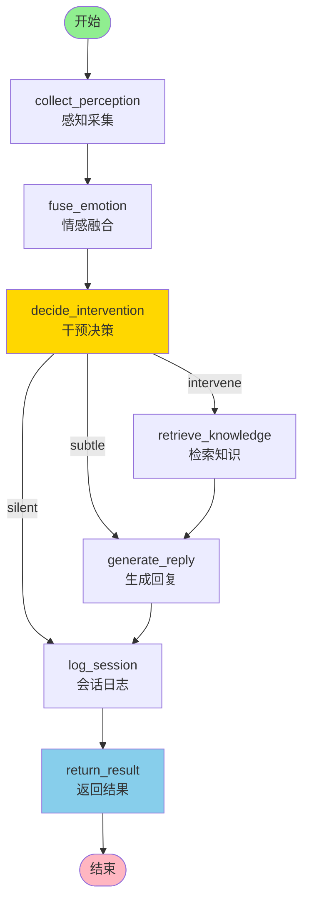

# A01 - LangGraph 状态机图结构

## 模块名称

`Agent/src/agent/graph.py`

---

## 职责描述

`graph.py` 是婉晴AI Python Agent的**核心状态机定义模块**，使用LangGraph框架构建了一个可执行的决策图。它的核心职责包括：

1. **节点注册**：注册所有处理节点（感知采集、情感融合、干预决策等）
2. **边定义**：定义节点之间的连接关系
3. **条件路由**：根据干预决策动态路由到不同路径
4. **图编译**：将定义好的图编译成可执行的状态机
5. **单例管理**：提供全局图实例，避免重复编译

---

## 图结构设计

### 完整节点图



### 节点执行顺序

| 顺序 | 节点名称 | 执行时机 |
|------|----------|----------|
| 1 | `collect_perception` | 必执行 |
| 2 | `fuse_emotion` | 必执行 |
| 3 | `decide_intervention` | 必执行 |
| 4a | `retrieve_knowledge` | 仅 `intervene` 路径 |
| 4b | `generate_reply` | `subtle` 或 `intervene` 路径 |
| 5 | `log_session` | 所有路径 |
| 6 | `return_result` | 汇聚点 |

---

## 核心代码结构

### 图构建函数

```python
def _build_graph() -> Any:
    """构建并编译LangGraph状态机"""
    g = StateGraph(AgentState)
    
    # 注册所有节点
    g.add_node("collect_perception", collect_perception_node)
    g.add_node("fuse_emotion", fuse_emotion_node)
    g.add_node("decide_intervention", decide_intervention_node)
    g.add_node("retrieve_knowledge", retrieve_knowledge_node)
    g.add_node("generate_reply", generate_reply_node)
    g.add_node("log_session", log_session_node)
    g.add_node("return_result", return_result_node)
    
    # 设置入口点
    g.set_entry_point("collect_perception")
    
    # 普通边（固定顺序）
    g.add_edge("collect_perception", "fuse_emotion")
    g.add_edge("fuse_emotion", "decide_intervention")
    
    # 条件边（核心路由）
    g.add_conditional_edges(
        "decide_intervention",
        _intervention_router,
        {
            "silent": "log_session",
            "subtle": "generate_reply",
            "intervene": "retrieve_knowledge"
        }
    )
    
    # 后续固定边
    g.add_edge("generate_reply", "log_session")
    g.add_edge("retrieve_knowledge", "generate_reply")
    g.add_edge("log_session", "return_result")
    g.add_edge("return_result", END)
    
    return g.compile()
```

### 条件路由函数

```python
def _intervention_router(state: AgentState) -> str:
    """
    根据干预决策确定下一步节点
    
    路由规则：
      - "silent"   → log_session（静默观察）
      - "subtle"   → generate_reply（轻量回复）
      - "intervene" → retrieve_knowledge → generate_reply（深度干预）
    """
    decision = state.get("intervention_decision")
    if decision is None:
        return "silent"
    
    action = decision.suggested_action.value
    return action
```

### 单例模式

```python
_graph_instance: Any = None

def get_graph() -> Any:
    """获取全局LangGraph编译图单例（延迟初始化）"""
    global _graph_instance
    if _graph_instance is None:
        _graph_instance = _build_graph()
    return _graph_instance
```

---

## 节点详解

### 1. collect_perception（感知采集节点）

从Redis读取最新感知数据，写入AgentState.latest_perception。

### 2. fuse_emotion（情感融合节点）

整合感知数据、历史情感，调用DeepSeek输出EmotionVector。

### 3. decide_intervention（干预决策节点）

基于五因子模型计算干预分数，决定SILENT/SUBTLE/INTERVENE。

### 4. retrieve_knowledge（知识检索节点）

从ChromaDB检索心理学知识卡片。

### 5. generate_reply（回复生成节点）

结合情感、知识、历史，调用DeepSeek生成关怀回复。

### 6. log_session（会话日志节点）

异步写入会话日志和长期记忆。

### 7. return_result（结果封装节点）

封装最终响应，供FastAPI SSE流返回。

---

## 配置与环境依赖

| 依赖项 | 说明 |
|--------|------|
| langgraph | 图结构编排框架 |
| redis.asyncio | 异步Redis客户端 |
| chromadb | 向量数据库 |
| DeepSeek API | LLM推理服务 |

---

## 常见问题与调试

### Q1: 图执行卡死
**排查步骤**：
1. 检查DeepSeek API是否超时
2. 检查Redis/ChromaDB连接
3. 使用async_timeout添加超时控制

### Q2: 节点返回值格式错误
**原因**：节点返回的dict key与AgentState字段不匹配

### Q3: 条件路由异常
**排查步骤**：
1. 检查_intervention_router逻辑
2. 确认decision.suggested_action.value值
