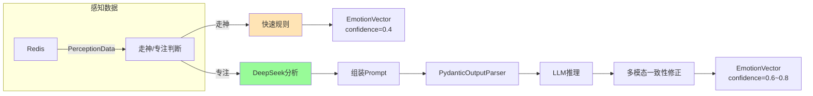

# A04 - 情感融合节点

## 模块名称

`Agent/src/agent/nodes/fuse_emotion.py`

---

## 职责描述

`fuse_emotion_node` 是 LangGraph 状态机中的**情感融合核心节点**，负责：

1. **走神/专注模式判断**：根据感知数据判断当前用户状态
2. **多源数据融合**：整合感知数据、Qwen 分析、历史情感
3. **LLM 情感分析**：调用 DeepSeek 进行深度情感推理（使用 PydanticOutputParser 解析结构化输出）
4. **多模态一致性修正**：基于 AU/Qwen 的一致性调整置信度
5. **EmotionVector 生成**：输出标准化的情感向量

---

## 核心概念

### OCC 情感八维模型

OCC（Ortony-Clore-Collins）模型将情感分为 8 个基本维度：

| 维度 | 中文 | 高值提示 |
|------|------|----------|
| `joy` | 喜悦 | 愉悦、正向反馈、目标达成感 |
| `sadness` | 悲伤 | 失落、无助、无望感 |
| `anger` | 愤怒 | 挫败、被冒犯、防御性语言 |
| `fear` | 恐惧 | 担忧、不安全感、回避倾向 |
| `disgust` | 厌恶 | 排斥、嫌弃、反感 |
| `surprise` | 惊讶 | 意外、震惊、措手不及 |
| `well_grounding` | 踏实感 | 平静、安全、被支持 |
| `anticipation` | 期待 | 对未来的预期 |

> **注意**：实际代码中还有 2 个额外字段：`cognitive_distortions`（认知扭曲列表）和 `history_context`（历史上下文摘要）。

### 走神模式 vs 专注模式

| 模式 | 触发条件 | 处理方式 |
|------|----------|----------|
| 走神模式 | 用户专注度高、无异常情绪 | 仅使用 AU 阈值规则，不调用 LLM |
| 专注模式 | 检测到情绪异常（眨眼/低头/AU4/负面情绪） | 完整调用 DeepSeek 进行情感分析 |

---

## 核心代码结构

### 主节点函数

```python
async def fuse_emotion_node(state: AgentState) -> dict[str, Any]:
    """
    LangGraph fuse_emotion 节点

    Returns:
        dict: {
            "current_emotion": EmotionVector,
            "is_focused_mode": bool
        }
    """
    session_id = state.session_id

    # Step 1: 获取最新感知数据（优先从 state 获取，否则从 Redis 拉取）
    perception = state.latest_perception
    if perception is None:
        from src.emotion.perception import get_latest_perception
        perception = await get_latest_perception(session_id)

    # Step 2: 走神/专注模式判断
    triggered, reason = check_attention_trigger(perception)
    is_focused = triggered or state.is_focused_mode

    # Step 3: 走神模式 → 快速规则
    if not is_focused:
        return _quick_rule_emotion(perception)

    # Step 4: 专注模式 → DeepSeek 分析
    return await _full_llm_analysis(state, perception)
```

---

## 关键实现细节

### 1. 走神/专注模式触发规则

```python
def check_attention_trigger(perception: PerceptionData) -> tuple[bool, str]:
    """
    判断是否触发专注模式

    触发条件（满足任一即切换）：
      1. 眨眼频率 > 25次/分
      2. 低头角度 < -40°（严重低头才判定为走神）
      3. AU4（皱眉）> 0.7
      4. AU 模型负面情绪 + 高置信度
    """
    au = perception.au

    if perception.blink_rate > 25:
        return True, "眨眼频率过高"

    if perception.head_pose.pitch < -40:
        return True, "低头角度过大"

    if au.AU4 > 0.7:
        return True, "AU4(皱眉)过高"

    negative_emotions = {"sad", "angry", "fear", "disgust"}
    if au.confidence > 0.6 and au.primary_emotion in negative_emotions:
        return True, f"AU模型负面情绪: {au.primary_emotion}"

    return False, ""
```

### 2. 走神模式快速规则

```python
def _quick_rule_emotion(perception: PerceptionData) -> dict[str, Any]:
    """
    走神模式下的快速规则判断

    仅基于 AU 阈值做简单推断，不调用 LLM
    置信度固定低（0.4）
    """
    au = perception.au

    if au.AU4 > 0.7 and au.AU15 > 0.5:
        primary = EmotionLabel.SADNESS
    elif au.AU4 > 0.7:
        primary = EmotionLabel.FEAR
    elif au.AU12 > 0.4:
        primary = EmotionLabel.JOY
    else:
        primary = EmotionLabel.NEUTRAL

    return {
        "current_emotion": EmotionVector(
            primary_emotion=primary,
            intensity=min(1.0, (au.AU4 + au.AU15) / 2 + 0.1),
            confidence=0.4,
            reasoning="[走神模式] 基于AU阈值规则快速判断"
        ),
        "is_focused_mode": False
    }
```

### 3. DeepSeek LLM 分析（专注模式）

```python
async def _full_llm_analysis(state, perception) -> dict[str, Any]:
    """专注模式下的完整 LLM 分析流程，使用 PydanticOutputParser 解析"""

    # Step 1: 组装分析 Prompt
    analysis_input = _assemble_analysis_input(
        perception=perception,
        qwen_analysis=state.qwen_analysis,
        emotion_history=state.emotion_history
    )

    # Step 2: 调用 DeepSeek，使用 PydanticOutputParser 解析结构化输出
    parser = PydanticOutputParser(pydantic_object=EmotionVector)
    client = _get_deepseek_client()
    response = await client.ainvoke([
        SystemMessage(system_prompt),
        HumanMessage(f"{analysis_input}\n\n{parser.get_format_instructions()}")
    ])

    # Step 3: 解析输出（包含 JSON 清洗和兜底解析）
    llm_output = _parse_llm_output(response.content, parser)

    # Step 4: 多模态一致性修正
    consistency = _compute_multimodal_consistency(
        llm_emotion=llm_output.primary_emotion.value,
        au_emotion=perception.au.primary_emotion,
        au_confidence=perception.au.confidence
    )

    # 最终置信度 = α * LLM置信度 + (1-α) * 一致性
    alpha = emotion_config.LLM_CONFIDENCE_ALPHA  # 默认 0.6
    final_confidence = alpha * llm_output.confidence + (1 - alpha) * consistency

    # Step 5: 更新置信度并返回
    llm_output.confidence = final_confidence

    return {
        "current_emotion": llm_output,
        "is_focused_mode": True
    }
```

### 4. 多模态一致性计算

```python
def _compute_multimodal_consistency(
    llm_emotion: str,
    au_emotion: str,
    au_confidence: float
) -> float:
    """
    计算多模态一致性得分（0~1）

    一致性定义：LLM 输出情绪与 AU 的情绪极性是否对齐
    """
    polarity_map = {
        "joy": "positive", "well_grounding": "neutral", "neutral": "neutral",
        "fear": "negative", "sadness": "negative", "anger": "negative",
        "disgust": "negative"
    }

    llm_polarity = polarity_map.get(llm_emotion, "neutral")
    au_polarity = polarity_map.get(au_emotion, "neutral")

    if au_confidence > 0.4:
        return 1.0 if llm_polarity == au_polarity else 0.2

    return 0.5  # 无可靠 AU 数据时返回中性
```

---

## 数据流示例



---

## 配置与环境依赖

| 配置项 | 说明 |
|--------|------|
| `llm_config.API_KEY` | DeepSeek API 密钥 |
| `llm_config.BASE_URL` | DeepSeek API 地址 |
| `emotion_config.LLM_CONFIDENCE_ALPHA` | 置信度修正权重（默认 0.6） |

---

## 常见问题与调试

### Q1: LLM 输出解析失败
**症状**：`ValidationError` 或 JSON 解析异常。

**解决方案**：已实现 Markdown 代码块清洗和兜底解析，错误时会降级为走神模式。

### Q2: 走神模式一直不退出
**症状**：用户情绪变化但一直走神模式。

**排查步骤**：
1. 检查 `check_attention_trigger` 规则
2. 确认感知数据是否正常
3. 检查 AU 模型置信度

### Q3: OCC 向量全为 0
**症状**：雷达图显示异常。

**排查步骤**：
1. 检查 LLM 输出是否正确
2. 确认 OCC 字段映射
3. 查看日志中的异常信息

---

## 相关文件

| 文件 | 关系 |
|------|------|
| `emotion/perception.py` | 感知数据处理 |
| `models/schemas.py` | EmotionVector 定义 |
| `config.py` | LLM 和 Emotion 配置 |
| `decide_intervention.py` | 后续干预决策 |
