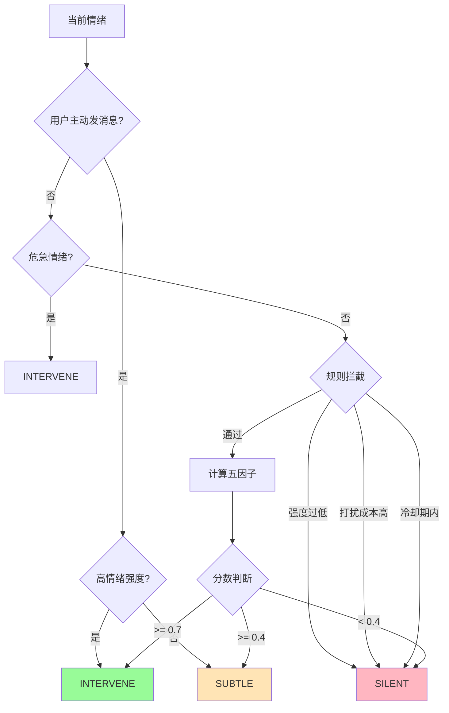

# A05 - 干预决策节点

## 模块名称

`Agent/src/agent/nodes/decide_intervention.py`

---

## 职责描述

`decide_intervention_node` 是 LangGraph 状态机中的**干预决策核心节点**，基于五因子模型综合计算干预分数，决定婉晴应采取的行动级别。它的核心职责包括：

1. **规则过滤**：拦截极不合适的打扰场景
2. **五因子评分**：计算综合干预分数
3. **冷却期管理**：避免频繁打扰用户（Redis 持久化）
4. **阈值决策**：将分数映射为具体行动
5. **UI 指令生成**：生成配套的视觉反馈指令

---

## 核心概念

### 三级干预动作

| 动作 | 含义 | 后续节点 |
|------|------|----------|
| `SILENT` | 静默观察，不打扰用户 | `log_session` → `return_result` |
| `SUBTLE` | 轻量暗示，生成简单回复 | `generate_reply` → `log_session` → `return_result` |
| `INTERVENE` | 深度干预，检索知识后生成关怀 | `retrieve_knowledge` → `generate_reply` → `log_session` → `return_result` |

### 五因子评分模型

```
干预分数 = W1×情绪强度 + W2×情感优先级 - W3×打扰成本 + W4×趋势因子 + W5×置信度

其中：
  W1 = 0.35（情绪强度权重）
  W2 = 0.25（情感优先级权重）
  W3 = 0.20（打扰成本权重，负值）
  W4 = 0.10（趋势因子权重）
  W5 = 0.10（置信度权重）
```

---

## 核心代码结构

### 主节点函数

```python
async def decide_intervention_node(state: AgentState) -> dict[str, Any]:
    """
    LangGraph 干预决策节点

    降级策略：任何节点内未捕获的异常均降级为 SILENT
              避免因单节点故障导致整个 Agent 崩溃。
    """
    try:
        return await _decide_intervention_impl(state)
    except Exception as e:
        logger.error(f"[decide_intervention] 节点执行异常，降级为 SILENT: {e}")
        return {"intervention_decision": _create_silent_decision()}
```

### 核心决策逻辑

```python
async def _decide_intervention_impl(state: AgentState) -> dict[str, Any]:
    current_emotion = state.current_emotion
    perception = state.latest_perception
    user_input = state.user_input

    # ★ 优先级最高：用户主动发消息 → 跳过所有规则拦截
    is_user_initiated = bool(user_input and user_input.strip())

    # 计算打扰成本
    focus_level = perception.focus_level if perception else 0.5
    arousal = current_emotion.arousal
    interrupt_cost = focus_level * (1.0 - arousal)

    # 五因子综合评分
    score = (
        cfg.WEIGHT_INTENSITY * intensity
        + cfg.WEIGHT_EMOTION_PRIORITY * emotion_priority
        - cfg.WEIGHT_INTERRUPT_COST * interrupt_cost
        + cfg.WEIGHT_TREND * trend_factor
        + cfg.WEIGHT_CONFIDENCE * confidence
    )

    # 规则拦截层（不拦截用户主动对话）
    if not is_user_initiated:
        if intensity < cfg.MIN_INTENSITY_FOR_INTERVENTION:
            return {"intervention_decision": _create_silent_decision()}
        if interrupt_cost > cfg.HIGH_INTERRUPT_COST:
            return {"intervention_decision": _create_silent_decision()}
        if _in_cooldown(cooldown_key):
            return {"intervention_decision": _create_silent_decision()}

    # 阈值决策
    if is_user_initiated:
        action = InterventionAction.SUBTLE  # 或 INTERVENE（高强度时）
    elif score >= cfg.INTERVENE_THRESHOLD:
        action = InterventionAction.INTERVENE
    elif score >= cfg.SUBTLE_THRESHOLD:
        action = InterventionAction.SUBTLE
    else:
        action = InterventionAction.SILENT
```

---

## 关键实现细节

### 1. 规则拦截层

```python
# A. 情绪强度过低 → SILENT
if intensity < cfg.MIN_INTENSITY_FOR_INTERVENTION:
    return {"intervention_decision": _create_silent_decision()}

# B. 打扰成本过高 → SILENT
if interrupt_cost > cfg.HIGH_INTERRUPT_COST:
    return {"intervention_decision": _create_silent_decision()}

# C. 冷却期内 → SILENT（Redis 持久化，支持跨请求）
redis_ts = await redis.get(cooldown_key)
if redis_ts:
    time_since_last = (current_time_ms - int(redis_ts)) / 1000
    if time_since_last < cfg.COOLDOWN_BASE_SECONDS:
        return {"intervention_decision": _create_silent_decision()}

# D. 危急情绪 → 跳过所有规则
is_emergency = (intensity >= cfg.EMERGENCY_INTENSITY_THRESHOLD
                and emotion_priority >= 0.8)
```

### 2. 用户主动发消息的特殊处理

```python
# 用户主动发消息时，跳过打扰成本/冷却期/最低强度规则
if is_user_initiated:
    if current_emotion.intensity >= cfg.HIGH_INTENSITY_THRESHOLD_FOR_USER_INITIATED:
        action = InterventionAction.INTERVENE  # 深度 RAG 干预
    else:
        action = InterventionAction.SUBTLE  # 轻量回复
```

### 3. 冷却期管理

```python
# Redis Key 模板
_COOLDOWN_KEY_TPL = "cooldown:agent:{session_id}"
_COOLDOWN_TTL_SECONDS = 300  # 5 分钟 TTL

# 触发干预后写入 Redis
if decision.needed:
    redis = await get_redis()
    await redis.set(cooldown_key, str(new_ts), ex=_COOLDOWN_TTL_SECONDS)
```

### 4. 趋势因子计算

```python
def _get_trend_factor(trend: EmotionTrend) -> float:
    if trend == EmotionTrend.RISING:
        return intervention_config.TREND_RISING_FACTOR
    elif trend == EmotionTrend.FALLING:
        return intervention_config.TREND_FALLING_FACTOR
    else:
        return intervention_config.TREND_STABLE_FACTOR
```

### 5. UI 指令生成

```python
def _get_ui_instruction(action, emotion_name) -> UIInstruction:
    """根据动作和情绪生成 UI 指令"""
    if action == InterventionAction.SILENT:
        return UIInstruction(**intervention_config.UI_INSTRUCTION_MAP["silent"])
    elif action == InterventionAction.SUBTLE:
        return UIInstruction(**intervention_config.UI_INSTRUCTION_MAP["subtle"])
    else:
        return UIInstruction(**intervention_config.UI_INSTRUCTION_MAP["intervene"].get(
            emotion_name, intervention_config.UI_INSTRUCTION_MAP["subtle"]
        ))
```

---

## 数据流示例



### 五因子计算示例

```python
# 假设场景：用户皱眉+AUDown，情绪悲伤上升趋势
intensity = 0.75
emotion_priority = 0.8  # 悲伤
focus_level = 0.6
arousal = 0.4
interrupt_cost = 0.6 * (1.0 - 0.4) = 0.36
trend_factor = 0.15  # 上升趋势
confidence = 0.7

score = 0.35*0.75 + 0.25*0.8 - 0.20*0.36 + 0.10*0.15 + 0.10*0.7
      = 0.2625 + 0.20 - 0.072 + 0.015 + 0.07
      = 0.4755

# 0.4 <= 0.4755 < 0.7 → SUBTLE
```

---

## 配置与环境依赖

| 配置项 | 说明 |
|--------|------|
| `WEIGHT_INTENSITY` | 情绪强度权重，默认 0.35 |
| `WEIGHT_EMOTION_PRIORITY` | 情感优先级权重，默认 0.25 |
| `WEIGHT_INTERRUPT_COST` | 打扰成本权重，默认 0.20 |
| `WEIGHT_TREND` | 趋势因子权重，默认 0.10 |
| `WEIGHT_CONFIDENCE` | 置信度权重，默认 0.10 |
| `INTERVENE_THRESHOLD` | 深度干预阈值，默认 0.70 |
| `SUBTLE_THRESHOLD` | 轻量干预阈值，默认 0.40 |
| `COOLDOWN_BASE_SECONDS` | 冷却时间，默认 120 秒 |
| `EMERGENCY_INTENSITY_THRESHOLD` | 危急情绪强度阈值 |
| `HIGH_INTENSITY_THRESHOLD_FOR_USER_INITIATED` | 用户主动时的高强度阈值 |
| Redis | 冷却期状态存储（跨请求持久化） |

---

## 常见问题与调试

### Q1: 干预过于频繁
**症状**：用户反映婉晴总是打扰。

**排查步骤**：
1. 检查冷却期是否生效（Redis 连接）
2. 调整 `COOLDOWN_BASE_SECONDS`
3. 检查打扰成本计算

### Q2: 干预从不触发
**症状**：即使情绪明显异常也不干预。

**排查步骤**：
1. 检查五因子权重配置
2. 确认 `latest_perception` 数据正常
3. 查看日志中的评分详情

### Q3: 冷却期不生效
**症状**：冷却期内仍有干预。

**排查步骤**：
1. 检查 Redis 连接
2. 确认 `cooldown_key` 格式
3. 检查 TTL 设置

---

## 相关文件

| 文件 | 关系 |
|------|------|
| `fuse_emotion.py` | 输入来源 |
| `generate_reply.py` | 后续节点 |
| `models/schemas.py` | InterventionDecision 定义 |
| `utils/redis_client.py` | Redis 操作 |
