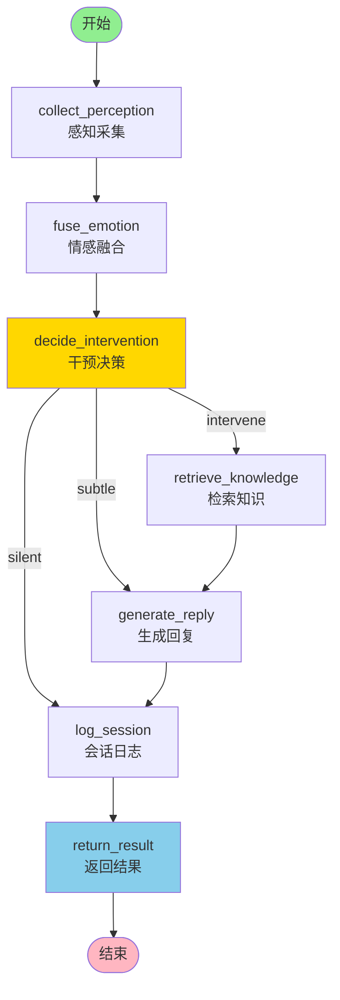

# A07 - Agent整体运转逻辑：婉晴AI的大脑是如何工作的

## 模块名称

`Agent/src/agent/graph.py`

---

## 一句话

婉晴AI的"大脑"是一个基于LangGraph的**确定性状态机管道**——它不依赖LLM随机选择工具，而是按照固定的流程：采集感知 → 融合情感 → 决策干预 → 检索知识 → 生成回复，每一步都精确编排，数据通过AgentState在节点间传递。

---

## 为什么选择"确定性管道"而非"自主Agent"？

婉晴不是ChatGPT那种通用AI助手，她的场景要求**实时响应**和**可预测性**：

| 方案 | 优点 | 缺点 |
|------|------|------|
| 通用ReAct Agent | 灵活、通用 | 响应慢、不可预测、LLM可能"想太多" |
| **确定性管道（本项目采用）** | 实时、可控、可调试 | 不够灵活，但符合婉晴场景需求 |

**核心洞察**：婉晴是一个"被动感知 + 主动关怀"的情感智能体，流程是固定的，不需要LLM自主选择工具。节点内部已经封装了对Redis、DeepSeek、ChromaDB的调用，等价于"节点即工具"。

---

## 完整节点图



---

## 三个执行路径

### SILENT（静默观察）
适用场景：用户正常、无情绪波动
```
collect_perception → fuse_emotion → decide_intervention → log_session → return_result
```
婉晴只记录日志，不打扰用户。

### SUBTLE（微干预）
适用场景：用户情绪轻微波动、但不需要深度关怀
```
collect_perception → fuse_emotion → decide_intervention → generate_reply → log_session → return_result
```
婉晴生成简单回复（如"我在这里陪你"），不做RAG知识检索。

### INTERVENE（深度干预）
适用场景：用户情绪明显异常、需要专业心理学支持
```
collect_perception → fuse_emotion → decide_intervention → retrieve_knowledge → generate_reply → log_session → return_result
```
婉晴先检索心理学知识库，再生成有针对性的关怀回复。

---

## AgentState：贯穿全局的共享数据容器

所有节点通过读写 `AgentState` 传递数据。State是一个Pydantic模型，字段按模块分区：

```python
class AgentState(MessagesState):
    # 会话标识
    session_id: str
    user_id: str

    # 感知数据（collect_perception写入）
    latest_perception: PerceptionData | None

    # 情感向量（fuse_emotion写入）
    current_emotion: EmotionVector | None

    # 干预决策（decide_intervention写入）
    intervention_decision: InterventionDecision | None

    # 对话历史（Java传入/Redis读取）
    conversation_history: list[dict]

    # RAG检索结果（retrieve_knowledge写入）
    retrieved_knowledge_cards: list[str]
    retrieved_knowledge_cards_with_meta: list[dict]

    # 长期记忆
    retrieved_long_term_memories: list[str]

    # 用户输入
    user_input: str

    # 最终响应（return_result写入）
    final_response: dict[str, Any]
```

---

## 节点详解

### 1. collect_perception（感知采集）

**做什么**：从Redis读取最新感知数据，写入 `state.latest_perception`

**输入**：Redis key = `emotion:realtime:{session_id}`

**输出**：`state.latest_perception = PerceptionData(...)`

```python
async def collect_perception_node(state: AgentState) -> dict:
    session_id = state["session_id"]
    perception = await get_latest_perception(session_id)
    return {"latest_perception": perception}
```

### 2. fuse_emotion（情感融合）

**做什么**：整合感知数据、历史情感，调用DeepSeek输出EmotionVector

**走神模式 vs 专注模式**：
- 走神模式：仅用AU阈值规则，置信度固定0.4（不调用LLM，节省成本）
- 专注模式：调用DeepSeek深度分析，置信度0.6~0.8

**输出**：`state.current_emotion = EmotionVector(...)`

详见 `A04_情感融合节点.md`

### 3. decide_intervention（干预决策）

**做什么**：基于五因子评分模型计算干预分数，决定SILENT/SUBTLE/INTERVENE

**五因子公式**：
```
分数 = 0.35×情绪强度 + 0.25×情感优先级 - 0.20×打扰成本 + 0.10×趋势因子 + 0.10×置信度
```

**阈值**：
- 分数 ≥ 0.70 → INTERVENE
- 分数 ≥ 0.40 → SUBTLE
- 分数 < 0.40 → SILENT

**输出**：`state.intervention_decision = InterventionDecision(...)`

详见 `A05_干预决策节点.md`

### 4. retrieve_knowledge（RAG检索）

**做什么**：从心理学知识库和个人长期记忆双路检索

**双路并发检索**：
1. 心理学知识库（ChromaDB RAG collection）
2. 个人长期记忆（ChromaDB long-term collection）

**输出**：
- `state.retrieved_knowledge_cards`（心理学卡片内容）
- `state.retrieved_knowledge_cards_with_meta`（含meta，供generate_reply提取recommended_strategy）
- `state.retrieved_long_term_memories`（个人历史记忆）

### 5. generate_reply（回复生成）

**做什么**：组装Prompt，调用DeepSeek生成关怀回复

**Prompt注入内容**：
- 系统Prompt：婉晴人设（温柔、不评判、先共情后引导）
- 心理学知识卡片（来自retrieve_knowledge）
- 个人历史记忆
- 对话历史（最近3轮）
- 当前情感状态

**输出**：`state.intervention_decision.reply`（婉晴的回复文本）

### 6. log_session（会话日志）

**做什么**：异步写入会话日志和记忆

**4个异步操作**（均不阻塞主对话流程）：
1. 回调Java后端 → 写入MySQL session_logs
2. 存入ChromaDB → 个人长期记忆（情感向量归档）
3. 追加Redis → 短期对话历史
4. 触发摘要检查 → 超过20条则压缩存入向量库

### 7. return_result（结果封装）

**做什么**：所有路径的汇聚点，封装最终SSE响应

**安全兜底**：
- 如果reply为空，默认回复"你好呀！我在这里陪着你。"
- 如果action为silent，自动转为subtle，确保SSE有内容流式传输

**最终输出格式**：
```python
{
    "action": "subtle",
    "emotion": "悲伤",
    "intensity": 0.75,
    "ui_instruction": {"color": "blue", "pulse": "slow"},
    "reply": "我能感受到你现在情绪很低落...",
    "strategy": "5-4-3-2-1着陆技术",
    "urgency": "low",
    "vector": {"喜悦": 0.1, "悲伤": 0.75, ...}
}
```

---

## 数据流全景图

```
前端用户发送消息
      │
      │ POST /api/v1/chat/stream
      ▼
Java ChatController
      │ 写入Redis对话历史
      │ 调用Agent SSE
      ▼
Python Agent (LangGraph)
      │
      ├─[1] collect_perception  → Redis GET emotion:realtime:{session_id}
      │
      ├─[2] fuse_emotion        → DeepSeek LLM（专注模式）
      │                         → 走神模式（规则快速判断）
      │
      ├─[3] decide_intervention → 五因子评分 → SILENT/SUBTLE/INTERVENE
      │
      ├─[4] retrieve_knowledge  → ChromaDB RAG × 2路并发
      │                         → 心理学知识库 + 个人长期记忆
      │
      ├─[5] generate_reply      → DeepSeek LLM
      │                         → 组装Prompt → 生成关怀回复
      │                         → TTS并行触发（不阻塞）
      │                         → Notion日记（Function Calling）
      │
      ├─[6] log_session        → 异步写入
      │                         → MySQL + ChromaDB + Redis + 摘要压缩
      │
      └─[7] return_result      → 封装SSE响应
      │
      │ SSE流式返回
      ▼
Java AgentClient
      │ 透传SSE + 注入干预弹窗 + 写入情感历史
      ▼
前端
      │ 逐字渲染 + 雷达图更新 + 光晕动画
      ▼
用户看到婉晴回复 + 听到语音
```

---

## Java调用Agent的完整请求体

```python
# Java传入的请求体 → Agent/src/dto/request/AgentInvokeReq.java
{
    "session_id": "550e8400-e29b-41d4-a716-446655440000",
    "user_id": "user_001",
    "user_message": "我今天心情很差",
    "conversation_history": [  # Java从Redis读取后传入
        {"role": "user", "content": "你好"},
        {"role": "ai", "content": "你好呀，我在这里！"}
    ],
    "emotion_history": [  # 最近10条情感记录
        {"timestamp": 1709123456789, "primary_emotion": "平静", "intensity": 0.3}
    ],
    "user_rejection_penalty": 1.0  # 来自Java统计的拒绝率
}
```

---

## 调试点位

### 日志关键词

| 模块 | 日志前缀 | 含义 |
|------|----------|------|
| 感知采集 | `[collect_perception]` | 感知数据读取 |
| 情感融合 | `[fuse_emotion]` | 情感分析结果 |
| 干预决策 | `[decide_intervention]` | 决策分数详情 |
| 知识检索 | `[retrieve_knowledge]` | RAG检索结果数量 |
| 回复生成 | `[generate_reply]` | 回复文本/降级原因 |
| 会话日志 | `[log_session]` | 写入MySQL/ChromaDB结果 |
| 结果封装 | `[return_result]` | 最终响应内容 |
| 图路由 | `[router]` | 条件边路由决策 |

### 常见问题排查

| 症状 | 排查步骤 |
|------|----------|
| 婉晴不回复 | 检查Agent日志是否有`[router]`输出；检查SSE连接是否建立 |
| 雷达图全为零 | 检查`[fuse_emotion]`日志，确认OCC向量是否生成 |
| 干预从不触发 | 检查`[decide_intervention]`日志中的五因子分数详情 |
| 记忆丢失 | 检查Redis连接；检查`[log_session]`是否有ChromaDB写入日志 |
| TTS无声音 | 检查`[generate_reply]`是否有TTS触发日志；检查WebSocket连接 |

---

## 核心文件速查

| 文件 | 作用 |
|------|------|
| `src/agent/graph.py` | LangGraph图定义：7个节点 + 条件路由 + 单例管理 |
| `src/agent/state.py` | AgentState定义：贯穿全局的共享状态容器 |
| `src/agent/nodes/collect_perception.py` | 节点1：Redis感知数据读取 |
| `src/agent/nodes/fuse_emotion.py` | 节点2：DeepSeek OCC情感融合 |
| `src/agent/nodes/decide_intervention.py` | 节点3：五因子干预决策 |
| `src/agent/nodes/generate_reply.py` | 节点5：Prompt组装 + DeepSeek回复生成 |
| `src/models/schemas.py` | 所有数据模型：EmotionVector、InterventionDecision等 |

---

## 相关文档

- `A01_LangGraph状态机图结构.md` — LangGraph图构建的详细代码
- `A04_情感融合节点.md` — fuse_emotion节点的完整实现
- `A05_干预决策节点.md` — decide_intervention节点的完整实现
- `A06_核心数据模型.md` — 所有Pydantic数据模型定义
- `A10_短期记忆管理.md` — Redis短期记忆机制
