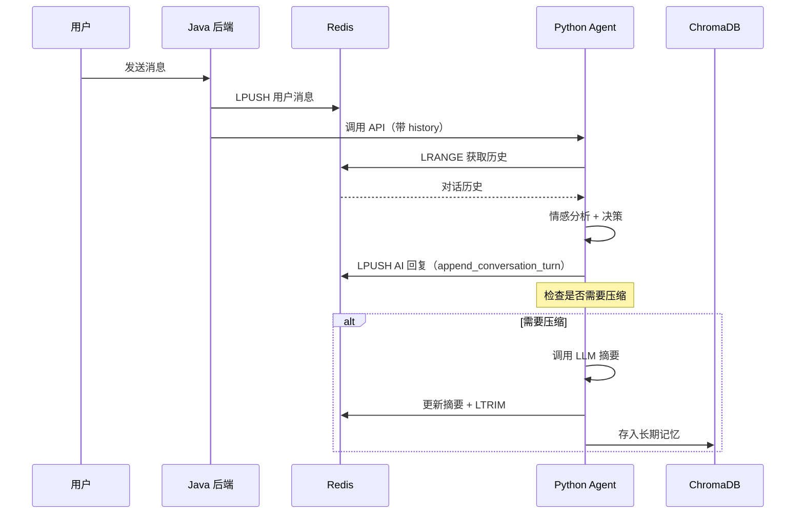

# A10 - 短期记忆管理

## 模块名称

`Agent/src/memory/short_term.py`

---

## 职责描述

`short_term.py` 是婉晴 AI Agent 的**短期工作记忆模块**，负责管理与对话上下文相关的短期记忆，核心职责包括：

1. **对话历史读取**：获取最近 N 条对话用于上下文注入
2. **会话摘要读取**：获取当前会话的累积摘要
3. **历史摘要压缩**：当对话超过阈值时触发 LLM 摘要并归档到长期记忆
4. **短期记忆追加**：由 LangGraph `log_session_node` 调用，向 Redis List 追加对话消息

---

## 核心设计

### 架构约定

- **写入方**：Python Agent（`log_session_node` 调用 `append_conversation_turn`）
- **读取方**：Python Agent（上下文注入 Prompt）
- **删除/压缩**：Python Agent（摘要触发后）
- **Java 侧**：Java 后端在调用 Agent API 时，在请求体中传入 `conversation_history`

### Redis Key 结构

```
session:{session_id}:history     # 对话历史（List，最多20条原始消息）
session:{session_id}:summary      # 累积摘要（String）
```

---

## 核心代码结构

### 1. 历史读取

```python
async def get_recent_history(session_id: str, limit: int = 10) -> list[ConversationMessage]:
    """
    读取最近 N 条原始对话

    使用 lrange(0, limit-1)：取出从新到旧的最近 limit 条
    然后翻转顺序，使其符合人类阅读的时间正序（先旧后新）
    """
    key = redis_config.history_key(session_id)
    r = await get_redis()

    raw_msgs = await r.lrange(key, 0, limit - 1)

    messages = []
    for raw in raw_msgs:
        try:
            data = json.loads(raw)
            messages.append(ConversationMessage(**data))
        except Exception as e:
            logger.warning(f"[short_term] 解析历史消息失败: {e}")

    return messages[::-1]  # 翻转顺序
```

### 2. 会话摘要读取

```python
async def get_session_summary(session_id: str) -> str:
    """获取当前会话的累积摘要"""
    key = redis_config.summary_key(session_id)
    r = await get_redis()
    summary = await r.get(key)
    return summary or ""
```

### 3. 历史压缩与摘要

```python
async def check_and_summarize_history(session_id: str, user_id: str) -> None:
    """
    检查对话长度，超过阈值则触发摘要并归档到长期记忆

    触发条件：Redis List 长度 >= SUMMARY_TRIGGER_COUNT（默认 20）
    压缩后：保留最新 SUMMARY_KEEP_COUNT（默认 5）条，其余摘要后存入向量库
    """
    history_key = redis_config.history_key(session_id)
    summary_key = redis_config.summary_key(session_id)
    limit = redis_config.SUMMARY_TRIGGER_COUNT
    keep = redis_config.SUMMARY_KEEP_COUNT

    r = await get_redis()
    length = await r.llen(history_key)

    if length < limit:
        return  # 未达阈值，无需压缩

    # 取出待压缩的旧消息（最新 keep 条不压缩）
    raw_to_compress = await r.lrange(history_key, keep, -1)
    if not raw_to_compress:
        return

    # 读取已有摘要，调用 LLM 进行增量摘要
    old_summary = await get_session_summary(session_id)
    new_summary = await _generate_incremental_summary(old_summary, text_to_compress)

    # 事务执行：更新摘要 + 裁剪列表
    async with r.pipeline(transaction=True) as pipe:
        pipe.set(summary_key, new_summary)
        pipe.ltrim(history_key, 0, keep - 1)
        await pipe.execute()

    # 异步存入长期记忆（ChromaDB）
    await store_long_term_memory(
        user_id=user_id,
        content=new_summary,
        memory_type=MemoryType.CONVERSATION_SUMMARY,
        metadata={"session_id": session_id}
    )
```

### 4. 增量摘要生成

```python
async def _generate_incremental_summary(old_summary: str, new_dialogue: str) -> str:
    """调用 DeepSeek 进行增量总结"""
    system_prompt = """你是一个专业的长上下文总结助手。
请根据【之前的摘要】和【新增的对话】，将其浓缩为一个连贯的【最新摘要】。
要求：
- 提取用户情绪变化、暴露的问题、以及 AI 采取的干预措施。
- 保持客观简练，不要遗漏关键事实（如提到的事件、姓名、偏好）。
"""
    human_prompt = f"【之前的摘要】\n{old_summary or '无'}\n\n【新增的对话】\n{new_dialogue}\n\n请输出最新摘要："

    client = ChatOpenAI(model=llm_config.CHAT_MODEL, ...)
    chain = ChatPromptTemplate.from_messages([...]) | client
    response = await chain.ainvoke({})
    return response.content.strip()
```

### 5. 短期记忆追加（由 LangGraph 调用）

```python
async def append_conversation_turn(
    session_id: str,
    role: str,      # "user" 或 "ai"
    content: str
) -> None:
    """
    向 Redis List 追加一条对话消息

    写入方：LangGraph log_session_node（Python Agent 侧）
    使用 LPUSH：新消息添加到列表头部
    设置 TTL：SESSION_TTL_SECONDS（默认 2 小时）
    """
    key = redis_config.history_key(session_id)
    r = await get_redis()

    msg = ConversationMessage(role=role, content=content)
    await r.lpush(key, msg.model_dump_json())
    await r.expire(key, redis_config.SESSION_TTL_SECONDS)
```

---

## 数据流示例



---

## 配置参数

| 参数 | 默认值 | 说明 |
|------|--------|------|
| `SUMMARY_TRIGGER_COUNT` | 20 | 触发摘要的消息数量阈值 |
| `SUMMARY_KEEP_COUNT` | 5 | 压缩后保留的最新消息数量 |
| `SESSION_TTL_SECONDS` | 7200 | 会话过期时间（2 小时） |

---

## 常见问题与调试

### Q1: 对话历史丢失
**症状**：Agent 回复时没有上下文。

**排查步骤**：
1. 检查 Redis 连接是否正常
2. 确认 LPUSH 操作是否成功
3. 检查 `append_conversation_turn` 是否被调用

### Q2: 摘要不触发
**症状**：对话超过 20 条但未触发摘要。

**排查步骤**：
1. 检查 `check_and_summarize_history` 是否被调用
2. 确认 `llen` 返回值是否正确
3. 查看日志中的压缩触发信息

### Q3: 摘要质量差
**症状**：摘要后上下文丢失。

**解决方案**：
1. 调整 `_generate_incremental_summary` 的 Prompt
2. 增加 `SUMMARY_KEEP_COUNT` 保留更多原始消息
3. 优化 LLM 模型的 temperature 参数

---

## 相关文件

| 文件 | 关系 |
|------|------|
| `long_term.py` | 长期记忆存储 |
| `rag/retriever.py` | 知识检索 |
| `graph.py` | 调用本模块 |
| `config.py` | Redis 配置 |
