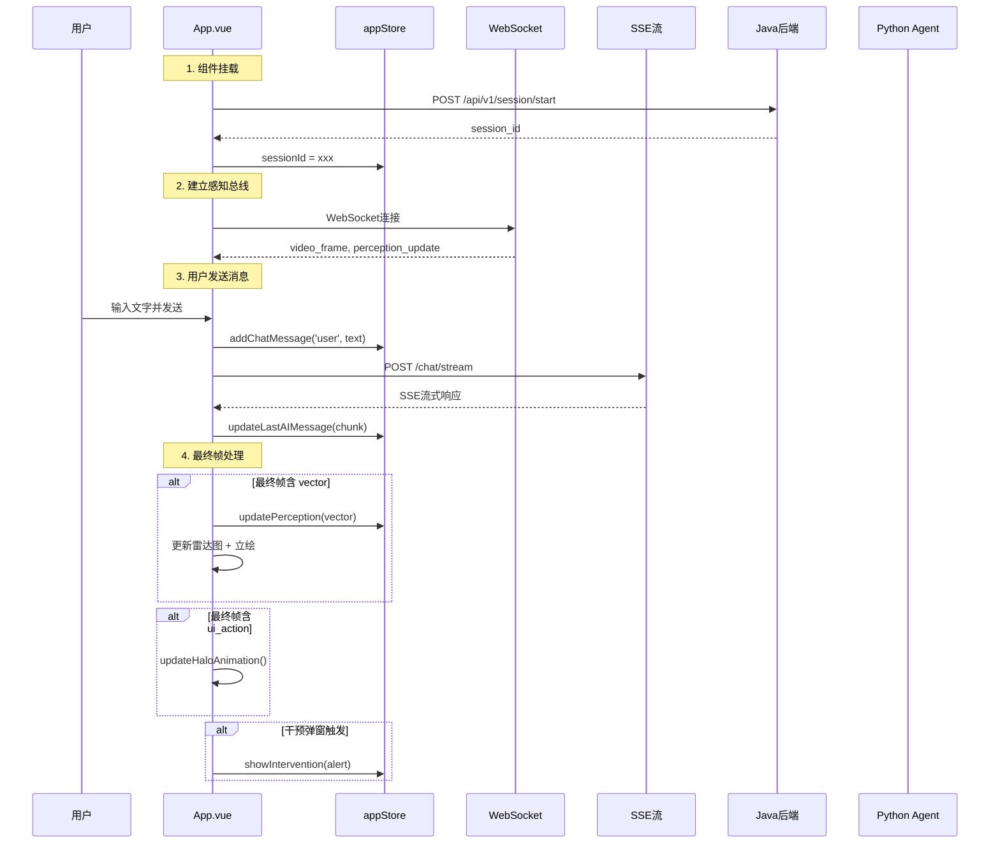

# F01 - 前端主应用入口

## 模块名称
`frontend/src/App.vue`

---

## 职责描述

`App.vue` 是婉晴AI前端应用的根组件，承担以下核心职责：

1. **会话初始化**：在组件挂载时向Java后端发起会话创建请求，获取会话ID。
2. **通信管道建立**：
   - 建立与Python感知服务的WebSocket连接（感知总线），接收实时感知数据
   - 通过SSE与Java后端建立对话通道，接收Agent的流式回复
3. **全局状态协调**：通过`appStore`统一管理情感状态、光晕动画、干预弹窗等全局状态
4. **光晕动画控制**：基于情感类型和强度，使用GSAP动画库动态渲染背景光晕效果
5. **主题切换**：支持深色/浅色主题的一键切换

---

## 输入与输出

### 接收的Props
本组件为根组件，不接收外部Props，但通过子组件Props向下传递状态。

### 触发的事件/回调
| 事件名 | 触发时机 | 处理逻辑 |
|--------|----------|----------|
| `@send` | 用户在ChatWindow发送消息 | 调用`sendAgentRequest`发起SSE对话 |
| `@accepted` | 用户接受干预弹窗 | 调用`sendInterventionFeedback('accepted')` |
| `@rejected` | 用户拒绝干预弹窗 | 调用`sendInterventionFeedback('rejected')` |
| `@dismissed` | 干预弹窗自动消失 | 调用`sendInterventionFeedback('ignored')` |

### 向子组件传递的Props
| 子组件 | Props | 描述 |
|--------|-------|------|
| PortraitBox | portraitPath, emotion, behavior, intensity, theme | 立绘资源路径、当前情绪、行为描述、动画强度 |
| VisualSignal | radarVector, videoFrame, intensity, theme | 雷达图数据、视频帧数据、动画强度 |
| ChatWindow | messages, isConnected, theme | 聊天历史、连接状态、主题 |
| DebugPanel | isConnected | 连接状态（调试用） |
| InterventionPopup | visible, message, urgency, theme | 弹窗显示状态、文案、紧急程度 |

---

## 核心代码结构

```javascript
// === 情绪-颜色映射 ===
const EMOTION_COLORS = {
  negative_anger: 'rgb(255, 77, 77)',   // 愤怒 → 红色
  negative_sad:   'rgb(74, 144, 226)',  // 悲伤 → 蓝色
  positive_joy:   'rgb(255, 179, 71)',  // 开心 → 橙色
  neutral:        'rgb(226, 232, 240)'   // 中性 → 灰色
}

// === Python → 前端 颜色映射 ===
const COLOR_MAP = {
  blue:    'negative_sad',    // Python蓝色 → 前端悲伤
  orange:  'positive_joy',    // Python橙色 → 前端开心
  green:   'positive_joy',
  purple:  'negative_anger', // Python紫色 → 前端愤怒
  neutral: 'neutral'
}

// === 脉冲速度映射 ===
const PULSE_MAP = { slow: 0.2, medium: 0.5, fast: 0.8, very_fast: 0.95 }
```

### 关键函数

| 函数名 | 作用 |
|--------|------|
| `initSession()` | 轮询Java后端直到会话创建成功（最多重试20次，间隔3秒） |
| `connectPerceptionBus()` | 建立WebSocket感知总线，处理各类感知消息 |
| `sendAgentRequest()` | 发起SSE对话请求，支持取消和重连 |
| `_fetchAgentSSE()` | SSE流解析核心逻辑，逐帧解析并更新UI |
| `updateHaloAnimation()` | GSAP驱动的光晕动画更新 |
| `handleInterventionAccepted/Rejected/Dismissed()` | 干预弹窗反馈处理 |

---

## 关键实现细节

### 1. 会话初始化重试机制

```javascript
const MAX_INIT_RETRIES = 20
const INIT_RETRY_DELAY = 3000

const initSession = async () => {
  for (let attempt = 1; attempt <= MAX_INIT_RETRIES; attempt++) {
    try {
      const resp = await fetch('http://localhost:8080/api/v1/session/start', {...})
      const json = await resp.json()
      const sessionId = json?.data?.session_id
      if (sessionId) {
        appStore.sessionId = sessionId
        return
      }
    } catch (e) { /* 继续重试 */ }
    await new Promise(r => setTimeout(r, INIT_RETRY_DELAY))
  }
}
```

### 2. SSE流式解析

```javascript
// 逐帧解析 SSE 事件
const lines = buffer.split('\n')
for (const rawLine of lines) {
  if (!line.startsWith('data:')) continue
  const payload = JSON.parse(line.slice(5).trim())
  
  // 逐字流式渲染
  if (payload.chunk) {
    accumulatedReply += payload.chunk
    appStore.updateLastAIMessage(accumulatedReply)
  }
  
  // 最终帧处理
  if (payload.is_end && payload.vector) {
    appStore.updatePerception({ vector: payload.vector, _perceptionTimestamp: Date.now() })
    // 更新立绘情绪...
  }
}
```

### 3. WebSocket消息分发

```javascript
socket.onmessage = (event) => {
  const msg = JSON.parse(event.data)
  if (msg.type === 'video_frame') {
    appStore.setVideoFrameData(msg.data)
  } else if (msg.type === 'perception_update') {
    appStore.updatePerception({ ...msg.data, _fromWebSocket: true })
  } else if (msg.type === 'voice_play') {
    // Base64内嵌音频直接播放
    new Audio(msg.data).play()
  }
}
```

### 4. 光晕动画 (GSAP)

```javascript
const updateHaloAnimation = () => {
  const type = appStore.debugEmotionType
  const t = appStore.debugIntensity
  
  if (type === 'neutral') {
    haloRef.value.style.opacity = '0'
    return
  }
  
  const targetColor = EMOTION_COLORS[type]
  const targetOpacity = Math.min(0.3 + t * 0.75, 0.75)
  const targetShadow = `inset 0 0 150px 50px rgba(..., ${targetOpacity})`
  
  gsap.to(haloRef.value, {
    duration: 1.5,
    boxShadow: targetShadow,
    ease: 'power2.out',
    onComplete: () => {
      // 脉冲动画
      gsap.to(haloRef.value, {
        duration: 5.0 - (t * 3.5),
        boxShadow: pulseShadow,
        yoyo: true,
        repeat: -1,
        ease: 'sine.inOut'
      })
    }
  })
}
```

---

## 数据流示例



---

## 配置与环境依赖

| 依赖项 | 说明 |
|--------|------|
| Vue 3 | 前端框架 |
| Pinia | 状态管理库 |
| GSAP | 动画库 |
| ECharts | 雷达图渲染（由子组件使用） |
| Java后端 | 会话管理 (`localhost:8080`) |
| Python感知服务 | WebSocket感知总线 (`ws://localhost:8000/ws`) |

### 环境变量（前端无需配置，后端提供）
- `http://localhost:8080` - Java后端地址
- `ws://localhost:8000/ws` - Python感知服务WebSocket地址

---

## 常见问题与调试

### Q1: 会话初始化失败
**症状**：婉晴提示"感知系统启动超时"。

**排查步骤**：
1. 检查Java后端是否启动：`curl http://localhost:8080/health`
2. 检查MySQL/Redis是否正常运行
3. 查看Java后端日志是否有启动错误

### Q2: WebSocket连接断开
**症状**：连接状态显示OFFLINE，感知数据停止更新。

**排查步骤**：
1. 检查Python感知服务是否运行：`curl http://localhost:8000/health`
2. 检查防火墙是否阻止WebSocket连接
3. 查看前端控制台是否有错误信息

### Q3: SSE流式响应卡顿
**症状**：AI回复字符出现延迟或不连续。

**排查步骤**：
1. 检查网络延迟
2. 检查DeepSeek API响应速度
3. 确认Agent服务(8001端口)是否正常

### Q4: 光晕动画不显示
**症状**：背景光晕层完全不显示。

**排查步骤**：
1. 确认主题是深色模式（浅色模式下光晕自动隐藏）
2. 检查`debugEmotionType`是否为`neutral`（中性时不显示光晕）
3. 检查GSAP是否正确加载

### Q5: 情感历史数据污染
**症状**：雷达图出现不合理的尖刺。

**原因**：SSE最终帧和WebSocket实时数据时间戳冲突。

**解决方案**：已实现Q4时间戳保护机制，SSE最终帧不会覆盖更新的WebSocket数据。

---

## 相关文件

| 文件 | 关系 |
|------|------|
| `frontend/src/store/appStore.js` | 全局状态管理，本组件的核心数据源 |
| `frontend/src/components/ChatWindow.vue` | 聊天输入输出 |
| `frontend/src/components/PortraitBox.vue` | 立绘展示 |
| `frontend/src/components/EmotionRadar.vue` | 雷达图展示 |
| `frontend/src/components/InterventionPopup.vue` | 干预弹窗 |
| `backend/src/main/java/.../ChatController.java` | SSE响应源 |
| `backend/api/websocket.py` | WebSocket感知总线源 |
