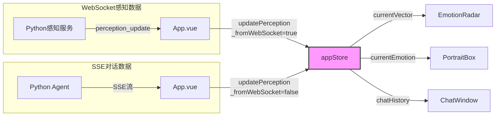

# F02 - 全局状态管理 (Pinia Store)

## 模块名称
`frontend/src/store/appStore.js`

---

## 职责描述

`appStore.js` 是婉晴AI前端应用的**全局状态管理中心**，采用Pinia状态管理库实现。它的核心职责包括：

1. **集中式状态存储**：管理会话ID、连接状态、主题模式等全局基础状态
2. **情感状态管理**：OCC八维情感向量、当前情绪类型、行为描述、情感历史
3. **聊天历史管理**：对话消息的添加、编辑、流式更新
4. **干预弹窗控制**：弹窗显示状态、文案、紧急程度
5. **感知数据处理**：接收并处理来自WebSocket的实时感知数据
6. **时间戳保护**：防止SSE最终帧覆盖更新的WebSocket数据（Q4机制）

---

## 输入与输出

### 状态字段一览

| 字段名 | 类型 | 默认值 | 描述 |
|--------|------|--------|------|
| `isConnected` | `ref` | `false` | WebSocket连接状态 |
| `viewMode` | `ref` | `'radar'` | 视图模式：radar/camera |
| `sessionId` | `ref` | `null` | 当前会话ID |
| `theme` | `ref` | `'dark'` | 主题：dark/light |
| `currentEmotion` | `ref` | `'平静'` | 当前情绪标签 |
| `currentBehavior` | `ref` | `'初始化中...'` | 当前行为描述 |
| `currentVector` | `ref` | `[0,0,0,0,0,0,0,0]` | OCC八维向量 |
| `emotionHistory` | `ref` | `[]` | 情感历史数组（最多60条） |
| `lastPerceptionTimestamp` | `ref` | `0` | 上次感知时间戳 |
| `currentAction` | `ref` | `'subtle'` | 当前干预动作 |
| `currentStrategy` | `ref` | `null` | 当前策略 |
| `debugEmotionType` | `ref` | `'neutral'` | 调试用情绪类型 |
| `debugIntensity` | `ref` | `0.2` | 调试用强度 |
| `videoFrameData` | `ref` | `null` | 视频帧数据 |
| `chatHistory` | `ref` | `[...]` | 聊天消息列表 |
| `showInterventionPopup` | `ref` | `false` | 弹窗显示状态 |
| `interventionPopupData` | `ref` | `{...}` | 弹窗数据 |

### OCC八维情感标签顺序

```javascript
// 与后端 occ_to_zh 映射顺序对齐
// 与 EmotionRadar.vue props.labels 完全一致
const OCC_LABELS = [
  "喜悦",      // joy
  "悲伤",      // sadness
  "愤怒",      // anger
  "恐惧",      // fear
  "厌恶",      // disgust
  "惊讶",      // surprise
  "踏实感",    // well_grounding
  "期待"       // anticipation
]
```

---

## 核心代码结构

### Store定义

```javascript
export const useAppStore = defineStore('app', () => {
  // === 状态定义 ===
  const isConnected = ref(false)
  const sessionId = ref(null)
  const theme = ref('dark')
  const currentEmotion = ref('平静')
  const currentVector = ref([0, 0, 0, 0, 0, 0, 0, 0])
  // ... 更多状态

  // === 计算属性 ===
  const currentPortraitPath = computed(() => {
    const map = {
      '开心': '/portraits/开心.png',
      '悲伤': '/portraits/无奈.png',
      // ...
    }
    return map[currentEmotion.value] || '/portraits/正常.png'
  })

  // === Actions ===
  const addChatMessage = (role, text) => {
    chatHistory.value.push({ role, text })
  }

  const updatePerception = (data) => {
    // Q4: 时间戳保护机制
    const incomingTs = data._perceptionTimestamp || data.timestamp || Date.now()
    if (incomingTs < lastPerceptionTimestamp.value) {
      return // 丢弃比当前数据更旧的消息
    }
    // ... 更新逻辑
  }

  return { /* 导出所有状态和方法 */ }
})
```

### 关键函数详解

#### 1. `updatePerception()` - 感知数据更新

这是最核心的状态更新函数，处理来自WebSocket的感知数据：

```javascript
const updatePerception = (data) => {
  // Q4: 时间戳保护 — 避免 SSE 最终帧覆盖更新的 WebSocket 数据
  const incomingTs = data._perceptionTimestamp || data.timestamp || Date.now()
  if (incomingTs < lastPerceptionTimestamp.value) {
    return // 丢弃比当前数据更旧的消息
  }

  // 更新情绪和向量
  if (data.emotion) currentEmotion.value = data.emotion
  if (data.behavior) currentBehavior.value = data.behavior

  if (data.vector && typeof data.vector === 'object') {
    // 新格式：后端返回 OCC dict {"喜悦": 0.8, "悲伤": 0.3, ...}
    currentVector.value = OCC_LABELS.map(l => {
      const v = data.vector[l]
      return (typeof v === 'number' && v >= 0) ? v : 0
    })
  }

  // Q3: 追加到情感历史（仅 WebSocket 实时通道追加）
  if (data._fromWebSocket) {
    emotionHistory.value.push({
      timestamp: incomingTs,
      vector: data.vector || currentVector.value
    })
    // 最多保留60条
    if (emotionHistory.value.length > MAX_EMOTION_HISTORY) {
      emotionHistory.value.shift()
    }
  }

  lastPerceptionTimestamp.value = incomingTs
}
```

#### 2. `updateLastAIMessage()` - SSE流式更新

用于SSE流式渲染时更新最后一条AI消息：

```javascript
const updateLastAIMessage = (text) => {
  const msgs = chatHistory.value
  // 从后往前找最后一条AI消息
  for (let i = msgs.length - 1; i >= 0; i--) {
    if (msgs[i].role === 'ai') {
      msgs[i].text = text  // 更新内容而非创建新消息
      break
    }
  }
}
```

#### 3. `showIntervention()` - 干预弹窗控制

```javascript
const showIntervention = (data) => {
  interventionPopupData.value = {
    urgency: data.urgency || 'low',
    message: data.message || '婉晴感受到你可能心情有些不好，需要聊聊吗？',
    autoDismissSeconds: data.urgency === 'high' ? 15 : 8
  }
  showInterventionPopup.value = true
}
```

---

## 数据流示例



### 时间戳保护机制 (Q4)

```
时间线:
0ms   WebSocket: vector={喜悦:0.3} → lastTs=100
50ms  SSE:       vector={喜悦:0.8} → incomingTs=50 < 100? 是 → 丢弃!
100ms WebSocket: vector={喜悦:0.5} → lastTs=100 → 更新
```

---

## 配置与环境依赖

| 依赖项 | 说明 |
|--------|------|
| Pinia | Vue 3 官方状态管理库 |
| Vue 3 | Composition API |

### 常量配置

```javascript
const MAX_EMOTION_HISTORY = 60  // 情感历史最大条数
```

---

## 常见问题与调试

### Q1: 雷达图不更新
**症状**：OCC向量数据变化但雷达图无响应。

**排查步骤**：
1. 检查`currentVector`是否正确更新（前端Vue DevTools）
2. 确认`OCC_LABELS`顺序与后端一致
3. 检查EmotionRadar组件是否正确监听变化

### Q2: 情感历史数据丢失
**症状**：`emotionHistory`数组为空或数据被意外清除。

**原因**：`updatePerception`中未正确标记`_fromWebSocket: true`

**解决方案**：确保WebSocket消息处理时传递`_fromWebSocket: true`标识

### Q3: 干预弹窗无法显示
**症状**：`showInterventionPopup`已设为true但弹窗不出现。

**排查步骤**：
1. 检查`InterventionPopup`组件是否正确挂载
2. 确认父组件`App.vue`正确传递props
3. 检查CSS是否覆盖了弹窗显示

### Q4: 时间戳保护误判
**症状**：WebSocket数据被错误丢弃。

**原因**：某些情况下时间戳格式不一致

**解决方案**：统一使用`Date.now()`生成时间戳，确保可比性

### Q5: 主题切换失效
**症状**：点击切换按钮但UI样式不变。

**排查步骤**：
1. 检查`theme`状态是否正确切换
2. 确认所有组件都使用了`props.theme`或`store.theme`
3. 检查CSS变量是否正确绑定

---

## 附录：情绪-立绘映射表

| 前端情绪 | 立绘路径 |
|----------|----------|
| 开心/喜悦 | `/portraits/开心.png` |
| 生气/愤怒 | `/portraits/生气.png` |
| 悲伤/无奈 | `/portraits/无奈.png` |
| 焦虑/恐惧 | `/portraits/害怕.png` |
| 惊讶 | `/portraits/惊讶.png` |
| 好奇 | `/portraits/好奇.png` |
| 害羞 | `/portraits/害羞.png` |
| 其他 | `/portraits/正常.png` |

---

## 相关文件

| 文件 | 关系 |
|------|------|
| `frontend/src/App.vue` | 主要调用方，所有状态由此组件使用 |
| `frontend/src/components/EmotionRadar.vue` | 消费`currentVector` |
| `frontend/src/components/PortraitBox.vue` | 消费`currentEmotion`, `currentPortraitPath` |
| `frontend/src/components/ChatWindow.vue` | 消费`chatHistory` |
| `frontend/src/components/InterventionPopup.vue` | 消费干预相关状态 |
| `Agent/src/models/schemas.py` | 后端EmotionVector数据结构定义 |
