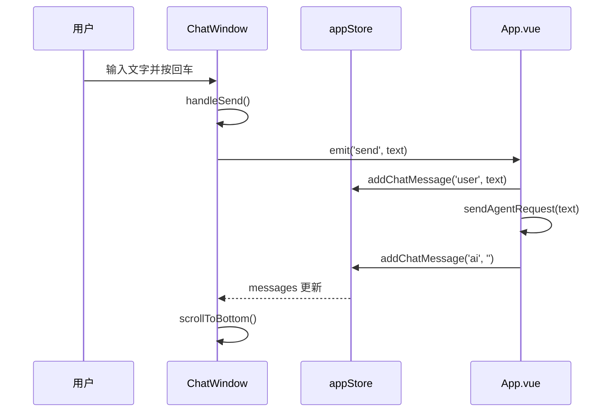

# F03 - 聊天窗口组件

## 模块名称
`frontend/src/components/ChatWindow.vue`

---

## 职责描述

`ChatWindow.vue` 是婉晴AI前端应用的**对话交互组件**，负责：

1. **消息展示**：以聊天气泡形式渲染用户和AI的对话历史
2. **用户输入**：提供文本输入框，支持回车发送消息
3. **自动滚动**：新消息出现时自动滚动到底部
4. **连接状态指示**：显示WebSocket连接状态（在线/离线）
5. **主题适配**：支持深色/浅色主题的样式切换

---

## 输入与输出

### Props

| 属性名 | 类型 | 默认值 | 描述 |
|--------|------|--------|------|
| `messages` | `Array` | 必填 | 消息列表，每项 `{role: 'user'|'ai', text: string}` |
| `isConnected` | `Boolean` | `true` | WebSocket连接状态 |
| `theme` | `String` | `'dark'` | 主题：'dark' / 'light' |

### 事件

| 事件名 | 参数 | 描述 |
|--------|------|------|
| `@send` | `text: string` | 用户点击发送按钮或按回车时触发 |

---

## 核心代码结构

### 模板结构

```vue
<template>
  <div class="chat-window">
    <!-- 顶部状态栏 -->
    <div class="header">
      <div class="status-indicator" :class="isConnected ? 'online' : 'offline'"></div>
      <span>Wanqing Live</span>
    </div>

    <!-- 消息列表 -->
    <div ref="chatContainer" class="messages">
      <div v-for="(msg, index) in messages" :key="index" 
           class="message" :class="msg.role">
        
        <div class="bubble">{{ msg.text }}</div>
      </div>
    </div>

    <!-- 输入区域 -->
    <div class="input-area">
      <textarea v-model="inputMsg" @keydown.enter.prevent="handleSend" />
      <button @click="handleSend" :disabled="!inputMsg.trim()">
        <svg>发送图标</svg>
      </button>
    </div>
  </div>
</template>
```

### 关键函数

| 函数名 | 作用 |
|--------|------|
| `handleSend()` | 处理发送逻辑，校验后emit事件 |
| `scrollToBottom()` | 自动滚动到聊天底部 |
| `handleImgError()` | 头像加载失败时的兜底处理 |

### 关键实现

#### 1. 发送处理

```javascript
const handleSend = () => {
  if (!inputMsg.value.trim()) return
  emit('send', inputMsg.value)  // 触发父组件事件
  inputMsg.value = ''  // 清空输入框
}
```

#### 2. 自动滚动

```javascript
const scrollToBottom = () => {
  nextTick(() => {
    if (chatContainer.value) {
      chatContainer.value.scrollTop = chatContainer.value.scrollHeight
    }
  })
}

// 监听消息变化自动滚动
watch(() => props.messages, () => {
  scrollToBottom()
}, { deep: true })
```

#### 3. 回车发送（Shift+Enter换行）

```html
<textarea
  v-model="inputMsg"
  @keydown.enter.prevent="handleSend"
  placeholder="与婉晴对话..."
></textarea>
```

---

## 数据流示例



---

## 样式设计

### 气泡样式

```css
/* 用户消息 - 右对齐，青色背景 */
.message.user {
  flex-direction: row-reverse;
}
.message.user .bubble {
  background: rgba(6, 182, 212, 0.8); /* cyan-600 */
  color: white;
  border-radius: 1rem 1rem 0.25rem 1rem;
}

/* AI消息 - 左对齐，半透明背景 */
.message.ai .bubble {
  background: rgba(255, 255, 255, 0.1); /* 暗色主题 */
  border: 1px solid rgba(255, 255, 255, 0.05);
  border-radius: 1rem 1rem 1rem 0.25rem;
}
```

### 头像映射

```javascript
const avatarSrc = (role) => {
  return role === 'user' 
    ? '/portraits/user_avatar.png' 
    : '/portraits/ai_avatar.png'
}
```

---

## 配置与环境依赖

| 依赖项 | 说明 |
|--------|------|
| Vue 3 | Composition API |
| Pinia | 状态管理（由父组件使用） |

---

## 常见问题与调试

### Q1: 输入框无法输入
**症状**：输入文字后立即被清空。

**排查步骤**：
1. 检查`v-model`绑定是否正确
2. 确认`handleSend`没有异常抛出

### Q2: 消息不自动滚动
**症状**：新消息出现后需要手动滚动。

**排查步骤**：
1. 检查`chatContainer`的`ref`是否正确
2. 确认`scrollToBottom`中的条件判断
3. 检查CSS是否限制了滚动

### Q3: 头像不显示
**症状**：消息气泡旁没有头像图片。

**排查步骤**：
1. 检查头像文件路径是否正确
2. 查看浏览器控制台是否有404错误
3. `handleImgError`兜底逻辑是否生效

### Q4: 回车发送失效
**症状**：按回车后没有触发发送。

**排查步骤**：
1. 确认`@keydown.enter.prevent`绑定了正确的处理函数
2. 检查是否有其他事件冒泡阻止

### Q5: 浅色主题样式异常
**症状**：切换到浅色模式后气泡颜色不协调。

**排查步骤**：
1. 检查`theme` props是否正确传递
2. 确认CSS类绑定逻辑正确
3. 验证Tailwind主题变量是否生效

---

## 相关文件

| 文件 | 关系 |
|------|------|
| `frontend/src/App.vue` | 父组件，传递props和监听事件 |
| `frontend/src/store/appStore.js` | 提供chatHistory等状态 |
| `frontend/public/portraits/user_avatar.png` | 用户头像资源 |
| `frontend/public/portraits/ai_avatar.png` | AI头像资源 |
