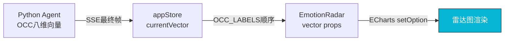

# F04 - 情绪雷达图组件

## 模块名称
`frontend/src/components/EmotionRadar.vue`

---

## 职责描述

`EmotionRadar.vue` 是婉晴AI前端应用的**情感可视化组件**，使用ECharts库渲染OCC八维情感雷达图，实时反映婉晴的内心情感状态。

**OCC模型简介**：OCC（Ortony-Clore-Collins）模型是心理学中经典的情感分类模型，将情感分为8个基本维度：
- **喜悦** (Joy) - 正向愉悦情绪
- **悲伤** (Sadness) - 失落、无助情绪
- **愤怒** (Anger) - 挫败、被冒犯情绪
- **恐惧** (Fear) - 担忧、不安全感
- **厌恶** (Disgust) - 排斥、反感
- **惊讶** (Surprise) - 意外、震惊
- **踏实感** (Well-grounding) - 平静、安全、被支持
- **期待** (Anticipation) - 对未来的预期

---

## 输入与输出

### Props

| 属性名 | 类型 | 默认值 | 描述 |
|--------|------|--------|------|
| `vector` | `Array` | `[0,0,0,0,0,0,0,0]` | OCC八维情感向量（0~1范围） |
| `labels` | `Array` | 见下方 | 轴标签名称 |
| `theme` | `String` | `'dark'` | 主题：'dark' / 'light' |

### 默认标签顺序

```javascript
const DEFAULT_LABELS = [
  "喜悦", "悲伤", "愤怒", "恐惧", 
  "厌恶", "惊讶", "踏实感", "期待"
]
```

---

## 核心代码结构

### ECharts配置

```javascript
const option = {
  backgroundColor: 'transparent',
  radar: {
    center: ['50%', '55%'],
    radius: '65%',
    indicator: props.labels.map(name => ({ name, max: 1 })),
    shape: 'circle',  // 圆形雷达图
    splitNumber: 4,
    axisName: { color: axisColor.value, fontSize: 10 },
    splitLine: { lineStyle: { color: splitLineColors.value } },
    splitArea: { show: false },
    axisLine: { lineStyle: { color: lineColor.value } }
  },
  series: [{
    type: 'radar',
    data: [{ value: props.vector }],
    symbol: 'none',
    lineStyle: { width: 2, color: lineStyleColor.value },
    areaStyle: {
      color: new echarts.graphic.LinearGradient(0, 0, 0, 1, [
        { offset: 0, color: areaColor0.value },
        { offset: 1, color: areaColor1.value }
      ])
    }
  }]
}
```

### 主题颜色映射

| 主题 | 文字颜色 | 分隔线颜色 | 填充色 |
|------|----------|------------|--------|
| `dark` | `#94a3b8` (slate-400) | `rgba(255,255,255,0.1)` | 青-透明渐变 |
| `light` | `#64748b` (slate-500) | `rgba(0,0,0,0.15)` | 青-透明渐变（更浅） |

---

## 关键实现细节

### 1. 图表初始化

```javascript
const initChart = () => {
  if (!radarChartRef.value) return
  myChart = echarts.init(radarChartRef.value)
  updateChartOption()
  
  // 监听窗口大小变化
  window.addEventListener('resize', handleResize)
}
```

### 2. 数据响应式更新

```javascript
watch(() => [props.vector, props.theme], () => {
  updateChartOption()
}, { deep: true })

const updateChartOption = () => {
  if (!myChart) return
  myChart.setOption({
    radar: {
      indicator: props.labels.map(name => ({ name, max: 1 }))
    },
    series: [{
      data: [{ value: props.vector }]
    }]
  }, { replaceMerge: ['series'] })
}
```

### 3. 资源清理

```javascript
onUnmounted(() => {
  window.removeEventListener('resize', handleResize)
  if (myChart) {
    myChart.dispose()  // 释放ECharts实例
  }
})
```

---

## 数据流示例



### 向量数据示例

```javascript
// 从appStore获取的向量
const vector = [0.8, 0.2, 0.1, 0.1, 0.0, 0.1, 0.6, 0.3]

// 含义
// 喜悦: 0.8 (高)
// 悲伤: 0.2 (低)
// 愤怒: 0.1 (低)
// 恐惧: 0.1 (低)
// 厌恶: 0.0 (无)
// 惊讶: 0.1 (低)
// 踏实感: 0.6 (中高)
// 期待: 0.3 (中低)
```

---

## 视觉设计

### 雷达图外观

```
         喜悦
          /\
         /  \
        /    \
       /      \
踏实感----------惊讶
       \      /
        \    /
         \  /
          \/
      愤怒\/恐惧
         /\
        /  \
       /    \
      厌恶----悲伤
           期待
```

### 动态效果
- **面积填充**：半透明渐变，从中心向外延伸
- **连线**：2px宽度，圆润颜色
- **响应式**：窗口大小变化时自动调整尺寸

---

## 配置与环境依赖

| 依赖项 | 说明 |
|--------|------|
| Vue 3 | 组件框架 |
| ECharts | 图表库，通过npm安装 |
| appStore | 提供`currentVector`状态 |

### ECharts按需引入（优化）

```javascript
import * as echarts from 'echarts'
// 完整导入，生产环境建议按需导入
// import { RadarChart } from 'echarts/charts'
// import { GridComponent } from 'echarts/components'
```

---

## 常见问题与调试

### Q1: 雷达图显示为空白
**症状**：组件挂载但没有看到雷达图。

**排查步骤**：
1. 检查父组件是否正确传递`vector` prop
2. 确认ECharts是否正确加载
3. 检查DOM元素是否有高度/宽度

### Q2: 向量数据与雷达图不匹配
**症状**：雷达图形状与预期不符。

**原因**：`vector`数组顺序与`labels`不一致

**解决方案**：
- 确认`OCC_LABELS`顺序为：`喜悦,悲伤,愤怒,恐惧,厌恶,惊讶,踏实感,期待`
- 向量数组必须严格按此顺序

### Q3: 主题切换后颜色不变
**症状**：切换主题后雷达图颜色保持不变。

**排查步骤**：
1. 检查`watch`是否正确监听`props.theme`
2. 确认计算属性`axisColor`等是否正确响应
3. `setOption`是否传入完整配置（包含颜色）

### Q4: 数据更新但图表不刷新
**症状**：`vector`变化但雷达图无更新。

**排查步骤**：
1. 使用`{ replaceMerge: ['series'] }`强制替换数据
2. 检查`watch`的`deep`选项是否启用

### Q5: 图表性能问题
**症状**：雷达图更新时出现卡顿。

**优化建议**：
1. 使用`throttle`限制更新频率
2. 考虑使用`markRaw`标记ECharts实例
3. 减少`setOption`调用次数

---

## 相关文件

| 文件 | 关系 |
|------|------|
| `frontend/src/App.vue` | 父组件，传递`currentVector` |
| `frontend/src/store/appStore.js` | 提供`OCC_LABELS`和`currentVector` |
| `Agent/src/agent/nodes/fuse_emotion.py` | 后端生成OCC向量 |
| `Agent/src/models/schemas.py` | EmotionVector数据结构定义 |
