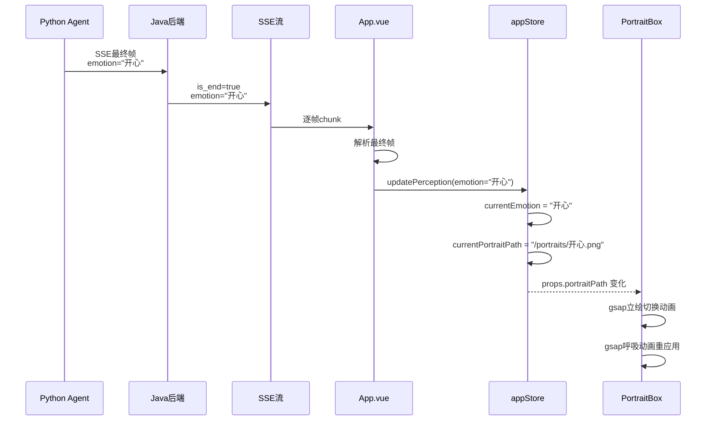

# F05 - AI立绘组件

## 模块名称
`frontend/src/components/PortraitBox.vue`

---

## 职责描述

`PortraitBox.vue` 是婉晴AI前端应用的**角色立绘展示组件**，负责：

1. **立绘渲染**：根据当前情绪状态显示对应的婉晴立绘图片
2. **情绪切换**：当情绪变化时，优雅地切换到新的立绘
3. **呼吸动画**：通过GSAP实现轻柔的浮动呼吸效果，增强角色的"生命力"
4. **状态标签**：显示当前情绪状态和行为描述
5. **主题适配**：支持深色/浅色主题的样式切换

---

## 输入与输出

### Props

| 属性名 | 类型 | 默认值 | 描述 |
|--------|------|--------|------|
| `portraitPath` | `String` | 必填 | 立绘图片资源路径 |
| `emotion` | `String` | `'平静'` | 当前情绪标签 |
| `behavior` | `String` | `'初始化中...'` | 当前行为描述 |
| `intensity` | `Number` | `0.2` | 情绪强度（0~1），影响呼吸动画速度 |
| `theme` | `String` | `'dark'` | 主题：'dark' / 'light' |

---

## 核心代码结构

### 模板结构

```vue
<template>
  <div ref="portraitCardRef" class="portrait-container">
    <!-- 立绘图片 -->
    

    <!-- 状态标签 -->
    <div class="status-tags">
      <div class="tag">
        <div class="status-dot"></div>
        <span>状态: {{ emotion }}</span>
      </div>
      <div class="tag">
        <div class="info-dot"></div>
        <span>行为: {{ behavior }}</span>
      </div>
    </div>
  </div>
</template>
```

### 关键函数

| 函数名 | 作用 |
|--------|------|
| `applyBreathMotion()` | 应用呼吸浮动动画 |
| `watch portraitPath` | 监听立绘切换，触发动画效果 |

---

## 关键实现细节

### 1. 立绘切换动画

```javascript
watch(() => props.portraitPath, (newVal) => {
  if (!imgRef.value) return
  
  // 先淡出并稍微缩小
  gsap.to(imgRef.value, {
    duration: 0.3,
    opacity: 0,
    scale: 0.95,
    ease: 'power2.in',
    onComplete: () => {
      // 淡入并恢复大小
      // (portraitPath已响应式更新)
      gsap.to(imgRef.value, {
        duration: 0.6,
        opacity: 1,
        scale: 1,
        ease: 'back.out(1.4)'  // 带回弹效果
      })
    }
  })
})
```

**动画时序**：
```
0ms ─────────────────────────────── 300ms ─────────────────────────────── 900ms
      ↓
  淡出缩小 (opacity:1→0, scale:1→0.95)
                                     ↓
                              portraitPath 更新
                                     ↓
                           淡入恢复 (opacity:0→1, scale:0.95→1)
```

### 2. 呼吸浮动动画 (BreathMotion)

```javascript
const applyBreathMotion = () => {
  if (!portraitCardRef.value) return
  
  gsap.killTweensOf(portraitCardRef.value)
  
  const t = props.intensity
  // 强度越高，浮动越快、幅度越大
  const floatDuration = 4.0 - (t * 2.0)    // 0.2→3.6秒, 0.8→2.4秒
  const floatY = 4 + (t * 8)              // 0.2→5.6px, 0.8→10.4px
  
  gsap.to(portraitCardRef.value, {
    duration: Math.max(0.5, floatDuration),
    y: -floatY,  // 向上浮动
    yoyo: true,   // 来回浮动
    repeat: -1,  // 无限循环
    ease: 'sine.inOut'
  })
}

// 监听强度变化，重新应用动画
watch(() => props.intensity, () => {
  applyBreathMotion()
})
```

**动画效果**：
- 情绪强度高（如愤怒、焦虑）→ 浮动快、幅度大 → 表现不安
- 情绪强度低（如平静、满足）→ 浮动慢、幅度小 → 表现稳定

### 3. 状态标签设计

```css
/* 状态标签容器 */
.status-tags {
  position: absolute;
  top: 1rem;
  left: 1rem;
  padding: 0.5rem 0.75rem;
  border-radius: 9999px;
  backdrop-filter: blur(12px);
}

/* 状态点 */
.status-dot {
  width: 6px;
  height: 6px;
  border-radius: 50%;
  background: #22d3ee; /* cyan-400 */
  animation: pulse 2s infinite;
}
```

---

## 立绘资源映射

立绘切换由父组件`appStore`的`currentPortraitPath`计算属性决定：

| 情绪 | 立绘路径 |
|------|----------|
| 开心/喜悦 | `/portraits/开心.png` |
| 生气/愤怒 | `/portraits/生气.png` |
| 悲伤/无奈 | `/portraits/无奈.png` |
| 焦虑/恐惧 | `/portraits/害怕.png` |
| 惊讶 | `/portraits/惊讶.png` |
| 好奇 | `/portraits/好奇.png` |
| 害羞 | `/portraits/害羞.png` |
| 其他 | `/portraits/正常.png` |

---

## 数据流示例



---

## 视觉设计

### 深色主题

```css
.portrait-container {
  background: rgba(255, 255, 255, 0.05);
  border: 1px solid rgba(255, 255, 255, 0.1);
}

.portrait-image {
  filter: drop-shadow(0 0 20px rgba(255, 255, 255, 0.1));
}
```

### 浅色主题

```css
.portrait-container {
  background: rgba(255, 255, 255, 0.5);
  border: 1px solid rgba(0, 0, 0, 0.1);
}

.portrait-image {
  filter: drop-shadow(0 0 20px rgba(0, 0, 0, 0.1));
}
```

---

## 配置与环境依赖

| 依赖项 | 说明 |
|--------|------|
| Vue 3 | 组件框架 |
| GSAP | 动画库（npm安装） |
| appStore | 提供立绘路径计算 |

### 立绘资源目录
```
frontend/public/portraits/
├── 开心.png
├── 生气.png
├── 无奈.png
├── 害怕.png
├── 惊讶.png
├── 好奇.png
├── 害羞.png
└── 正常.png
```

---

## 常见问题与调试

### Q1: 立绘切换动画不执行
**症状**：情绪变化但立绘直接切换，没有动画效果。

**排查步骤**：
1. 检查`imgRef`是否正确绑定
2. 确认`gsap`是否正确加载
3. 检查控制台是否有JavaScript错误

### Q2: 呼吸动画停止
**症状**：立绘不再浮动。

**排查步骤**：
1. 检查`portraitCardRef`是否存在
2. 确认`gsap.killTweensOf`没有误删动画
3. 检查`intensity`是否变为0

### Q3: 立绘图片加载失败
**症状**：立绘区域显示空白或错误图标。

**排查步骤**：
1. 检查`portraitPath`路径是否正确
2. 确认图片文件是否存在于`public/portraits/`目录
3. 检查浏览器控制台是否有404错误

### Q4: 动画性能问题
**症状**：动画卡顿或CPU占用高。

**优化建议**：
1. 使用`will-change: transform`优化动画性能
2. 限制`intensity`更新频率
3. 确保使用`gsap.killTweensOf`清理旧动画

### Q5: 浅色主题下立绘对比度低
**症状**：浅色模式下立绘看不清楚。

**排查步骤**：
1. 检查`drop-shadow`是否正确应用
2. 考虑增加立绘背景的对比度
3. 调整`filter`参数

---

## 相关文件

| 文件 | 关系 |
|------|------|
| `frontend/src/App.vue` | 父组件，传递props |
| `frontend/src/store/appStore.js` | 提供`currentPortraitPath`计算 |
| `frontend/public/portraits/*.png` | 立绘图片资源 |
| `Agent/src/agent/nodes/fuse_emotion.py` | 后端生成情绪判断 |
