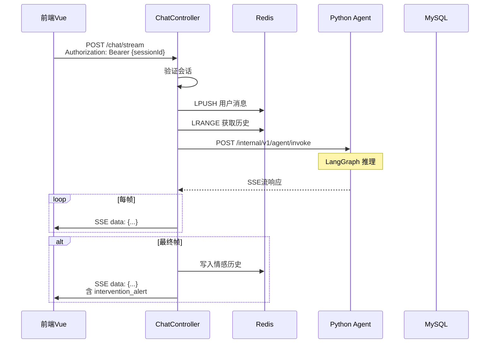

# J01 - Java SSE聊天控制器

## 模块名称

`backend/src/main/java/com/wanqing/ai/controller/ChatController.java`

---

## 职责描述

`ChatController` 是婉晴AI Java后端的**SSE聊天核心控制器**，承担以下职责：

1. **接收前端请求**：接收前端发起的流式聊天请求
2. **会话验证**：验证会话ID是否有效
3. **对话历史管理**：将用户消息写入Redis对话历史
4. **Agent调用**：将请求转发给Python Agent引擎
5. **SSE流透传**：将Python Agent的SSE响应实时透传给前端
6. **情感历史写入**：流结束时将情感向量写入Redis
7. **干预弹窗注入**：在SSE最终帧注入干预弹窗信息

---

## 输入与输出

### 请求格式

**接口**：`POST /api/v1/chat/stream`

**Header**：
- `Authorization`: `Bearer {sessionId}` - 会话ID

**Body**：
```json
{
  "message": "用户输入的文字"
}
```

### 响应格式

**Content-Type**：`text/event-stream`

**数据帧**：
```json
// 非末帧
{"chunk": "婉", "is_end": false}

// 末帧
{
  "chunk": "晴",
  "is_end": true,
  "reply": "完整回复",
  "vector": {"喜悦": 0.8, "悲伤": 0.2, ...},
  "action": "subtle",
  "urgency": "low",
  "ui_action": {"color": "neutral", "pulse": "slow"},
  "intervention_alert": {
    "show_popup": false,
    "urgency": "low",
    "message": "婉晴在这里，随时愿意倾听。"
  }
}
```

---

## 核心代码结构

### 依赖注入

```java
@RequiredArgsConstructor
public class ChatController {
    private final AgentClient agentClient;           // Agent通信客户端
    private final SessionService sessionService;      // 会话管理
    private final EmotionHistoryService emotionHistoryService;  // 情感历史
    private final FeedbackService feedbackService;     // 反馈服务
    private final ObjectMapper objectMapper;         // JSON序列化
    private final StringRedisTemplate redisTemplate;  // Redis操作
}
```

### 主入口方法

```java
@PostMapping(value = "/stream", produces = MediaType.TEXT_EVENT_STREAM_VALUE)
public ResponseEntity<ResponseBodyEmitter> chatStream(
        @RequestHeader(value = "Authorization") String sessionId,
        @RequestBody ChatMessageReq request) {
    // 1. 解析sessionId
    final String realSessionId = sessionId.trim().startsWith("Bearer ")
        ? sessionId.substring(7).trim() : sessionId.trim();
    
    // 2. 验证会话
    UserSession session = sessionService.getSessionById(realSessionId);
    if (session == null) return ResponseEntity.notFound().build();
    
    // 3. 创建SSE Emitter（5分钟超时）
    SseEmitter emitter = new SseEmitter(5 * 60 * 1000L);
    
    // 4. 异步执行Agent调用
    sseExecutor.submit(() -> {
        try {
            // ... 写入Redis历史、调用Agent、处理SSE流
        } catch (Exception e) {
            emitter.completeWithError(e);
        }
    });
    
    return ResponseEntity.ok().body(emitter);
}
```

---

## 关键实现细节

### 1. Redis对话历史管理

```java
// 1. 写入用户消息到Redis
String historyKey = "session:" + realSessionId + ":history";
Map<String, Object> userMsg = new HashMap<>();
userMsg.put("role", "user");
userMsg.put("content", request.getMessage());
userMsg.put("timestamp", System.currentTimeMillis());
redisTemplate.opsForList().leftPush(historyKey, msgJson);

// 限制历史长度（保留最新20条）
redisTemplate.opsForList().trim(historyKey, 0, 19);

// 2. 读取完整对话历史
List<String> rawHistory = redisTemplate.opsForList().range(historyKey, 0, -1);
Collections.reverse(rawHistory); // 转为时间正序
```

### 2. Agent SSE流处理

```java
agentClient.callAgentStream(agentReq)
    .doOnNext(resp -> {
        // 发送SSE事件
        String jsonData = objectMapper.writeValueAsString(resp);
        emitter.send(SseEmitter.event()
            .name("message")
            .data(jsonData));
        
        // 3. 流结束时写入情感历史
        if (Boolean.TRUE.equals(resp.getIsEnd()) && resp.getVector() != null) {
            long now = System.currentTimeMillis();
            // 提取主要情绪
            String primaryEmotion = resp.getVector().entrySet().stream()
                .max(Map.Entry.comparingByValue())
                .map(Map.Entry::getKey)
                .orElse("中性");
            // 写入Redis
            emotionHistoryService.appendEmotionHistory(realSessionId, emotionEntry);
        }
    })
    .doOnComplete(() -> {
        emitter.send(SseEmitter.event().name("end").comment("婉晴回复完毕"));
        emitter.complete();
    })
    .subscribe();
```

### 3. 干预弹窗注入

```java
if (Boolean.TRUE.equals(resp.getIsEnd()) && resp.getUrgency() != null) {
    String action = resp.getAction();
    String urgency = resp.getUrgency();
    boolean isSilentAction = "silent".equalsIgnoreCase(action);
    boolean shouldPopup = !isSilentAction && !"low".equalsIgnoreCase(urgency);
    
    // 构造干预弹窗响应
    AgentInvokeResp alertResp = AgentInvokeResp.builder()
        .chunk(resp.getChunk())
        .isEnd(resp.getIsEnd())
        .reply(resp.getReply())
        .vector(resp.getVector())
        .action(resp.getAction())
        .urgency(resp.getUrgency())
        .interventionAlert(AgentInvokeResp.InterventionAlert.builder()
            .showPopup(shouldPopup)
            .urgency(urgency)
            .message(_generatePopupMessage(urgency, resp.getReply()))
            .build())
        .build();
    
    emitter.send(SseEmitter.event()
        .name("message")
        .data(objectMapper.writeValueAsString(alertResp)));
}
```

---

## 数据流示例



---

## 配置与环境依赖

| 配置项 | 说明 |
|--------|------|
| `agent.engine.url` | Python Agent地址，默认`http://localhost:8001` |
| `agent.engine.timeout` | SSE请求超时，默认60秒 |
| MySQL | 存储UserSession会话信息 |
| Redis | 存储对话历史、情感历史 |

---

## 常见问题与调试

### Q1: SSE连接超时
**症状**：前端等待很久后收到超时错误。

**排查步骤**：
1. 检查`agent.engine.timeout`配置
2. 检查Python Agent是否卡死
3. 检查DeepSeek API响应时间

### Q2: 对话历史丢失
**症状**：Agent回复时没有上下文。

**排查步骤**：
1. 检查Redis连接是否正常
2. 确认`lrpush`和`ltrim`操作是否成功
3. 检查历史列表长度限制

### Q3: 情感历史未写入
**症状**：Redis中没有情感历史记录。

**排查步骤**：
1. 检查`EmotionHistoryService`实现
2. 确认`is_end`判断逻辑
3. 检查`appendEmotionHistory`方法

### Q4: 干预弹窗不触发
**症状**：`intervention_alert`为空或不显示。

**排查步骤**：
1. 检查Python Agent返回的`urgency`
2. 确认`suggested_action`不为`silent`
3. 验证前端`intervention_alert`解析逻辑

---

## 相关文件

| 文件 | 关系 |
|------|------|
| `AgentClient.java` | 调用Python Agent的客户端 |
| `SessionService.java` | 会话管理服务 |
| `EmotionHistoryService.java` | 情感历史服务 |
| `AgentInvokeReq.java` | 请求DTO |
| `AgentInvokeResp.java` | 响应DTO |
