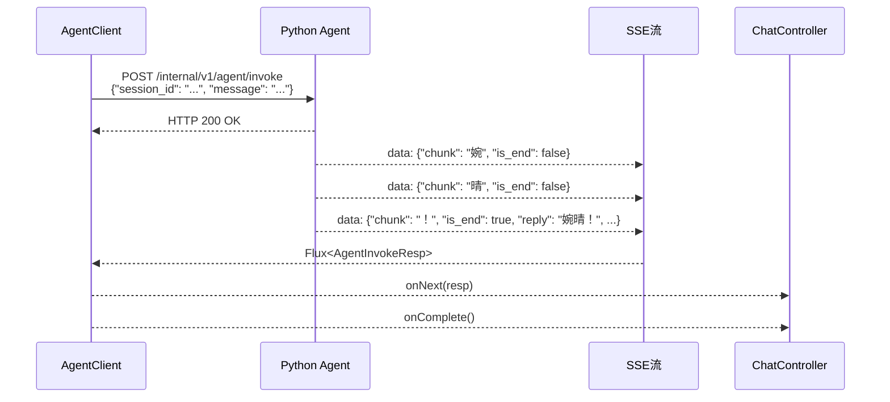

# J02 - Agent客户端

## 模块名称

`backend/src/main/java/com/wanqing/ai/client/AgentClient.java`

---

## 职责描述

`AgentClient` 是Java后端与Python Agent引擎通信的专用客户端，核心职责包括：

1. **HTTP连接管理**：与Python Agent服务建立HTTP连接
2. **SSE流解析**：解析Python返回的Server-Sent Events流
3. **请求转发**：将Java DTO转换为Python可识别的JSON格式
4. **响应转换**：将Python的SSE帧反序列化为Java DTO
5. **错误处理**：支持超时、重试、降级等错误处理机制

---

## 核心设计

### 通信协议

- **协议**：HTTP POST + SSE (Server-Sent Events)
- **URL**：`POST http://localhost:8001/internal/v1/agent/invoke`
- **格式**：每帧为`data: {json}\n\n`格式

### SSE解析流程

```java
// 1. 建立WebClient
WebClient webClient = WebClient.builder()
    .baseUrl(agentEngineUrl)
    .defaultHeader("Accept", "text/event-stream")
    .build();

// 2. 发起POST请求并获取SSE流
webClient.post()
    .uri("/internal/v1/agent/invoke")
    .contentType(MediaType.APPLICATION_JSON)
    .bodyValue(request)
    .exchangeToFlux(clientResponse -> {
        // 返回String类型的SSE流
        return clientResponse.bodyToFlux(String.class);
    })
    // 3. 过滤和解析SSE帧
    .filter(line -> line != null && !line.trim().isEmpty())
    .map(line -> {
        // 去掉 "data: " 前缀
        String jsonStr = line.trim();
        if (jsonStr.startsWith("data: ")) {
            jsonStr = jsonStr.substring("data: ".length()).trim();
        } else if (jsonStr.startsWith("data:")) {
            jsonStr = jsonStr.substring("data:".length()).trim();
        }
        // JSON反序列化
        return objectMapper.readValue(jsonStr, AgentInvokeResp.class);
    })
```

### 关键配置

```java
@Value("${agent.engine.url:http://localhost:8001}")
private String agentEngineUrl;

@Value("${agent.engine.timeout:60}")
private int agentTimeout;
```

---

## 输入与输出

### 请求格式

```java
public Flux<AgentInvokeResp> callAgentStream(AgentInvokeReq request)
```

### 响应格式

```java
public class AgentInvokeResp {
    private String chunk;              // 单个字符
    private Boolean isEnd;            // 是否末帧
    private String reply;             // 完整回复
    private Map<String, Double> vector;  // OCC八维向量
    private String action;             // 干预动作
    private String urgency;            // 紧急程度
    private Map<String, Object> uiAction; // UI指令
    private InterventionAlert interventionAlert; // 干预弹窗
}
```

---

## 关键实现细节

### 1. SSE帧解析

```java
.map(line -> {
    String jsonStr = line.trim();
    // 兼容 "data: " 和 "data:" 两种格式
    if (jsonStr.startsWith("data: ")) {
        jsonStr = jsonStr.substring("data: ".length()).trim();
    } else if (jsonStr.startsWith("data:")) {
        jsonStr = jsonStr.substring("data:".length()).trim();
    }
    if (jsonStr.isEmpty()) {
        return null;
    }
    try {
        AgentInvokeResp resp = objectMapper.readValue(jsonStr, AgentInvokeResp.class);
        log.debug("Chunk: '{}' | is_end={}", resp.getChunk(), resp.getIsEnd());
        return resp;
    } catch (Exception e) {
        log.warn("SSE JSON解析失败，跳过该帧: {}", e.getMessage());
        return null;
    }
})
.filter(resp -> resp != null)
```

### 2. 重试机制

```java
.retryWhen(Retry.backoff(2, Duration.ofSeconds(1))
    .filter(ex -> ex instanceof WebClientResponseException
            || ex instanceof ConnectException
            || ex instanceof SocketTimeoutException)
    .doBeforeRetry(signal -> log.warn(
        "Agent连接失败（第{}次重试）: {}",
        signal.totalRetries() + 1,
        signal.failure().getMessage())))
```

### 3. 降级处理

```java
.onErrorResume(ex -> {
    log.error("Agent调用最终失败（已重试2次），返回降级响应");
    AgentInvokeResp fallback = AgentInvokeResp.builder()
        .isEnd(true)
        .reply("婉晴暂时无法回复（Agent服务不可用），请稍后重试。")
        .build();
    return Flux.just(fallback);
})
```

---

## 数据流示例



---

## 配置与环境依赖

| 配置项 | 说明 |
|--------|------|
| `agent.engine.url` | Python Agent服务地址，默认`http://localhost:8001` |
| `agent.engine.timeout` | SSE单次请求超时，默认60秒 |
| Spring WebFlux | 响应式HTTP客户端（WebClient） |

---

## 常见问题与调试

### Q1: 连接被拒绝
**症状**：`ConnectException`或返回降级响应。

**排查步骤**：
1. 检查Python Agent是否启动：`curl http://localhost:8001/health`
2. 检查端口是否正确
3. 检查防火墙设置

### Q2: SSE解析失败
**症状**：部分帧被跳过，日志显示"JSON解析失败"。

**排查步骤**：
1. 检查Python Agent输出的SSE格式
2. 确认`data:`前缀后有空格还是无空格
3. 查看原始SSE行内容

### Q3: 请求超时
**症状**：`SocketTimeoutException`。

**排查步骤**：
1. 增加`agent.engine.timeout`配置
2. 检查DeepSeek API响应速度
3. 检查网络延迟

### Q4: 重试风暴
**症状**：连续重试多次导致系统压力。

**解决方案**：
1. 配置最大重试次数（当前为2次）
2. 使用指数退避策略
3. 考虑熔断机制

---

## 相关文件

| 文件 | 关系 |
|------|------|
| `ChatController.java` | 主要调用方 |
| `AgentInvokeReq.java` | 请求DTO |
| `AgentInvokeResp.java` | 响应DTO |
| `Agent/src/main.py` | Python Agent服务入口 |
