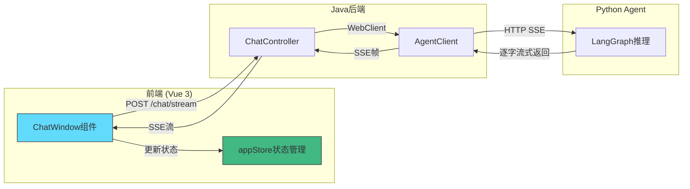
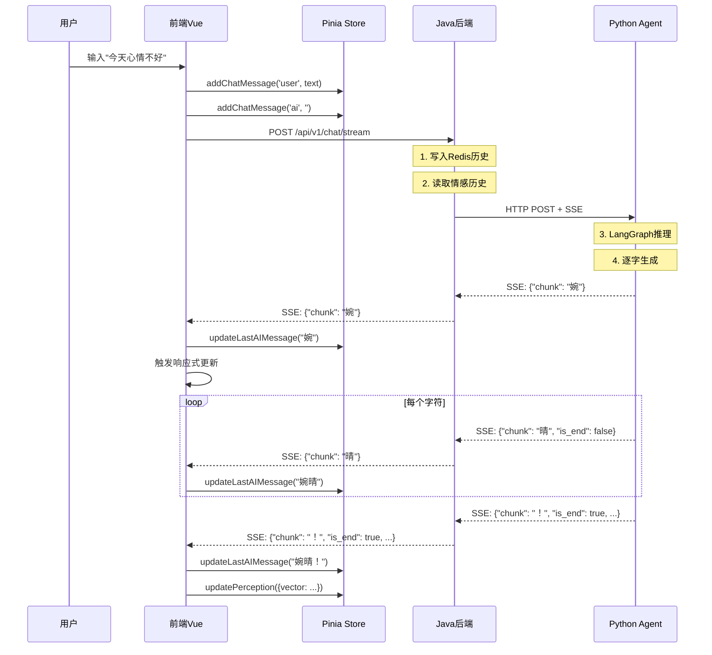

# T01 - 前端聊天组件：Vue3 + SSE流式渲染实战

---

## 1. 模块概览

### 1.1 一句话定义

前端聊天组件负责**接收用户的文字输入，并通过SSE（Server-Sent Events）接收来自后端的流式响应，实现逐字显示的打字机效果**。

### 1.2 在系统中的位置



### 1.3 解决的核心问题

1. **实时性**：传统HTTP请求需要等待完整响应，SSE实现服务端推送
2. **流式渲染**：AI回复逐字显示，提升用户体验
3. **状态同步**：聊天历史、打字状态、连接状态统一管理

---

## 2. 技术原理与设计思想

### 2.1 SSE vs WebSocket：为什么选择SSE？

| 特性 | SSE (Server-Sent Events) | WebSocket |
|------|--------------------------|-----------|
| 方向 | 单向（服务端→客户端） | 双向 |
| 复杂度 | 简单 | 复杂 |
| HTTP兼容 | 是，可穿透防火墙 | 否，需要特殊协议 |
| 自动重连 | 浏览器原生支持 | 需要手动实现 |
| 适用场景 | **实时推送、消息流** | 双向交互、游戏 |

**本项目选择SSE的原因**：
- 对话请求是**请求-响应模式**，前端只需接收流
- WebSocket更适合需要双向通信的场景（如感知数据推送，使用WebSocket）
- SSE更简单，HTTP兼容性好，易于调试

### 2.2 Fetch API + Stream：新一代SSE方案

传统SSE使用`EventSource` API，但有以下限制：
- 只能访问GET请求
- 难以发送POST请求（对话需要发送用户消息）
- 无法取消请求

婉晴AI使用**Fetch API + ReadableStream**方案：

```javascript
// 核心代码结构
const response = await fetch(url, {
    method: 'POST',
    headers: { 'Content-Type': 'application/json' },
    body: JSON.stringify({ message: userText })
})

// 获取流式响应体
const reader = response.body.getReader()
const decoder = new TextDecoder()

while (true) {
    const { done, value } = await reader.read()
    if (done) break
    
    // value 是 Uint8Array，需要解码
    const chunk = decoder.decode(value, { stream: true })
    // 处理 chunk...
}
```

### 2.3 SSE帧格式解析

服务端返回的SSE格式：
```
data: {"chunk": "婉", "is_end": false}
data: {"chunk": "晴", "is_end": false}
data: {"chunk": "！", "is_end": true, "reply": "婉晴！", ...}
```

前端需要解析：
1. 去掉`data: `前缀
2. JSON.parse解析
3. 提取`chunk`字段进行渲染

### 2.4 流式渲染的核心问题

**问题**：如何实现逐字渲染？

**方案**：累积字符 + 局部更新

```javascript
let accumulatedReply = ''  // 累积器

// 收到每个chunk
if (payload.chunk) {
    accumulatedReply += payload.chunk
    // 只更新最后一条AI消息的内容
    appStore.updateLastAIMessage(accumulatedReply)
}
```

**关键洞察**：
- 不是创建多个消息，而是**复用同一条消息，不断更新其内容**
- 这样可以保证DOM节点稳定，避免大量重排/重绘

---

## 3. 关键代码解析

### 3.1 核心文件结构

```
frontend/src/
├── App.vue                    # 主入口，持有SSE逻辑
├── store/
│   └── appStore.js           # 状态管理
└── components/
    └── ChatWindow.vue        # 聊天UI组件
```

### 3.2 SSE请求发起（App.vue）

```javascript
// ======== 关键代码1：SSE请求发起 ========

const _fetchAgentSSE = async (url, sessionId, userMessage, signal) => {
    let accumulatedReply = ''  // 累积回复

    try {
        const response = await fetch(url, {
            method: 'POST',
            headers: {
                'Content-Type': 'application/json',
                'Authorization': 'Bearer ' + sessionId  // Session ID放Header
            },
            body: JSON.stringify({ message: userMessage }),
            signal  // 可取消的AbortSignal
        })

        const reader = response.body.getReader()
        const decoder = new TextDecoder()
        let buffer = ''

        // ======== 关键代码2：流式读取循环 ========
        while (true) {
            const { done, value } = await reader.read()
            if (done) break

            // 解码二进制数据
            buffer += decoder.decode(value, { stream: true })

            // 按行分割处理SSE帧
            const lines = buffer.split('\n')
            buffer = lines.pop()  // 保留最后一行（可能不完整）

            for (const rawLine of lines) {
                const line = rawLine.replace(/\r$/, '')
                
                // 解析SSE帧：data: {...}
                if (!line.startsWith('data:')) continue
                let jsonStr = line.slice(5).trim()
                if (!jsonStr) continue

                try {
                    const payload = JSON.parse(jsonStr)

                    // ======== 关键代码3：逐字渲染 ========
                    if (payload.chunk) {
                        accumulatedReply += payload.chunk
                        appStore.updateLastAIMessage(accumulatedReply)
                    }

                    // ======== 关键代码4：最终帧处理 ========
                    if (payload.is_end && payload.vector) {
                        // 更新情感状态
                        appStore.updatePerception({
                            vector: payload.vector,
                            _perceptionTimestamp: Date.now()
                        })

                        // 提取主要情绪
                        const entries = Object.entries(payload.vector)
                        const maxEntry = entries.reduce((a, b) => (b[1] > a[1] ? b : a))
                        appStore.currentEmotion = EMOTION_MAP[maxEntry[0]] || '平静'
                    }
                } catch (e) {
                    console.warn('解析失败:', e)
                }
            }
        }
    } catch (e) {
        if (e.name === 'AbortError') return  // 忽略取消
        console.error('SSE异常:', e)
    }
}
```

**代码解读**：
- `signal`参数：允许外部取消请求（如用户快速发送多条消息）
- `decoder.decode(value, { stream: true })`：保持decoder状态，支持多帧拼接
- `buffer`变量：处理TCP分片问题，最后一行可能不完整，保留到下一轮处理

### 3.3 消息状态更新（appStore.js）

```javascript
// ======== 关键代码5：累积式消息更新 ========

const updateLastAIMessage = (text) => {
    const msgs = chatHistory.value
    // 从后往前找最后一条AI消息
    for (let i = msgs.length - 1; i >= 0; i--) {
        if (msgs[i].role === 'ai') {
            msgs[i].text = text  // 直接修改内容，不创建新节点
            break
        }
    }
}

// ======== 关键代码6：添加用户消息 ========

const addChatMessage = (role, text) => {
    chatHistory.value.push({ role, text })
}
```

**为什么从后往前找？**
- 确保找到真正的最后一条AI消息
- 避免聊天历史中间可能有其他AI消息的情况

### 3.4 ChatWindow组件（聊天UI）

```vue
<template>
  <!-- ======== 关键代码7：消息列表 ======== -->
  <div class="messages" ref="chatContainer">
    <div v-for="(msg, index) in messages" :key="index" 
         class="message" :class="msg.role">
      <!-- 头像 -->
      
      
      <!-- 气泡：role决定样式 -->
      <div class="bubble" :class="msg.role">
        {{ msg.text }}
      </div>
    </div>
  </div>

  <!-- ======== 关键代码8：输入区域 ======== -->
  <div class="input-area">
    <textarea
      v-model="inputMsg"
      @keydown.enter.prevent="handleSend"  <!-- 回车发送，Shift+Enter换行 -->
      placeholder="与婉晴对话..."
    ></textarea>
    <button @click="handleSend">发送</button>
  </div>
</template>

<script setup>
const handleSend = () => {
    if (!inputMsg.value.trim()) return
    emit('send', inputMsg.value)  <!-- 通知父组件 -->
    inputMsg.value = ''
}

// ======== 关键代码9：自动滚动 ========
const scrollToBottom = () => {
    nextTick(() => {
        if (chatContainer.value) {
            chatContainer.value.scrollTop = chatContainer.value.scrollHeight
        }
    })
}

watch(() => props.messages, scrollToBottom, { deep: true })
</script>
```

### 3.5 消息样式设计

```css
/* 用户消息：右对齐，青色 */
.message.user {
    flex-direction: row-reverse;
}
.message.user .bubble {
    background: rgba(6, 182, 212, 0.8);
    color: white;
    border-radius: 1rem 1rem 0.25rem 1rem;  /* 右上圆角 */
}

/* AI消息：左对齐，半透明 */
.message.ai {
    flex-direction: row;
}
.message.ai .bubble {
    background: rgba(255, 255, 255, 0.1);
    border-radius: 1rem 1rem 1rem 0.25rem;  /* 左上圆角 */
}
```

---

## 4. 核心难点与实现细节

### 4.1 TCP分片问题的处理

**问题**：SSE数据可能跨多个TCP包到达，`decoder.decode()`需要保持状态。

**解决方案**：
```javascript
// 保持decoder状态
const decoder = new TextDecoder()
let buffer = ''

while (true) {
    const { done, value } = await reader.read()
    if (done) break

    // stream: true 保持decoder状态，处理跨包数据
    buffer += decoder.decode(value, { stream: true })

    // 按行分割
    const lines = buffer.split('\n')
    buffer = lines.pop()  // 最后一行可能不完整
}
```

### 4.2 双重SSE格式兼容

**问题**：Spring和Python的SSE格式略有不同：
- Spring：`data:{...}`（冒号后无空格）
- FastAPI：`data: {...}`（冒号后有空格）

**解决方案**：
```javascript
// 去掉 data: 前缀，兼容两种格式
let jsonStr = line.slice(5)
if (jsonStr.startsWith(' ')) jsonStr = jsonStr.slice(1)
```

### 4.3 请求取消与重发

**问题**：用户快速发送多条消息时，需要取消之前的请求。

**解决方案**：
```javascript
let agentAbortController = null

const sendAgentRequest = (userMessage) => {
    // 取消之前的请求
    if (agentAbortController) agentAbortController.abort()
    
    // 创建新的取消控制器
    agentAbortController = new AbortController()
    
    _fetchAgentSSE(url, sessionId, userMessage, agentAbortController.signal)
}
```

### 4.4 组件卸载清理

**问题**：组件销毁时需要清理资源，避免内存泄漏。

**解决方案**：
```javascript
onUnmounted(() => {
    // 1. 取消SSE请求
    if (agentAbortController) {
        agentAbortController.abort()
    }

    // 2. 清理定时器
    if (wsReconnectTimer !== null) {
        clearTimeout(wsReconnectTimer)
    }

    // 3. 清理动画
    if (haloRef.value) {
        gsap.killTweensOf(haloRef.value)
    }
})
```

---

## 5. 数据流与交互

### 5.1 完整消息交互流程



### 5.2 打字机效果实现原理

```
时间线：
t=0ms   →  accumulatedReply = ""      →  UI: (空)
t=50ms  →  accumulatedReply = "婉"    →  UI: "婉"
t=100ms →  accumulatedReply = "婉晴"  →  UI: "婉晴"
t=150ms →  accumulatedReply = "婉晴！"  →  UI: "婉晴！"

关键：复用同一个DOM节点，只更新其文本内容
```

---

## 6. 配置与依赖

### 6.1 环境配置

```javascript
// 前端配置（通常在 .env 文件）
VITE_API_BASE_URL=http://localhost:8080
VITE_WS_BASE_URL=ws://localhost:8000
```

### 6.2 依赖项

| 依赖 | 版本 | 用途 |
|------|------|------|
| vue | ^3.4 | 前端框架 |
| pinia | ^2.1 | 状态管理 |
| @vueuse/core | ^10 | 工具函数 |

### 6.3 本地调试技巧

1. **查看SSE原始数据**：
   ```javascript
   // 在浏览器控制台执行
   fetch('http://localhost:8080/api/v1/chat/stream', {
       method: 'POST',
       headers: { 'Content-Type': 'application/json' },
       body: JSON.stringify({ message: '你好' })
   }).then(r => r.body.getReader())
   ```

2. **模拟慢速响应**：
   ```python
   # Python Agent端添加延迟
   import asyncio
   for char in "婉晴回复":
       yield f"data: {{'chunk': '{char}'}}\n\n"
       await asyncio.sleep(0.1)  # 每个字符延迟100ms
   ```

---

## 7. 扩展与思考

### 7.1 可选优化方向

**1. 流式HTML渲染**
当前方案直接更新文本，未来可考虑：
```javascript
// 渲染HTML（如Markdown），需要额外的解析库
import { marked } from 'marked'
const html = marked(accumulatedReply)
messageEl.innerHTML = html
```

**2. 打字速度控制**
```javascript
// 控制每个字符的显示延迟
const typeSpeed = 30  // ms
const charDelay = Math.max(10, 50 - messageLength * 0.5)
```

**3. 消息撤销**
```javascript
const chatHistory = ref([
    { id: 1, role: 'user', text: '...', status: 'sending' }
])
// 用户可以撤销发送中的消息
```

### 7.2 设计启示

**1. 流式优于等待**
- 用户感知到"AI在思考"比等待完整回答更重要
- 即使LLM响应慢，流式渲染也能保持用户参与度

**2. 累积优于追加**
- 更新同一条消息比创建多个节点性能更好
- 减少了DOM操作和重排/重绘

**3. 可取消优于阻塞**
- 网络请求必须支持取消
- 快速发送多条消息时，之前的请求应该被取消

---

## 8. 学习资源

### 8.1 官方文档

- [MDN: Using SSE](https://developer.mozilla.org/en-US/docs/Web/API/Server-sent_events/Using_server-sent_events)
- [Vue 3 Composition API](https://vuejs.org/guide/extras/composition-api-faq.html)
- [Pinia State Management](https://pinia.vuejs.org/)

### 8.2 进阶阅读

- [Fetch API + Streams](https://developer.mozilla.org/en-US/docs/Web/API/ReadableStream)
- [SSE vs WebSocket](https://www.ably.io/blog/websockets-vs-server-sent-events-sse)

---

## 模块索引

返回 [模块清单与索引](./00_模块清单与索引.md) | 上一篇：暂无 | 下一篇：[T02-前端感知通信](./T02_前端感知通信.md)
