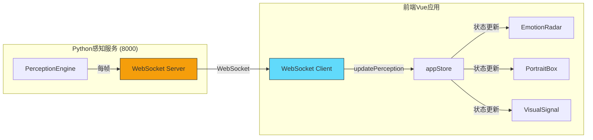
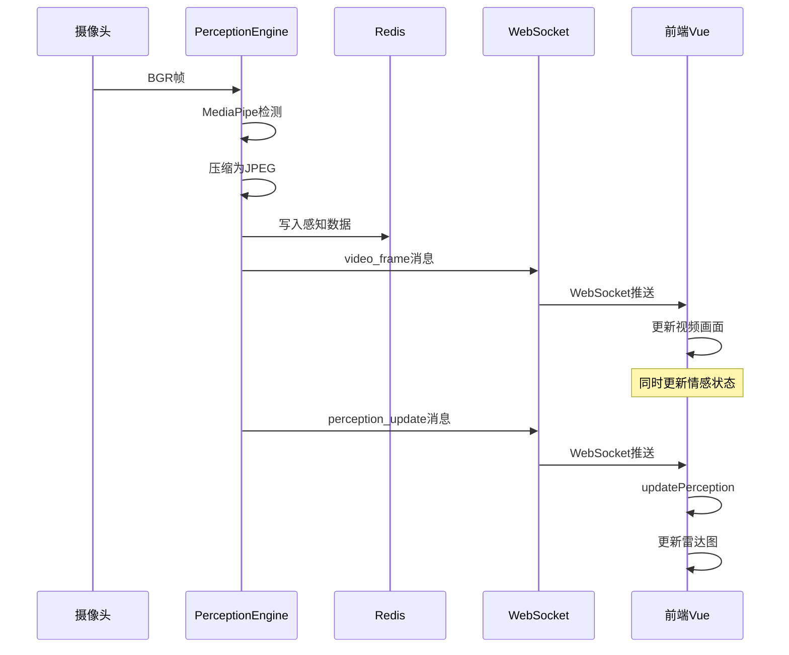

# T02 - 前端感知通信：WebSocket实时数据总线

---

## 1. 模块概览

### 1.1 一句话定义

前端感知通信模块通过**WebSocket建立与Python感知服务的持久连接**，实时接收摄像头画面、感知分析结果和TTS语音数据。

### 1.2 在系统中的位置



### 1.3 解决的核心问题

1. **实时性**：感知数据（10Hz）需要低延迟推送
2. **多数据类型**：视频帧、情感数据、TTS音频需要统一通道
3. **连接保活**：长时间连接需要心跳检测和自动重连

---

## 2. 技术原理与设计思想

### 2.1 WebSocket vs SSE：为什么选择WebSocket？

| 特性 | WebSocket | SSE |
|------|-----------|-----|
| 方向 | **双向** | 单向（服务端→客户端） |
| 连接类型 | 持久TCP连接 | HTTP长连接 |
| 推送效率 | 高（无HTTP头部开销） | 中等（HTTP头部） |
| 兼容性 | 需要ws://协议 | HTTP兼容 |
| 复杂度 | 中等 | 简单 |

**感知服务的需求**：
- 需要接收**摄像头采集的原始图像**（大数据量）
- 需要**实时推送感知分析结果**
- **双向通信**：前端可以发送控制指令（如摄像头开关）

因此，感知服务选择**WebSocket**，而对话服务选择**SSE**。

### 2.2 WebSocket消息协议设计

婉晴AI设计了统一的JSON消息格式：

```javascript
// 消息结构
{
    "type": "video_frame" | "perception_update" | "voice_play" | "voice_stream" | 
            "voice_stream_end" | "ping" | "request_summary",
    "data": { ... },
    "timestamp_ms": 1234567890
}
```

**消息类型详解**：

| 类型 | 方向 | 用途 | 数据格式 |
|------|------|------|----------|
| `video_frame` | 服务端→客户端 | 推送摄像头画面 | Base64编码的JPEG |
| `perception_update` | 服务端→客户端 | 推送感知分析结果 | `{au, head_pose, blink_rate, ...}` |
| `voice_play` | 服务端→客户端 | 播放TTS音频 | `data:audio/mp3;base64,...` |
| `voice_stream` | 服务端→客户端 | 流式音频块 | Base64编码的MP3 |
| `voice_stream_end` | 服务端→客户端 | 流式音频结束 | `{total_chunks, total_bytes}` |
| `ping` | 客户端→服务端 | 心跳检测 | - |
| `request_summary` | 客户端→服务端 | 请求日报生成 | - |

### 2.3 帧率与带宽权衡

**问题**：摄像头原始画面很大，直接传输会占用大量带宽。

**解决方案**：服务端压缩后发送

```python
# Python感知服务：JPEG压缩
import cv2
import base64

def compress_frame(frame):
    # 压缩为JPEG，质量70%
    _, buffer = cv2.imencode('.jpg', frame, [cv2.IMWRITE_JPEG_QUALITY, 70])
    return base64.b64encode(buffer).decode('utf-8')
```

**带宽估算**：
- 原始RGB：640×480×3 = 921,600 bytes
- JPEG压缩后：~30,000 bytes（压缩率约97%）
- 10Hz频率：300 KB/s ≈ 2.4 Mbps

---

## 3. 关键代码解析

### 3.1 WebSocket连接建立（App.vue）

```javascript
// ======== 关键代码1：连接建立 ========

let socket = null
let wsReconnectTimer = null

const connectPerceptionBus = () => {
    // 防止重复连接
    if (socket && (socket.readyState === WebSocket.CONNECTING || 
                   socket.readyState === WebSocket.OPEN)) {
        return
    }

    socket = new WebSocket('ws://localhost:8000/ws')

    // ======== 关键代码2：连接打开 ========
    socket.onopen = () => {
        console.log('[WS] 连接已建立')
        appStore.setConnection(true)
    }

    // ======== 关键代码3：消息处理 ========
    socket.onmessage = (event) => {
        try {
            const msg = JSON.parse(event.data)
            handlePerceptionMessage(msg)
        } catch (e) {
            console.error('[WS] 消息解析失败:', e)
        }
    }

    // ======== 关键代码4：错误处理 ========
    socket.onerror = (e) => {
        console.error('[WS] 连接错误:', e)
    }

    // ======== 关键代码5：断开重连 ========
    socket.onclose = () => {
        appStore.setConnection(false)
        // 3秒后自动重连
        wsReconnectTimer = setTimeout(connectPerceptionBus, 3000)
    }
}
```

### 3.2 消息分发处理（App.vue）

```javascript
// ======== 关键代码6：消息分发器 ========

const handlePerceptionMessage = (msg) => {
    switch (msg.type) {
        case 'video_frame':
            // 视频帧：直接传递给VisualSignal组件
            appStore.setVideoFrameData(msg.data)
            break

        case 'perception_update':
            // 感知更新：更新情感状态
            appStore.updatePerception({
                ...msg.data,
                _fromWebSocket: true,  // 标记来源
                _perceptionTimestamp: msg.data.timestamp_ms || Date.now()
            })
            break

        case 'voice_play':
            // TTS音频：Base64内嵌方式播放
            if (msg.data.startsWith('data:audio')) {
                new Audio(msg.data).play()
            }
            break

        case 'voice_stream':
            // 流式音频：累积块数据
            if (msg.is_first) {
                streamingAudioChunks = [msg.data]
            } else {
                streamingAudioChunks.push(msg.data)
            }
            break

        case 'voice_stream_end':
            // 流式结束：合并并播放完整音频
            const merged = mergeAudioChunks(streamingAudioChunks)
            const blob = new Blob([merged], { type: 'audio/mpeg' })
            new Audio(URL.createObjectURL(blob)).play()
            streamingAudioChunks = []
            break
    }
}
```

### 3.3 自动重连机制

```javascript
// ======== 关键代码7：智能重连 ========

const connectPerceptionBus = () => {
    socket = new WebSocket('ws://localhost:8000/ws')

    socket.onclose = () => {
        appStore.setConnection(false)

        // 避免多个定时器
        if (wsReconnectTimer !== null) {
            clearTimeout(wsReconnectTimer)
        }

        // 指数退避重连（避免频繁重连）
        wsReconnectTimer = setTimeout(connectPerceptionBus, 3000)
    }
}

// 组件卸载时清理
onUnmounted(() => {
    if (wsReconnectTimer !== null) {
        clearTimeout(wsReconnectTimer)
        wsReconnectTimer = null
    }
    if (socket) {
        socket.close()
        socket = null
    }
})
```

### 3.4 WebSocket服务端处理（Python）

```python
# backend/api/websocket.py
from fastapi import WebSocket, WebSocketDisconnect

async def handle_websocket(websocket: WebSocket):
    """WebSocket路由分发器"""
    await manager.connect(websocket)

    try:
        while True:
            data = await websocket.receive_text()
            msg_obj = json.loads(data)
            msg_type = msg_obj.get("type")

            # 路由分发
            if msg_type == "ping":
                await websocket.send_text(json.dumps({"type": "pong"}))

            elif msg_type == "chat":
                await chat_service.handle_user_message(msg_obj.get("text"))

            elif msg_type == "request_summary":
                await chat_service.generate_daily_summary()

    except WebSocketDisconnect:
        manager.disconnect(websocket)
```

---

## 4. 核心难点与实现细节

### 4.1 大数据量传输：视频帧压缩

**问题**：640×480的原始RGB图像约900KB，直接传输会阻塞网络。

**解决方案**：

```python
# 服务端：JPEG压缩
import cv2
import base64

def compress_frame(frame):
    # 调整分辨率（可选，进一步减小数据量）
    frame = cv2.resize(frame, (320, 240))

    # JPEG压缩，质量70%
    _, buffer = cv2.imencode('.jpg', frame, 
                              [cv2.IMWRITE_JPEG_QUALITY, 70])

    # Base64编码
    return base64.b64encode(buffer).decode('utf-8')
```

**效果**：
- 原始：~900KB/帧
- 压缩后：~15KB/帧
- 带宽节省：98%

### 4.2 音频播放：Base64 vs 流式

**方案A：完整音频一次性发送**

```javascript
// 服务端：完整音频
msg = {"type": "voice_play", "data": "data:audio/mp3;base64," + base64}

// 客户端：直接播放
new Audio(msg.data).play()
```

**优点**：实现简单
**缺点**：大音频需要等待完整下载

**方案B：流式音频（婉晴AI采用）**

```javascript
// 第一帧
msg = {"type": "voice_stream", "is_first": true, "data": chunk1}

// 后续帧
msg = {"type": "voice_stream", "is_first": false, "data": chunk2}

// 结束帧
msg = {"type": "voice_stream_end", "total_chunks": 10, "total_bytes": 50000}
```

**优点**：边接收边播放，延迟更低
**缺点**：实现复杂，需要累积和合并

### 4.3 安全考虑：SSRF防护

**问题**：如果voice_play接收外部URL，可能被用于SSRF攻击。

**解决方案**：婉晴AI只接收Base64内嵌数据。

```javascript
// 严格校验：只接受data:audio格式
if (msg.data.startsWith('data:audio')) {
    new Audio(msg.data).play()
} else {
    console.warn('[WS] 拒绝非音频数据')
}
```

### 4.4 内存管理：流式音频累积

**问题**：流式音频需要累积所有块，可能导致内存问题。

**解决方案**：

```javascript
const MAX_AUDIO_CHUNKS = 1000  // 最大累积数
const MAX_AUDIO_BYTES = 50 * 1024 * 1024  // 50MB

if (streamingAudioChunks.length > MAX_AUDIO_CHUNKS) {
    console.warn('[WS] 音频块数过多，丢弃旧数据')
    streamingAudioChunks = streamingAudioChunks.slice(-MAX_AUDIO_CHUNKS)
}
```

---

## 5. 数据流与交互

### 5.1 感知数据推送流程



### 5.2 感知数据格式

```javascript
// 感知更新消息
{
    "type": "perception_update",
    "data": {
        "timestamp_ms": 1709123456789,
        "au": {
            "AU4": 0.5,      // 皱眉强度
            "AU12": 0.3,    // 嘴角上扬
            "primary_emotion": "neutral",
            "confidence": 0.7
        },
        "head_pose": {
            "pitch": -5.2,   // 俯仰角
            "yaw": 2.1,      // 偏航角
            "roll": 0.5      // 翻滚角
        },
        "blink_rate": 15.0,   // 眨眼频率（次/分）
        "focus_level": 0.8    // 专注度
    }
}
```

---

## 6. 配置与依赖

### 6.1 环境配置

```javascript
// .env
VITE_WS_URL=ws://localhost:8000/ws
```

### 6.2 后端配置

```python
# backend/ai_assistant/utils/config.py
class WebSocketConfig:
    HEARTBEAT_INTERVAL = 30      # 心跳间隔（秒）
    HEARTBEAT_TIMEOUT = 60       # 心跳超时（秒）
    MAX_FRAME_SIZE = 1024 * 1024  # 最大帧大小（1MB）
    COMPRESSION_QUALITY = 70      # JPEG压缩质量
```

### 6.3 本地调试技巧

1. **WebSocket调试工具**：浏览器扩展"Socket.io-Test"或"WebSocket King"

2. **查看连接状态**：
   ```javascript
   socket.onopen = () => console.log('OPEN', socket.readyState)
   socket.onclose = () => console.log('CLOSE', event.code, event.reason)
   socket.onerror = () => console.log('ERROR', socket)
   ```

3. **手动发送测试消息**：
   ```javascript
   // 在控制台执行
   socket.send(JSON.stringify({type: 'ping'}))
   ```

---

## 7. 扩展与思考

### 7.1 可选优化方向

**1. WebRTC视频流**
当前方案发送压缩JPEG帧，未来可考虑WebRTC实现更高效的点对点视频传输。

**2. 感知数据采样**
前端可能不需要10Hz的全部数据，可以做采样降频：
```javascript
let lastUpdate = 0
const THROTTLE_MS = 200  // 5Hz

if (Date.now() - lastUpdate > THROTTLE_MS) {
    updateUI(data)
    lastUpdate = Date.now()
}
```

**3. 断点续传**
对于长时间会话，可以考虑定期保存状态，实现断点续传。

### 7.2 设计启示

**1. 协议设计的统一性**
- 统一的JSON格式便于扩展
- type字段实现消息路由

**2. 带宽与质量的权衡**
- 感知服务优先级是实时性
- 可以适当降低图像质量换取带宽

**3. 安全性第一**
- 不信任任何外部URL
- Base64内嵌比URL引用更安全

---

## 8. 学习资源

### 8.1 官方文档

- [MDN: WebSocket API](https://developer.mozilla.org/en-US/docs/Web/API/WebSocket)
- [FastAPI WebSocket](https://fastapi.tiangolo.com/advanced/websockets/)
- [MDN: MediaRecorder API](https://developer.mozilla.org/en-US/docs/Web/API/MediaRecorder)

### 8.2 进阶阅读

- [WebSocket vs SSE vs Long Polling](https://www.ably.io/blog/websockets-sse-server-sent-events/)
- [WebRTC实时通信](https://webrtc.org/)

---

## 模块索引

返回 [模块清单与索引](./00_模块清单与索引.md) | 上一篇：[T01-前端聊天组件](./T01_前端聊天组件.md) | 下一篇：[T03-Java会话管理](./T03_Java会话管理.md)
