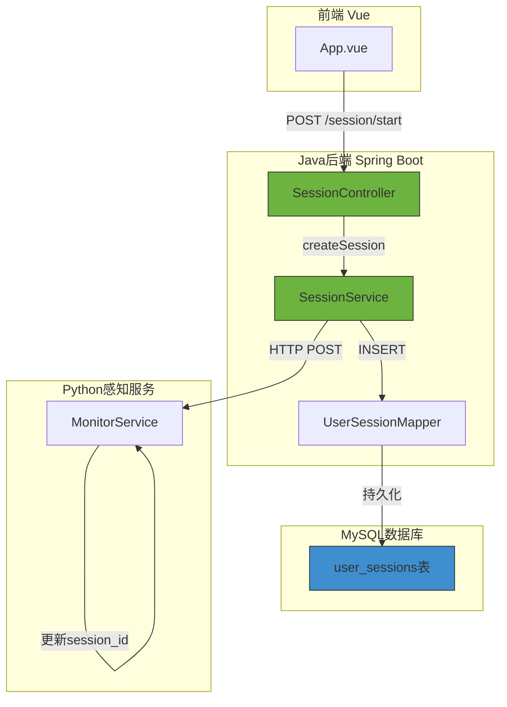
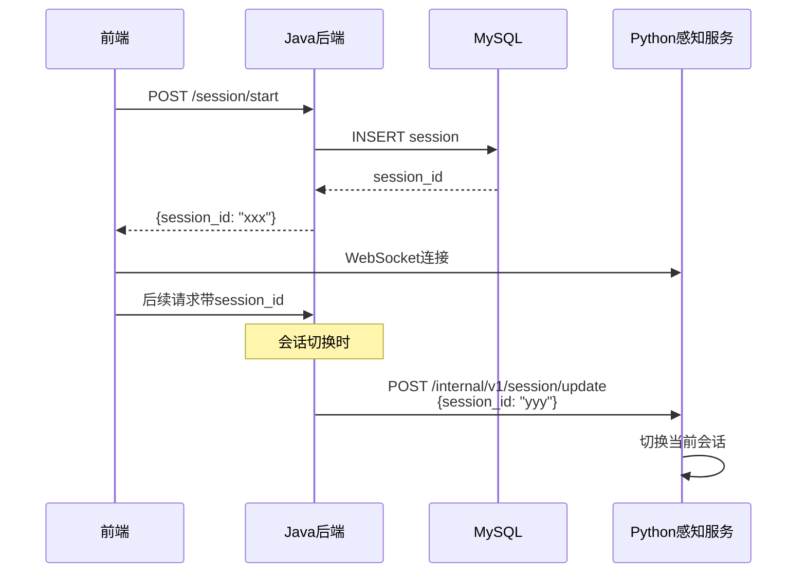
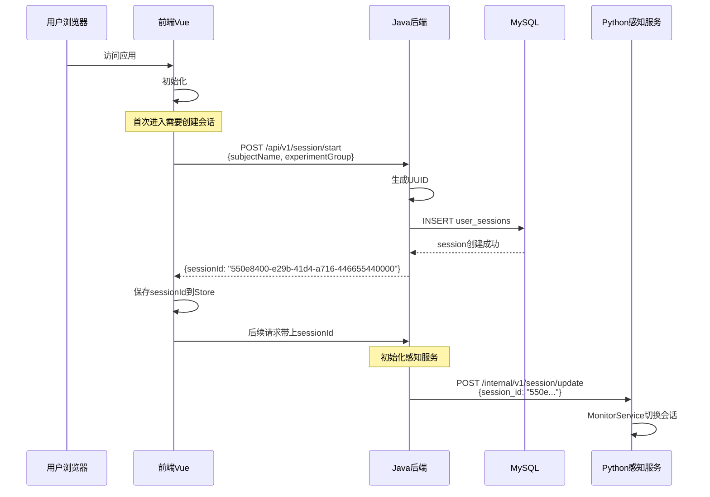

# T03 - Java会话管理：Spring Boot状态持久化

---

## 1. 模块概览

### 1.1 一句话定义

Java会话管理模块负责**管理用户的实验会话生命周期**，包括会话创建、状态查询、MySQL持久化和会话切换通知。

### 1.2 在系统中的位置



### 1.3 解决的核心问题

1. **会话隔离**：多用户同时使用，互不干扰
2. **状态持久化**：会话数据不因服务重启丢失
3. **上下文传递**：会话ID在Java后端、Python感知服务间同步

---

## 2. 技术原理与设计思想

### 2.1 为什么需要会话管理？

**问题背景**：
- 婉晴AI是面向实验场景的AI系统
- 每个参与者有独立的session_id
- 感知数据、对话历史、情感记录都需要按session隔离

**传统方案 vs 婉晴AI方案**：

| 传统方案 | 问题 | 婉晴AI方案 |
|----------|------|------------|
| 仅用内存 | 服务重启数据丢失 | MySQL持久化 |
| 仅用Session | 无法跨服务传递 | session_id同步到Python |
| UUID随机 | 难以追溯 | 关联subject_name、实验分组 |

### 2.2 数据库设计

```sql
CREATE TABLE user_sessions (
    id              BIGINT PRIMARY KEY AUTO_INCREMENT,
    session_id      VARCHAR(64) NOT NULL UNIQUE,    -- UUID主键
    subject_name    VARCHAR(64) NOT NULL,           -- 被试姓名
    experiment_group VARCHAR(32) DEFAULT 'default',    -- 实验分组
    status          VARCHAR(32) DEFAULT 'active',  -- 会话状态
    created_at      DATETIME DEFAULT CURRENT_TIMESTAMP,
    updated_at      DATETIME DEFAULT CURRENT_TIMESTAMP ON UPDATE CURRENT_TIMESTAMP,
    INDEX idx_session_id (session_id),
    INDEX idx_subject_name (subject_name)
);
```

**设计考量**：
- `session_id`使用UUID，保证全局唯一
- `experiment_group`支持A/B测试等实验设计
- `updated_at`自动更新，方便追踪活跃会话

### 2.3 服务间会话同步机制

**问题**：Java后端创建session后，Python感知服务需要知道当前是哪个session。

**解决方案**：



---

## 3. 关键代码解析

### 3.1 核心文件结构

```
backend/src/main/java/com/wanqing/ai/
├── controller/
│   └── SessionController.java      # HTTP接口
├── service/
│   ├── SessionService.java         # 会话服务接口
│   └── impl/
│       └── SessionServiceImpl.java # 会话服务实现
├── mapper/
│   └── UserSessionMapper.java      # MyBatis Mapper
├── entity/
│   └── UserSession.java            # 会话实体
└── dto/
    ├── request/
    │   └── SessionStartReq.java   # 请求DTO
    └── response/
        └── SessionStartResp.java  # 响应DTO
```

### 3.2 会话实体定义

```java
// ======== 关键代码1：会话实体 ========
@Data
@TableName("user_sessions")
public class UserSession {
    private Long id;

    @TableId(type = IdType.ASSIGN_UUID)  // UUID生成策略
    private String sessionId;             // UUID主键

    private String subjectName;           // 被试姓名
    private String experimentGroup;        // 实验分组
    private String status;                // active/completed/abandoned
    private LocalDateTime createdAt;      // 创建时间
    private LocalDateTime updatedAt;      // 更新时间
}
```

**字段设计解读**：
- `sessionId`使用UUID而非自增ID，避免ID泄露实验参与者信息
- `status`字段支持会话生命周期管理

### 3.3 会话创建Controller

```java
// ======== 关键代码2：会话创建接口 ========
@RestController
@RequestMapping("/api/v1/session")
@RequiredArgsConstructor
public class SessionController {

    private final SessionService sessionService;

    @PostMapping("/start")
    public Result<SessionStartResp> startSession(
            @RequestBody @Valid SessionStartReq req) {

        log.info("创建会话: subject={}, group={}",
                req.getSubjectName(), req.getExperimentGroup());

        // 调用服务创建会话
        UserSession session = sessionService.createSession(
                req.getSubjectName(),
                req.getExperimentGroup()
        );

        // 构造响应
        SessionStartResp resp = SessionStartResp.builder()
                .sessionId(session.getSessionId())
                .createdAt(session.getCreatedAt())
                .build();

        return Result.success(resp);
    }
}
```

### 3.4 会话服务实现

```java
// ======== 关键代码3：会话服务核心逻辑 ========
@Service
@RequiredArgsConstructor
public class SessionServiceImpl implements SessionService {

    private final UserSessionMapper sessionMapper;

    @Override
    @Transactional
    public UserSession createSession(String subjectName, String experimentGroup) {
        // 1. 构建会话对象
        UserSession session = UserSession.builder()
                .sessionId(UUID.randomUUID().toString())  // 生成UUID
                .subjectName(subjectName)
                .experimentGroup(experimentGroup != null ? experimentGroup : "default")
                .status("active")
                .createdAt(LocalDateTime.now())
                .updatedAt(LocalDateTime.now())
                .build();

        // 2. 插入数据库
        sessionMapper.insert(session);

        log.info("会话创建成功: sessionId={}, subject={}",
                session.getSessionId(), session.getSubjectName());

        return session;
    }

    @Override
    public UserSession getSessionById(String sessionId) {
        return sessionMapper.selectBySessionId(sessionId);
    }
}
```

### 3.5 MyBatis Mapper

```java
// ======== 关键代码4：Mapper接口 ========
@Mapper
public interface UserSessionMapper extends BaseMapper<UserSession> {

    // 按sessionId查询
    @Select("SELECT * FROM user_sessions WHERE session_id = #{sessionId}")
    UserSession selectBySessionId(@Param("sessionId") String sessionId);

    // 更新会话状态
    @Update("UPDATE user_sessions SET status = #{status}, updated_at = NOW() " +
            "WHERE session_id = #{sessionId}")
    int updateStatus(@Param("sessionId") String sessionId,
                     @Param("status") String status);
}
```

### 3.6 会话切换通知Python服务

```java
// ======== 关键代码5：会话切换通知 ========
@Service
@RequiredArgsConstructor
public class SessionServiceImpl implements SessionService {

    private final RestTemplate restTemplate;

    @Value("${perception.service.url:http://localhost:8000}")
    private String perceptionUrl;

    @Override
    public void switchSession(String sessionId, String userId) {
        // 通知Python感知服务切换会话
        String url = perceptionUrl + "/internal/v1/session/update";

        Map<String, String> body = new HashMap<>();
        body.put("session_id", sessionId);
        body.put("user_id", userId);

        try {
            restTemplate.postForObject(url, body, String.class);
            log.info("会话切换通知已发送: sessionId={}", sessionId);
        } catch (Exception e) {
            log.warn("会话切换通知失败: {}", e.getMessage());
            // 不影响主流程，感知服务会使用默认session
        }
    }
}
```

---

## 4. 核心难点与实现细节

### 4.1 UUID vs 自增ID：为什么选择UUID？

**自增ID的问题**：
- 暴露实验参与者数量
- 可能被用于关联不同实验数据
- ID可预测，不够安全

**UUID的优点**：
- 全局唯一，无碰撞风险
- 不暴露业务信息
- 无中心化依赖

**UUID的缺点**：
- 存储空间更大（36字符 vs 8字节）
- 无法用于分页查询

**婉晴AI的选择**：使用UUID，存储空间差异可忽略。

### 4.2 服务间通信：HTTP vs 消息队列

**方案A：HTTP轮询**
```java
// Python感知服务定期轮询Java获取session_id
while (true) {
    sessionId = httpGet("http://java:8080/api/current-session");
    time.sleep(1);
}
```
**缺点**：延迟高，有无效请求

**方案B：HTTP通知（婉晴AI采用）**
```java
// Java创建session后主动通知Python
restTemplate.postForObject(perceptionUrl + "/session/update", body, Void.class);
```
**优点**：实时、无额外开销
**缺点**：需要知道对方地址

**方案C：消息队列**
适合微服务架构，对于婉晴AI的规模过于复杂

### 4.3 事务管理与会话一致性

**问题**：会话创建和通知Python服务需要保持一致。

**解决方案**：

```java
@Override
@Transactional  // 确保会话创建成功
public UserSession createSession(String subjectName, String experimentGroup) {
    UserSession session = UserSession.builder()
            .sessionId(UUID.randomUUID().toString())
            .subjectName(subjectName)
            .experimentGroup(experimentGroup)
            .status("active")
            .build();

    sessionMapper.insert(session);

    // 通知Python（失败不影响事务）
    try {
        notifyPerceptionService(session.getSessionId());
    } catch (Exception e) {
        log.warn("感知服务通知失败: {}", e.getMessage());
    }

    return session;
}
```

**关键**：通知失败不回滚事务，因为通知是幂等的。

### 4.4 会话超时与清理

```java
// ======== 关键代码6：会话超时清理 ========
@Scheduled(cron = "0 0 3 * * ?")  // 每天凌晨3点执行
public void cleanExpiredSessions() {
    LocalDateTime expireTime = LocalDateTime.now().minusDays(7);

    int count = sessionMapper.deleteExpired(expireTime);
    log.info("清理过期会话: {}条", count);
}
```

---

## 5. 数据流与交互

### 5.1 会话创建完整流程



### 5.2 会话数据模型

```json
// SessionStartReq
{
    "subject_name": "张三",
    "experiment_group": "A组"
}

// SessionStartResp
{
    "session_id": "550e8400-e29b-41d4-a716-446655440000",
    "created_at": "2026-03-26T10:00:00"
}
```

---

## 6. 配置与依赖

### 6.1 数据库配置

```yaml
# application.yml
spring:
  datasource:
    url: jdbc:mysql://localhost:3306/wanqing?useSSL=false&serverTimezone=Asia/Shanghai
    username: root
    password: ${MYSQL_PASSWORD}
    driver-class-name: com.mysql.cj.jdbc.Driver

  jpa:
    hibernate:
      ddl-auto: validate  # 不自动创建表，由migration管理
    show-sql: false
```

### 6.2 Python服务配置

```yaml
# Python感知服务
perception:
  service:
    url: http://localhost:8000
    timeout: 5  # 秒
```

### 6.3 MyBatis配置

```yaml
mybatis:
  mapper-locations: classpath:mapper/*.xml
  type-aliases-package: com.wanqing.ai.entity
  configuration:
    map-underscore-to-camel-case: true  # 下划线转驼峰
```

---

## 7. 扩展与思考

### 7.1 可选优化方向

**1. 会话过期策略**
```java
// 超过一定时间无活动自动过期
public class SessionActivityListener {
    public void onRequest(String sessionId) {
        // 更新最后活动时间
        sessionMapper.updateLastActivity(sessionId);
    }
}
```

**2. 会话数据导出**
```java
// 导出实验数据
public void exportSessionData(String sessionId, String format) {
    // 支持JSON、CSV等格式
}
```

**3. 并发会话限制**
```java
// 限制同一用户最大并发会话数
if (sessionMapper.countActiveBySubject(subjectName) >= MAX_CONCURRENT) {
    throw new BusinessException("已达到最大会话数");
}
```

### 7.2 设计启示

**1. ID设计的隐私考量**
- UUID避免暴露业务信息
- session_id不应与用户真实身份直接关联

**2. 事务边界要清晰**
- 核心操作（创建会话）在事务内
- 辅助操作（通知Python）可放在事务外

**3. 服务间通信的容错**
- HTTP调用需要设置超时
- 失败不应影响主流程
- 日志记录便于排查问题

---

## 8. 学习资源

### 8.1 官方文档

- [MyBatis-Plus 官方文档](https://baomidou.com/pages/24112f/)
- [Spring Data JPA](https://spring.io/projects/spring-data-jpa)
- [MySQL UUID函数](https://dev.mysql.com/doc/refman/8.0/en/miscellaneous-functions.html#function_uuid)

### 8.2 进阶阅读

- [分布式ID生成方案](https://cloud.tencent.com/developer/article/1530550)
- [数据库事务隔离级别](https://dev.mysql.com/doc/refman/8.0/en/innodb-transaction-isolation-levels.html)

---

## 模块索引

返回 [模块清单与索引](./00_模块清单与索引.md) | 上一篇：[T02-前端感知通信](./T02_前端感知通信.md) | 下一篇：[T04-Java SSE透传](./T04_Java_SSE透传.md)
