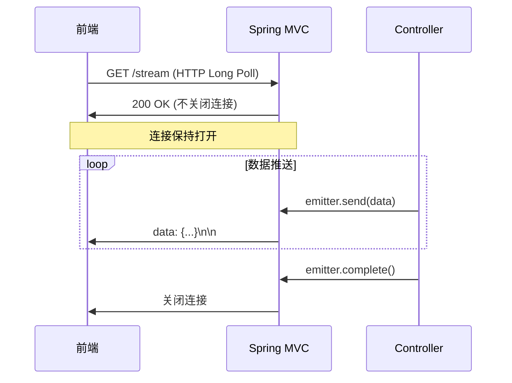
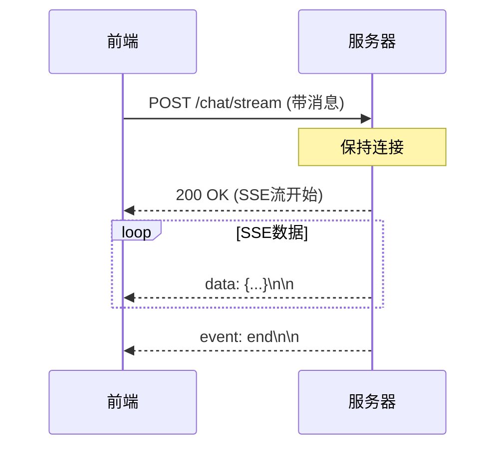
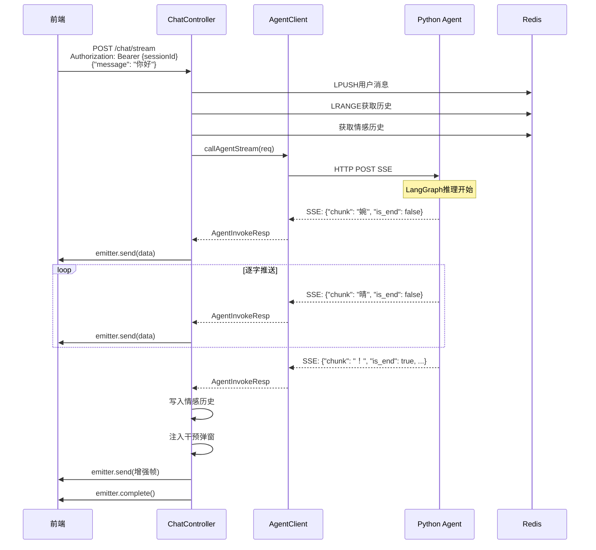

# T04 - Java SSE透传：WebClient与SseEmitter深度剖析

---

## 1. 模块概览

### 1.1 一句话定义

Java SSE透传模块负责**接收Python Agent的SSE流式响应，通过SseEmitter实时转发给前端**，同时完成情感历史写入和干预弹窗信息注入。

### 1.2 在系统中的位置

```mermaid
flowchart LR
    subgraph Frontend["前端 Vue"]
        A[SSE Client]
    end

    subgraph Java["Java后端"]
        B[ChatController]
        C[AgentClient]
        D[EmotionHistoryService]
    end

    subgraph Agent["Python Agent"]
        E[LangGraph]
        F[SSE Stream]
    end

    subgraph Redis["Redis"]
        G[情感历史]
    end

    A -->|POST /chat/stream| B
    B -->|调用| C
    C -->|HTTP POST + SSE| E
    E -->|SSE流| C
    C -->|透传| B
    B -->|SSE流| A

    Note over B: 写入情感历史
    B -->|LPUSH| G

    Note over B: 注入干预弹窗
    B -->|最终帧增强| A

    style B fill:#6db33f,stroke:#333
    style C fill:#6db33f,stroke:#333
    style F fill:#f59e0b,stroke:#333
```

### 1.3 解决的核心问题

1. **协议转换**：Python返回SSE，Java需要透传给前端
2. **流式转发**：实时接收并转发，不等待完整响应
3. **数据增强**：在流末端注入干预弹窗信息
4. **会话状态维护**：写入情感历史到Redis

---

## 2. 技术原理与设计思想

### 2.1 为什么需要Java作为中间层？

**问题**：前端直接调用Python Agent会遇到什么问题？

| 问题 | 影响 |
|------|------|
| 跨域(CORS) | 前端8080无法直接请求8001 |
| 协议差异 | 前端不熟悉SSE解析 |
| 状态管理 | 无法统一管理会话状态 |
| 持久化 | 情感历史无法写入MySQL |

**Java中间层的职责**：
```
前端 → Java(8080) → Python(8001)
         ↓
    会话验证
         ↓
    历史写入
         ↓
    数据增强
```

### 2.2 Spring WebClient vs RestTemplate

| 特性 | RestTemplate | WebClient |
|------|--------------|-----------|
| API风格 | 同步/阻塞 | 响应式/非阻塞 |
| SSE支持 | 需要额外处理 | 原生支持 |
| 并发处理 | 线程池 | 事件驱动 |
| 内存占用 | 较高 | 较低 |

**婉晴AI选择WebClient的原因**：
- `exchangeToFlux`方法直接支持SSE流处理
- 响应式编程更适合处理IO密集型任务
- 更好的背压(backpressure)支持

### 2.3 Spring SseEmitter原理

**SseEmitter是Spring MVC的SSE实现**：



**关键特性**：
- 基于HTTP长连接
- 支持超时设置
- 完成后回调
- 错误处理回调

### 2.4 SSE帧格式

```mermaid
graph LR
    A["data: {\"chunk\": \"婉\"}"] --> B[空行分隔]
    B --> C["data: {\"chunk\": \"晴\"}"]
    C --> D[空行]
    D --> E["data: {\"chunk\": \"!\", \"is_end\": true, ...}"]
    E --> F["event: end"]
```

**SSE规范要点**：
- 每条消息以`data: `开头
- 消息间以空行分隔
- 可选`event:`指定事件类型
- `retry:`指定重连间隔

---

## 3. 关键代码解析

### 3.1 核心文件结构

```
backend/src/main/java/com/wanqing/ai/
├── controller/
│   └── ChatController.java          # SSE聊天控制器
├── client/
│   └── AgentClient.java             # Agent通信客户端
├── service/
│   ├── EmotionHistoryService.java   # 情感历史服务
│   └── impl/
│       ├── EmotionHistoryServiceImpl.java
├── dto/
│   ├── request/
│   │   └── ChatMessageReq.java    # 请求DTO
│   └── response/
│       └── AgentInvokeResp.java    # Agent响应DTO
```

### 3.2 ChatController主入口

```java
// ======== 关键代码1：SSE端点定义 ========
@RestController
@RequestMapping("/api/v1/chat")
@RequiredArgsConstructor
public class ChatController {

    private final AgentClient agentClient;
    private final SessionService sessionService;
    private final EmotionHistoryService emotionHistoryService;
    private final ObjectMapper objectMapper;
    private final StringRedisTemplate redisTemplate;

    // SSE超时：5分钟
    private static final long SSE_TIMEOUT = 5 * 60 * 1000L;

    // 线程池处理异步SSE
    private final ExecutorService sseExecutor = Executors.newCachedThreadPool();

    // ======== 关键代码2：SSE流式响应接口 ========
    @PostMapping(value = "/stream",
                produces = MediaType.TEXT_EVENT_STREAM_VALUE)
    public ResponseEntity<ResponseBodyEmitter> chatStream(
            @RequestHeader("Authorization") String sessionId,
            @RequestBody ChatMessageReq request) {

        // 1. 解析Session ID
        final String realSessionId = parseSessionId(sessionId);

        // 2. 验证会话
        UserSession session = sessionService.getSessionById(realSessionId);
        if (session == null) {
            return ResponseEntity.notFound().build();
        }

        // 3. 创建SSE发射器
        SseEmitter emitter = new SseEmitter(SSE_TIMEOUT);

        // 4. 设置回调
        emitter.onCompletion(() -> log.info("SSE完成"));
        emitter.onTimeout(() -> log.warn("SSE超时"));
        emitter.onError(e -> log.error("SSE异常", e));

        // 5. 异步处理
        sseExecutor.submit(() -> {
            try {
                // 处理对话逻辑...
            } catch (Exception e) {
                emitter.completeWithError(e);
            }
        });

        return ResponseEntity.ok()
                .contentType(MediaType.parseMediaType("text/event-stream"))
                .header("Cache-Control", "no-cache, no-transform")
                .header("X-Accel-Buffering", "no")  // 禁用Nginx缓冲
                .body(emitter);
    }
}
```

### 3.3 AgentClient SSE处理

```java
// ======== 关键代码3：WebClient配置 ========
@Service
@RequiredArgsConstructor
public class AgentClient {

    private final ObjectMapper objectMapper;

    @Value("${agent.engine.url:http://localhost:8001}")
    private String agentEngineUrl;

    @Value("${agent.engine.timeout:60}")
    private int agentTimeout;

    // ======== 关键代码4：SSE流解析 ========
    public Flux<AgentInvokeResp> callAgentStream(AgentInvokeReq request) {
        WebClient webClient = WebClient.builder()
                .baseUrl(agentEngineUrl)
                .defaultHeader("Accept", "text/event-stream")
                .build();

        return webClient.post()
                .uri("/internal/v1/agent/invoke")
                .contentType(MediaType.APPLICATION_JSON)
                .bodyValue(request)
                // 核心：exchangeToFlux处理SSE
                .exchangeToFlux(clientResponse -> {
                    if (clientResponse.statusCode().is2xxSuccessful()) {
                        // 返回String类型的SSE流
                        return clientResponse.bodyToFlux(String.class);
                    }
                    return Flux.error(new RuntimeException("Agent返回错误状态"));
                })
                // 过滤注释行和空行
                .filter(line -> line != null &&
                        !line.trim().isEmpty() &&
                        !line.trim().startsWith(":"))
                // 解析SSE帧
                .map(line -> {
                    String jsonStr = parseSSEData(line);
                    return objectMapper.readValue(jsonStr, AgentInvokeResp.class);
                })
                // 超时配置
                .timeout(Duration.ofSeconds(agentTimeout))
                // 重试机制
                .retryWhen(Retry.backoff(2, Duration.ofSeconds(1)));
    }

    // ======== 关键代码5：SSE数据提取 ========
    private String parseSSEData(String line) {
        String jsonStr = line.trim();
        // 兼容 "data: " 和 "data:" 两种格式
        if (jsonStr.startsWith("data: ")) {
            jsonStr = jsonStr.substring("data: ".length());
        } else if (jsonStr.startsWith("data:")) {
            jsonStr = jsonStr.substring("data:".length());
        }
        return jsonStr.trim();
    }
}
```

### 3.4 SSE流透传逻辑

```java
// ======== 关键代码6：SSE流透传与增强 ========
sseExecutor.submit(() -> {
    try {
        // 1. 写入Redis对话历史
        writeUserMessageToRedis(request.getMessage());

        // 2. 读取情感历史
        List<Map<String, Object>> emotionHistory =
                emotionHistoryService.getEmotionHistory(realSessionId, 10);

        // 3. 调用Agent并处理SSE流
        agentClient.callAgentStream(buildAgentRequest())
                .doOnNext(resp -> {
                    try {
                        // 发送SSE帧到前端
                        emitter.send(SseEmitter.event()
                                .name("message")
                                .data(objectMapper.writeValueAsString(resp)));

                        // 4. 流结束时写入情感历史
                        if (Boolean.TRUE.equals(resp.getIsEnd()) && resp.getVector() != null) {
                            writeEmotionHistory(resp.getVector());
                        }

                        // 5. 最终帧：注入干预弹窗信息
                        if (Boolean.TRUE.equals(resp.getIsEnd())) {
                            enhanceWithInterventionAlert(emitter, resp);
                        }

                    } catch (IOException e) {
                        emitter.completeWithError(e);
                    }
                })
                .doOnComplete(() -> {
                    try {
                        emitter.send(SseEmitter.event()
                                .name("end")
                                .comment("婉晴回复完毕"));
                        emitter.complete();
                    } catch (IOException e) {
                        emitter.completeWithError(e);
                    }
                })
                .subscribe();

    } catch (Exception e) {
        emitter.completeWithError(e);
    }
});
```

### 3.5 干预弹窗注入

```java
// ======== 关键代码7：干预弹窗增强 ========
private void enhanceWithInterventionAlert(
        SseEmitter emitter, AgentInvokeResp resp) throws IOException {

    String action = resp.getAction();
    String urgency = resp.getUrgency();

    // SILENT动作不触发弹窗
    boolean isSilentAction = "silent".equalsIgnoreCase(action);
    boolean shouldPopup = !isSilentAction && !"low".equalsIgnoreCase(urgency);

    if (isSilentAction) {
        urgency = "low";
    }

    // 生成弹窗文案
    String message = generatePopupMessage(urgency, resp.getReply());

    // 构建增强响应
    AgentInvokeResp alertResp = AgentInvokeResp.builder()
            .chunk(resp.getChunk())
            .isEnd(resp.getIsEnd())
            .reply(resp.getReply())
            .vector(resp.getVector())
            .action(resp.getAction())
            .urgency(resp.getUrgency())
            .interventionAlert(AgentInvokeResp.InterventionAlert.builder()
                    .showPopup(shouldPopup)
                    .urgency(urgency)
                    .message(message)
                    .build())
            .build();

    // 发送增强帧
    emitter.send(SseEmitter.event()
            .name("message")
            .data(objectMapper.writeValueAsString(alertResp)));
}
```

---

## 4. 核心难点与实现细节

### 4.1 SSE与分块传输编码

**问题**：HTTP分块传输(Chunked Transfer Encoding)可能导致SSE帧被分割。

**解决方案**：

```java
// 使用WebClient的bodyToFlux直接处理流
clientResponse.bodyToFlux(String.class)
// 内部已处理好分块问题
```

**原理**：
- HTTP分块传输将响应分成多个chunk
- `bodyToFlux`内部累积直到遇到`\n\n`（SSE帧分隔符）
- 保证SSE帧的完整性

### 4.2 双工SSE vs 单工SSE

**问题**：SSE规范是单向的，如何处理POST请求+SSE响应？

**传统方案**：POST请求 → 短连接返回 → 新建SSE连接

**婉晴AI方案**：



**关键**：POST请求建立连接后不立即关闭，改为SSE流推送。

### 4.3 SSE解析的边界情况

**问题1**：收到`data:`前缀的多种变体
```javascript
// Python FastAPI可能输出
data: {"chunk": "婉"}

// Spring SseEmitter输出
data:{"chunk": "婉"}
```

**解决方案**：
```java
if (jsonStr.startsWith("data: ")) {
    jsonStr = jsonStr.substring("data: ".length());
} else if (jsonStr.startsWith("data:")) {
    jsonStr = jsonStr.substring("data:".length());
}
```

**问题2**：连续多行data（用于多行JSON）
```
data: {
data:   "chunk": "婉"
data: }
```
**解决方案**：当前端点简化处理，要求后端输出单行JSON。

### 4.4 流结束信号的可靠性

**问题**：如何确保前端知道流结束了？

**解决方案**：
```java
// 1. 发送end事件
emitter.send(SseEmitter.event()
    .name("end")  // 事件名
    .comment("婉晴回复完毕"));  // 注释

// 2. 调用complete
emitter.complete();
```

### 4.5 Nginx缓冲问题

**问题**：Nginx默认会缓冲SSE响应。

**解决方案**：
```nginx
location /api/v1/chat/stream {
    proxy_pass http://backend;
    proxy_http_version 1.1;
    proxy_set_header Connection '';
    proxy_cache off;
    proxy_buffering off;  # 禁用缓冲
    chunked_transfer_encoding on;  # 启用分块传输
}
```

Java端也需要设置：
```java
.header("X-Accel-Buffering", "no")  // 禁用Nginx缓冲
```

---

## 5. 数据流与交互

### 5.1 完整SSE透传流程



### 5.2 SSE响应格式

```json
// 非末帧
{
    "chunk": "婉",
    "is_end": false
}

// 末帧
{
    "chunk": "！",
    "is_end": true,
    "reply": "婉晴！",
    "vector": {"喜悦": 0.8, "悲伤": 0.1, ...},
    "action": "subtle",
    "urgency": "low",
    "ui_action": {"color": "neutral", "pulse": "slow"}
}

// 增强帧（含干预弹窗）
{
    "chunk": "！",
    "is_end": true,
    "intervention_alert": {
        "show_popup": false,
        "urgency": "low",
        "message": "婉晴在这里，随时愿意倾听。"
    }
}
```

---

## 6. 配置与依赖

### 6.1 Agent服务配置

```yaml
# application.yml
agent:
  engine:
    url: http://localhost:8001
    timeout: 60  # 秒
```

### 6.2 SSE配置

```yaml
sse:
  timeout: 300  # 5分钟
  heartbeat-interval: 30  # 心跳间隔（秒）
```

### 6.3 Redis配置

```yaml
spring:
  data:
    redis:
      host: localhost
      port: 6379
      timeout: 5000ms
```

---

## 7. 扩展与思考

### 7.1 可选优化方向

**1. 背压控制**
```java
.request(1)  // 背压：只请求1个元素
.flatMap(resp -> {
    // 处理后再请求下一个
})
```

**2. 多Agent负载均衡**
```java
@LoadBalanced
private WebClient.Builder webClientBuilder;

public Flux<AgentInvokeResp> callAgentStream(...) {
    String url = selectAgent();  // 轮询或权重选择
    return webClientBuilder.build()
            .post()
            .uri(url + "/invoke")
            ...
}
```

**3. SSE连接复用**
```java
// 复用连接，避免频繁建立TCP
WebClient.builder()
    .clientConnector(new ReactorClientHttpConnector(
        HttpClient.create().tcpConfiguration(...)))
```

### 7.2 设计启示

**1. 中间层不只是透传**
- Java层负责会话验证、历史写入、数据增强
- 减轻Python Agent的职责

**2. 错误处理要分层**
- WebClient层：网络错误、重试
- Controller层：业务错误
- SSE层：流异常

**3. 超时设置要合理**
- 太短：LLM推理可能被中断
- 太长：占用连接资源

---

## 8. 学习资源

### 8.1 官方文档

- [Spring WebFlux WebClient](https://docs.spring.io/spring-framework/reference/web/webflux-webclient.html)
- [Spring MVC SseEmitter](https://docs.spring.io/spring-framework/reference/web/webmvc/mvc-ann-async.html#mvc-ann-return-types-sse)
- [Server-Sent Events规范](https://html.spec.whatwg.org/multipage/server-sent-events.html)

### 8.2 进阶阅读

- [Reactor响应式编程](https://projectreactor.io/docs/core/release/reference/)
- [WebFlux vs MVC性能对比](https://tech.asymptote.io/articles/benchmarking-spring-webflux-vs-spring-mvc)

---

## 模块索引

返回 [模块清单与索引](./00_模块清单与索引.md) | 上一篇：[T03-Java会话管理](./T03_Java会话管理.md) | 下一篇：[T05-Python感知服务](./T05_Python感知服务.md)
