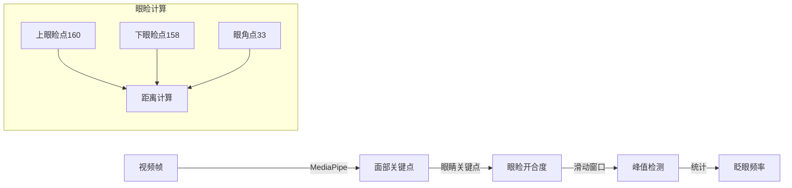
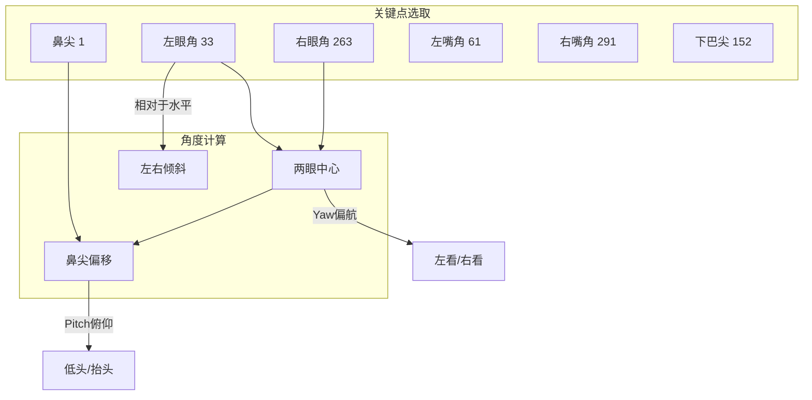
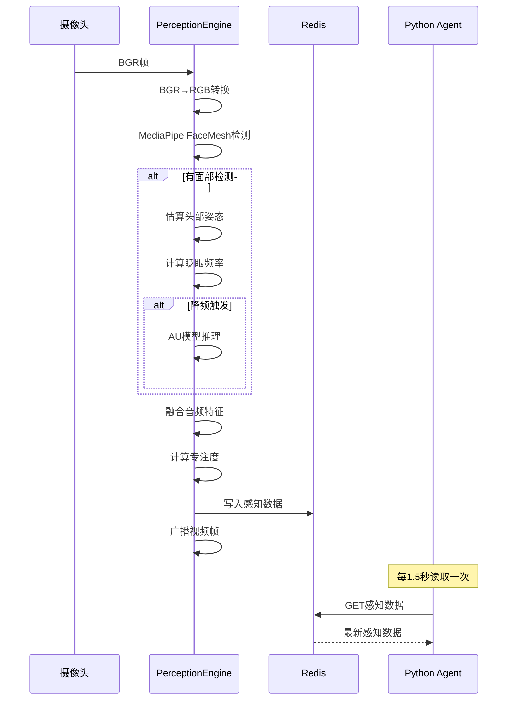

# T05 - Python感知服务：MediaPipe与实时多模态感知

---

## 1. 模块概览

### 1.1 一句话定义

Python感知服务负责**从摄像头采集视频帧，通过MediaPipe提取面部关键点，计算眨眼频率和头部姿态，将感知数据以10Hz频率写入Redis**，供Python Agent实时读取。

### 1.2 在系统中的位置

```mermaid
flowchart TB
    subgraph Camera["硬件层"]
        A[摄像头]
    end

    subgraph感知["Python感知服务 (8000)"]
        B[PerceptionEngine]
        C[BlinkDetector]
        D[HeadPoseEstimator]
        E[AudioFeatureExtractor]
    end

    subgraph感知["感知模型"]
        F[MediaPipe FaceMesh]
        G[AU Model]
    end

    subgraph Storage["存储层"]
        H[Redis]
    end

    subgraph Agent["Python Agent (8001)"]
        I[LangGraph]
    end

    Camera -->|BGR帧| B
    B -->|关键点| D
    B -->|图像| F
    B -->|图像| G
    B -->|音频| E
    B -->|10Hz| H
    H -->|感知数据| I

    style B fill:#f59e0b,stroke:#333
    style H fill:#3e8ed0,stroke:#333
```

### 1.3 解决的核心问题

1. **实时感知**：低延迟捕获并处理摄像头画面
2. **多模态融合**：整合面部、音频等多种感知信号
3. **计算效率**：10Hz采样 + 降频处理平衡性能与效果

---

## 2. 技术原理与设计思想

### 2.1 为什么选择MediaPipe？

| 方案 | 优点 | 缺点 | 适用场景 |
|------|------|------|----------|
| MediaPipe | 开箱即用、精度高、跨平台 | 商业使用有一定限制 | **婉晴AI采用** |
| OpenCV DNN | 完全开源 | 需要自己训练/调参 | 需要深度定制 |
| dlib | 轻量级 | 速度较慢 | CPU场景 |
| 自研模型 | 完全可控 | 开发成本高 | 大厂有资源 |

**MediaPipe的核心能力**：
- Face Mesh：468个面部关键点
- Holistic：整合面部+姿态+手部
- 实时性能：30fps+，延迟<50ms

### 2.2 眨眼检测原理

**问题**：如何从视频帧检测眨眼频率？

**算法设计**：


**关键点索引**：
- 左眼：33(外角)、160(上)、158(下)
- 右眼：263(外角)、385(上)、387(下)

**计算公式**：
```
眼睑开合度 = 垂直距离 / (水平距离 × 0.3)
当开合度 < 阈值(0.6) → 闭眼 → 峰值
```

### 2.3 头部姿态估算原理

**问题**：如何从2D关键点估算3D头部姿态？

**三角剖分法**：



**计算公式**：
```
Pitch(俯仰) = arctan(nose_offset_y / eye_distance)
Yaw(偏航)   = arctan(nose_offset_x / eye_distance)
Roll(翻滚)   = arctan(dy / dx)  // 两眼连线与水平线夹角
```

### 2.4 专注度计算

**公式**：
```
focus_level = w1 × (1 - head_deviation) + w2 × blink_score + w3 × gaze_factor

其中：
- head_deviation = (|pitch| + |yaw|) / 60  // 归一化
- blink_score = 1 - |blink_rate - 15| / 15  // 偏离正常值15次/分
- w1 = 0.5, w2 = 0.3, w3 = 0.2
```

**设计意图**：
- 头部稳定 → 分心程度低
- 眨眼正常(15次/分) → 注意力集中
- 低头(-40°以上)均视为专注阅读 → 不惩罚

---

## 3. 关键代码解析

### 3.1 核心文件结构

```
backend/ai_assistant/
├── core/
│   ├── perception_engine.py    # 感知引擎核心
│   ├── perception_models.py     # HuggingFace AU模型
│   └── audio_feature_extractor.py # 音频特征提取
└── utils/
    └── config.py               # 感知配置
```

### 3.2 感知引擎主循环

```python
# ======== 关键代码1：主循环结构 ========
class PerceptionEngine:
    def __init__(self, session_id="default"):
        # MediaPipe初始化
        mp_face = mp.solutions.face_mesh
        self._face_mesh = mp_face.FaceMesh(
            static_image_mode=False,
            max_num_faces=1,
            refine_landmarks=True,  # 精细关键点
            min_detection_confidence=0.5,
            min_tracking_confidence=0.5
        )

        # 子模块
        self._blink_detector = BlinkDetector()
        self._head_pose_estimator = HeadPoseEstimator()
        self._au_model = get_au_model()

        # 控制标志
        self._running = False
        self._frame_queue = Queue(maxsize=5)

    # ======== 关键代码2：启动方法 ========
    def start(self):
        self._running = True
        # 摄像头线程
        self._camera_thread = threading.Thread(target=self._camera_loop)
        self._camera_thread.start()
        # 感知处理线程
        self._thread = threading.Thread(target=self._run_loop)
        self._thread.start()

    # ======== 关键代码3：主循环 ========
    def _run_loop(self):
        last_sample = time.time()
        while self._running:
            # 1. 控制采样频率(约0.67Hz)
            elapsed = time.time() - last_sample
            sleep_time = 1.5 - elapsed  # 1.5秒采样间隔
            if sleep_time > 0:
                time.sleep(sleep_time)
            last_sample = time.time()

            # 2. 获取最新帧
            frame = self._get_latest_frame()
            if frame is None:
                continue

            # 3. MediaPipe检测
            rgb = cv2.cvtColor(frame, cv2.COLOR_BGR2RGB)
            results = self._face_mesh.process(rgb)

            # 4. 提取感知数据
            perception_data = self._extract_perception(frame, results)

            # 5. 写入Redis
            self._write_to_redis(perception_data)
```

### 3.3 眨眼检测器

```python
# ======== 关键代码4：眨眼检测 ========
class BlinkDetector:
    def __init__(self, window_seconds=60.0):
        self._history: deque = deque(maxlen=5000)  # 60秒滑动窗口
        self._window_seconds = window_seconds

    def update(self, timestamp: float, eye_openness: float):
        """记录眼睑开合度"""
        self._history.append((timestamp, eye_openness))

    def get_blink_rate(self) -> float:
        """计算60秒窗口内的眨眼频率"""
        if len(self._history) < 100:  # 约10秒数据
            return 15.0  # 默认值

        now = self._history[-1][0]
        cutoff = now - self._window_seconds
        window_data = [(t, v) for t, v in self._history if t >= cutoff]

        blink_count = self._count_peaks(window_data)
        elapsed = window_data[-1][0] - window_data[0][0]

        # 转换为次/分钟
        rate = blink_count * (60.0 / elapsed)
        return max(0.0, min(60.0, rate))

    def _count_peaks(self, window_data):
        """峰值检测：闭眼时的眼睑开合度"""
        blink_count = 0
        in_blink = False

        for i in range(1, len(window_data) - 1):
            v = window_data[i][1]
            prev_v = window_data[i-1][1]
            next_v = window_data[i+1][1]

            # 谷值检测：当前点比前后都低
            if v < prev_v and v < next_v:
                if v < 0.6:  # 低于阈值=闭眼
                    if not in_blink:
                        in_blink = True
                elif in_blink:
                    blink_count += 1
                    in_blink = False

        return blink_count
```

### 3.4 头部姿态估算

```python
# ======== 关键代码5：头部姿态估算 ========
class HeadPoseEstimator:
    # 6个关键点索引
    KEYPOINT_INDICES = {
        "nose_tip": 1,
        "left_eye_corner": 33,
        "right_eye_corner": 263,
        "left_mouth_corner": 61,
        "right_mouth_corner": 291,
        "chin": 152
    }

    def update_from_landmarks(self, landmarks, image_w, image_h):
        # 提取关键点坐标
        pts = {
            name: (lm.x * image_w, lm.y * image_h)
            for name, lm in self.KEYPOINT_INDICES.items()
        }

        # 两眼中心
        eye_center_x = (pts["left_eye_corner"][0] + pts["right_eye_corner"][0]) / 2
        eye_center_y = (pts["left_eye_corner"][1] + pts["right_eye_corner"][1]) / 2

        # 眼距（归一化用）
        eye_dist = math.sqrt(
            (pts["right_eye_corner"][0] - pts["left_eye_corner"][0]) ** 2 +
            (pts["right_eye_corner"][1] - pts["left_eye_corner"][1]) ** 2
        )

        if eye_dist < 1e-6:
            return self._last_pose  # 防止除零

        # Roll：两眼连线与水平线夹角
        dx = pts["right_eye_corner"][0] - pts["left_eye_corner"][0]
        dy = pts["right_eye_corner"][1] - pts["left_eye_corner"][1]
        roll = math.degrees(math.atan2(dy, dx))

        # Pitch：鼻尖相对两眼中心的垂直偏移
        nose_offset_y = pts["nose_tip"][1] - eye_center_y
        pitch = math.degrees(math.atan2(nose_offset_y, eye_dist))

        # Yaw：鼻尖相对两眼中心的水平偏移
        nose_offset_x = pts["nose_tip"][0] - eye_center_x
        yaw = math.degrees(math.atan2(nose_offset_x, eye_dist))

        return {"pitch": pitch, "yaw": yaw, "roll": roll}
```

### 3.5 Redis写入

```python
# ======== 关键代码6：Redis写入 ========
def _write_to_redis(self, perception_data):
    redis_client = self._ensure_redis()
    if redis_client is None:
        return

    key = f"emotion:realtime:{self.session_id}"
    redis_client.set(key, json.dumps(perception_data))

# ======== 关键代码7：感知数据结构 ========
# 写入Redis的JSON格式
{
    "timestamp": 1709123456789,
    "session_id": "xxx",
    "au": {
        "AU1": 0.1, "AU4": 0.5, "AU12": 0.3,
        "primary_emotion": "neutral",
        "confidence": 0.7
    },
    "head_pose": {
        "pitch": -5.2,
        "yaw": 2.1,
        "roll": 0.5
    },
    "blink_rate": 15.0,
    "audio": {
        "pitch": 200.0,
        "loudness": 0.5,
        "speaking": False
    },
    "focus_level": 0.8
}
```

---

## 4. 核心难点与实现细节

### 4.1 线程安全：帧队列设计

**问题**：摄像头采集和感知处理在不同线程，如何安全传递数据？

**解决方案**：Thread-Safe Queue

```python
# 生产者：摄像头线程
def _camera_loop(self):
    cap = cv2.VideoCapture(0)
    while self._camera_running:
        ret, frame = cap.read()
        if ret:
            self.push_frame(frame)  # 线程安全

# 消费者：感知线程
def push_frame(self, frame):
    try:
        # 非阻塞写入，队列满时丢弃旧帧
        self._frame_queue.put_nowait(frame.copy())
    except Full:
        # 队列满，清空后写入
        while not self._frame_queue.empty():
            self._frame_queue.get_nowait()
        self._frame_queue.put_nowait(frame.copy())

# 消费者：只取最新帧
def _get_latest_frame(self):
    frame = None
    try:
        while True:
            frame = self._frame_queue.get_nowait()  # 不断清空
    except Empty:
        pass
    return frame  # 返回最后一张
```

### 4.2 AU模型降频策略

**问题**：AU模型推理耗时，如果每帧都调用会拖慢处理。

**解决方案**：降频到3Hz

```python
class PerceptionEngine:
    def __init__(self):
        self._au_model_interval = 1 / 3.0  # ~0.333秒
        self._last_au_time = 0.0

    def _extract_perception(self, frame, results):
        current_time = time.time()

        if current_time - self._last_au_time >= self._au_model_interval:
            # 调用AU模型
            au_result = self._au_model.predict(frame)
            self._last_au_time = current_time
        else:
            # 使用上次结果
            au_result = self._last_au_result
```

**效果**：
- MediaPipe：10Hz全速
- AU模型：3Hz（节省70%计算）

### 4.3 摄像头自动重连

**问题**：摄像头可能临时断开。

**解决方案**：自动重连 + 模拟模式

```python
def _camera_loop(self):
    cap = cv2.VideoCapture(0)

    if not cap.isOpened():
        print("无法打开摄像头，切换到模拟模式")
        self._simulated_camera_loop()
        return

    reconnect_attempts = 0

    while self._camera_running:
        ret, frame = cap.read()

        if not ret:
            reconnect_attempts += 1
            print(f"摄像头读取失败，尝试重连({reconnect_attempts})")

            cap.release()
            time.sleep(1)
            cap = cv2.VideoCapture(0)

            if cap.isOpened():
                reconnect_attempts = 0
            elif reconnect_attempts >= 3:
                print("多次重连失败，切换到模拟模式")
                self._simulated_camera_loop()
                return
```

### 4.4 JPEG压缩优化带宽

**问题**：原始BGR帧太大（640×480×3 ≈ 921KB）。

**解决方案**：JPEG压缩 + Base64编码

```python
def compress_frame(frame):
    # 调整分辨率
    frame = cv2.resize(frame, (320, 240))

    # JPEG压缩
    _, buffer = cv2.imencode('.jpg', frame,
                              [cv2.IMWRITE_JPEG_QUALITY, 70])

    # Base64编码
    return base64.b64encode(buffer).decode('utf-8')
```

**效果**：
- 原始：~900KB
- 压缩后：~15KB
- 带宽节省：98%

---

## 5. 数据流与交互

### 5.1 感知数据流



### 5.2 专注模式触发条件

| 条件 | 阈值 | 含义 |
|------|------|------|
| 眨眼频率 | > 25次/分 | 紧张、焦虑 |
| 头部俯仰 | < -15° | 低头（可能沉思或沮丧） |
| AU4皱眉 | > 0.7 | 高强度负面情绪 |
| AU模型置信度 | > 0.6 | 情绪判断可信度高 |

---

## 6. 配置与依赖

### 6.1 感知配置

```python
# backend/ai_assistant/utils/config.py
class PerceptionConfig:
    # 采样参数
    SAMPLE_INTERVAL = 1.5  # 采样间隔（秒）
    SAMPLE_RATE = 10  # 目标采样率（Hz）

    # 眨眼检测
    NORMAL_BLINK_RATE = 15.0  # 正常频率（次/分）
    BLINK_PEAK_THRESHOLD = 0.6  # 闭眼阈值
    BLINK_WINDOW_SECONDS = 60.0  # 统计窗口

    # 头部姿态
    HEAD_STABILITY_WEIGHT = 0.5
    BLINK_RATE_WEIGHT = 0.3
    GAZE_DEVIATION_WEIGHT = 0.2

    # 专注模式触发
    ATTENTION_TRIGGER_BLINK_RATE = 25  # 眨眼频率阈值
    ATTENTION_TRIGGER_HEAD_PITCH = -15  # 头部俯仰阈值
    ATTENTION_TRIGGER_CONFIDENCE = 0.6  # AU模型置信度阈值
```

### 6.2 依赖项

```txt
# requirements.txt
opencv-python>=4.8.0
mediapipe>=0.10.0
numpy>=1.24.0
redis>=5.0.0
```

---

## 7. 扩展与思考

### 7.1 可选优化方向

**1. GPU加速**
```python
# 使用GPU版本的MediaPipe
mp_face = mp.solutions.face_mesh
mp_face = mp_face.FaceMesh(
    model_complexity=1,  # 0=Lite, 1=Full, 2=Heavy
    num_threads=4
)
```

**2. 多脸支持**
```python
# max_num_faces调整
self._face_mesh = mp_face.FaceMesh(max_num_faces=2)
```

**3. 自适应采样**
```python
# 专注模式提高采样率
sample_interval = 1.5 if not is_focused else 0.5  # 专注时2Hz
```

### 7.2 设计启示

**1. 传感器融合**
- 单模态可能不可靠
- 多模态投票提高准确性

**2. 计算资源分配**
- 非关键路径降频节省资源
- 关键路径保持高精度

**3. 容错设计**
- 摄像头断开时自动重连
- 降级到模拟模式保证系统可用

---

## 8. 学习资源

### 8.1 官方文档

- [MediaPipe Face Mesh](https://google.github.io/mediapipe/solutions/face_mesh)
- [OpenCV VideoCapture](https://docs.opencv.org/4.8.0/d8/dfe/classcv_1_1VideoCapture)

### 8.2 进阶阅读

- [Facial Action Coding System (FACS)](https://en.wikipedia.org/wiki/Facial_Action_Coding_System)
- [Head Pose Estimation](https://learnopencv.com/head-pose-estimation-using-opencv-and-dlib/)

---

## 模块索引

返回 [模块清单与索引](./00_模块清单与索引.md) | 上一篇：[T04-Java SSE透传](./T04_Java_SSE透传.md) | 下一篇：[T06-LangGraph状态机](./T06_LangGraph状态机.md)
