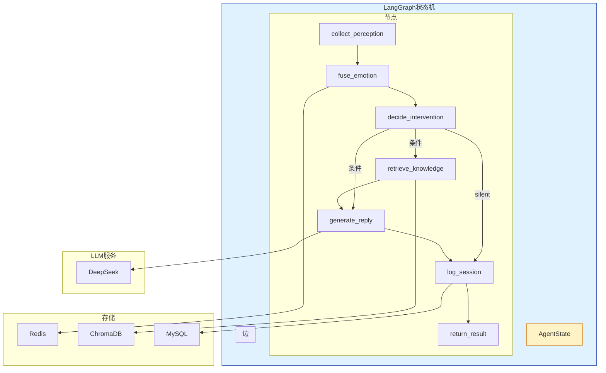
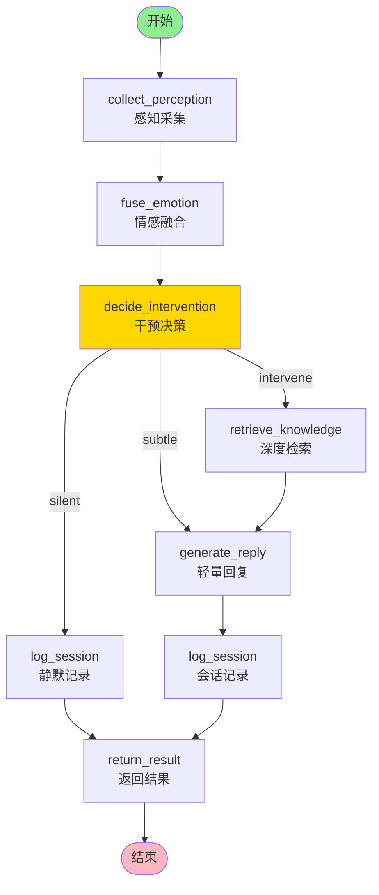
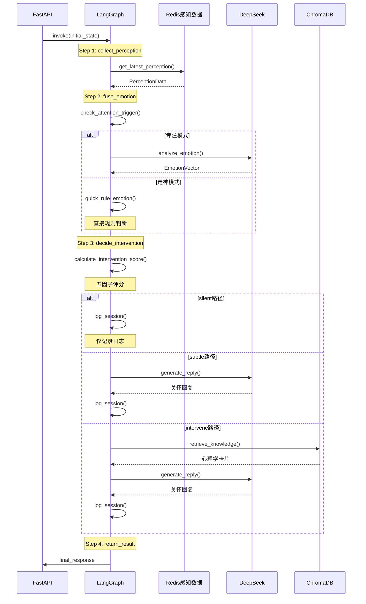

# T06 - LangGraph状态机：图结构设计与条件路由

---

## 1. 模块概览

### 1.1 一句话定义

LangGraph状态机模块负责**定义婉晴AI Agent的决策流程**，通过节点注册、边连接和条件路由，构建一个可执行的多步骤推理图。

### 1.2 在系统中的位置



### 1.3 解决的核心问题

1. **流程编排**：将复杂的AI推理分解为多个可管理的步骤
2. **状态共享**：通过AgentState在整个图中传递数据
3. **条件分支**：根据干预决策动态选择不同路径

---

## 2. 技术原理与设计思想

### 2.1 什么是LangGraph？

LangGraph是LangChain生态中的**图结构编排框架**，用于构建有状态的多步骤Agent。

**核心概念**：
- **节点(Node)**：执行特定任务的函数
- **边(Edge)**：节点之间的连接
- **状态(State)**：贯穿整个图执行的共享数据
- **条件边(Conditional Edge)**：根据状态动态选择下一个节点

**与传统LLM调用的对比**：

| 传统LLM调用 | LangGraph |
|-------------|-----------|
| 单次请求-响应 | 多步骤推理链 |
| 无状态 | 状态贯穿全程 |
| 固定流程 | 可条件分支 |
| 难以调试 | 每步可追踪 |

### 2.2 为什么选择LangGraph？

**婉晴AI的需求**：
1. 需要多步骤推理（感知→融合→决策→回复）
2. 需要根据状态动态路由（silent/subtle/intervene）
3. 需要在节点间共享数据（情感向量、干预决策）
4. 需要可插拔的工具调用（RAG检索、Notion同步）

**其他方案对比**：

| 方案 | 优点 | 缺点 |
|------|------|------|
| LangChain Expression Language | 轻量 | 状态管理弱 |
| LangGraph | 状态管理强、条件路由灵活 | 学习曲线 |
| 自研状态机 | 完全可控 | 开发成本高 |

**婉晴AI选择LangGraph**：平衡了灵活性与开发成本。

### 2.3 图结构设计

**完整节点图**：



**三条执行路径**：

| 路径 | 触发条件 | 用途 | 执行节点 |
|------|----------|------|----------|
| **Silent** | 无需干预 | 静默观察，记录日志 | collect→fuse→decide→log→return |
| **Subtle** | 轻度干预 | 简单关怀回复 | collect→fuse→decide→reply→log→return |
| **Intervene** | 深度干预 | 检索知识+关怀回复 | collect→fuse→decide→retrieve→reply→log→return |

### 2.4 条件路由原理

**条件路由是LangGraph的核心能力**：

```python
# 根据状态决定下一步
def route_decision(state):
    action = state["intervention_decision"]["suggested_action"]
    
    if action == "silent":
        return "log_session"
    elif action == "subtle":
        return "generate_reply"
    else:  # intervene
        return "retrieve_knowledge"

# 注册条件边
graph.add_conditional_edges(
    "decide_intervention",
    route_decision,  # 路由函数
    {
        "silent": "log_session",
        "subtle": "generate_reply",
        "intervene": "retrieve_knowledge"
    }
)
```

**执行流程**：
```
decide_intervention返回 action="intervene"
         ↓
route_decision(state) → "retrieve_knowledge"
         ↓
retrieve_knowledge → generate_reply → log_session → return_result
```

---

## 3. 关键代码解析

### 3.1 核心文件结构

```
Agent/src/agent/
├── graph.py          # 图构建与编译
├── state.py          # AgentState定义
└── nodes/
    ├── collect_perception.py  # 感知采集
    ├── fuse_emotion.py        # 情感融合
    ├── decide_intervention.py  # 干预决策
    ├── retrieve_knowledge.py  # 知识检索
    ├── generate_reply.py      # 回复生成
    ├── log_session.py        # 会话记录
    └── return_result.py      # 结果封装
```

### 3.2 AgentState定义

```python
# ======== 关键代码1：状态定义 ========
from langgraph.graph import MessagesState
from pydantic import BaseModel, Field

class AgentState(MessagesState):
    """
    婉晴AI全局状态机
    
    继承MessagesState以支持LangGraph的消息管理。
    额外字段按模块分区定义。
    """

    # === 会话标识 ===
    session_id: str = Field(default="")
    user_id: str = Field(default="")

    # === 感知数据 ===
    latest_perception: PerceptionData | None = Field(default=None)

    # === 情感融合 ===
    current_emotion: EmotionVector | None = Field(default=None)
    emotion_history: list[dict] = Field(default_factory=list)

    # === 干预决策 ===
    intervention_decision: InterventionDecision | None = Field(default=None)

    # === 记忆与知识 ===
    conversation_history: list[dict] = Field(default_factory=list)
    retrieved_knowledge_cards: list[str] = Field(default_factory=list)
    retrieved_long_term_memories: list[str] = Field(default_factory=list)

    # === 最终响应 ===
    final_response: dict = Field(default_factory=dict)
```

**设计要点**：
- 使用Pydantic确保类型安全
- 所有字段有默认值，避免节点报错
- 按功能分区，便于理解

### 3.3 图构建

```python
# ======== 关键代码2：图构建 ========
from langgraph.graph import END, StateGraph

def _build_graph():
    g = StateGraph(AgentState)

    # 1. 注册所有节点
    g.add_node("collect_perception", collect_perception_node)
    g.add_node("fuse_emotion", fuse_emotion_node)
    g.add_node("decide_intervention", decide_intervention_node)
    g.add_node("retrieve_knowledge", retrieve_knowledge_node)
    g.add_node("generate_reply", generate_reply_node)
    g.add_node("log_session", log_session_node)
    g.add_node("return_result", return_result_node)

    # 2. 设置入口点
    g.set_entry_point("collect_perception")

    # 3. 普通边（固定顺序）
    g.add_edge("collect_perception", "fuse_emotion")
    g.add_edge("fuse_emotion", "decide_intervention")

    # 4. 条件边（核心路由）
    g.add_conditional_edges(
        "decide_intervention",
        _intervention_router,  # 路由函数
        {
            "silent": "log_session",
            "subtle": "generate_reply",
            "intervene": "retrieve_knowledge"
        }
    )

    # 5. 后续固定边
    g.add_edge("generate_reply", "log_session")
    g.add_edge("retrieve_knowledge", "generate_reply")
    g.add_edge("log_session", "return_result")
    g.add_edge("return_result", END)

    return g.compile()
```

### 3.4 条件路由函数

```python
# ======== 关键代码3：条件路由 ========
def _intervention_router(state: AgentState) -> str:
    """
    根据干预决策确定下一步节点
    
    Returns:
        str: "silent" | "subtle" | "intervene"
    """
    decision = state.get("intervention_decision")
    
    if decision is None:
        logger.warning("[router] 无干预决策，默认 silent 路径")
        return "silent"
    
    # 获取干预动作
    action = decision.suggested_action.value
    
    logger.debug(f"[router] 路由决策: {action}")
    
    return action  # "silent" | "subtle" | "intervene"
```

### 3.5 单例模式

```python
# ======== 关键代码4：延迟初始化单例 ========
_graph_instance: CompiledStateGraph | None = None

def get_graph() -> CompiledStateGraph:
    """
    获取全局LangGraph编译图单例
    
    延迟初始化避免循环导入问题。
    """
    global _graph_instance
    
    if _graph_instance is None:
        _graph_instance = _build_graph()
        logger.info(f"[graph] LangGraph 编译完成")
    
    return _graph_instance
```

### 3.6 图执行

```python
# ======== 关键代码5：图执行入口 ========
async def run_agent(request: AgentInvokeRequest) -> dict:
    """
    执行Agent推理
    
    Args:
        request: AgentInvokeRequest
            - session_id: 会话ID
            - user_message: 用户消息
            - emotion_history: 历史情感
            - conversation_history: 对话历史
    
    Returns:
        dict: final_response
    """
    # 1. 初始化状态
    initial_state = {
        "session_id": request.session_id,
        "user_id": request.user_id,
        "user_input": request.user_message,
        "emotion_history": request.emotion_history or [],
        "conversation_history": request.conversation_history or [],
    }

    # 2. 执行图
    graph = get_graph()
    result = await graph.ainvoke(initial_state)

    # 3. 提取最终响应
    return result.get("final_response", {})
```

---

## 4. 核心难点与实现细节

### 4.1 节点返回值规范

**问题**：节点返回的dict如何合并到状态？

**LangGraph规则**：
- 节点的返回值会与当前状态**合并**
- 如果key已存在，**覆盖**现有值

```python
# 节点返回
{
    "current_emotion": emotion_vector,
    "is_focused_mode": True
}

# 合并到状态后
state = {
    ...existing_state...,
    "current_emotion": emotion_vector,  # 覆盖
    "is_focused_mode": True  # 新增
}
```

**设计要点**：
- 返回值key必须与AgentState字段名一致
- 只返回需要更新的字段

### 4.2 异步节点设计

**问题**：节点涉及IO操作（Redis、HTTP），如何避免阻塞？

**解决方案**：使用async/await

```python
# ======== 异步节点示例 ========
async def collect_perception_node(state: AgentState) -> dict:
    """感知采集节点（异步）"""
    
    session_id = state.get("session_id")
    
    # 异步读取Redis
    perception = await get_latest_perception(session_id)
    
    return {"latest_perception": perception}


async def fuse_emotion_node(state: AgentState) -> dict:
    """情感融合节点（异步LLM调用）"""
    
    # 异步调用DeepSeek
    emotion = await _analyze_with_llm(state)
    
    return {"current_emotion": emotion}
```

**LangGraph执行**：
```python
# ainvoke() 支持异步节点
result = await graph.ainvoke(initial_state)
```

### 4.3 状态一致性

**问题**：多个节点可能同时写入同一字段。

**解决方案**：
- LangGraph内部使用锁保证状态写入的原子性
- 节点执行顺序由图结构决定

```python
# 执行顺序保证
collect_perception → fuse_emotion → decide_intervention
                         ↓                    ↓
                   写入current_emotion   读取current_emotion
```

### 4.4 错误降级处理

**问题**：某个节点执行失败怎么办？

**解决方案**：节点内部try-except，外层兜底

```python
async def decide_intervention_node(state: AgentState) -> dict:
    try:
        return await _decide_intervention_impl(state)
    except Exception as e:
        logger.error(f"[decide] 节点异常，降级为SILENT: {e}")
        return {
            "intervention_decision": _create_silent_decision()
        }


def _create_silent_decision() -> InterventionDecision:
    """静默决策兜底"""
    return InterventionDecision(
        needed=False,
        urgency=InterventionUrgency.LOW,
        suggested_action=InterventionAction.SILENT,
        ui_instruction=UIInstruction(color="neutral", pulse="slow")
    )
```

### 4.5 图编译时机

**问题**：图应该在什么时候编译？

**方案A**：模块导入时编译
```python
# 问题：可能导致循环导入
graph = _build_graph()  # 在模块级别
```

**方案B**：延迟编译（婉晴AI采用）
```python
_graph_instance = None

def get_graph():
    global _graph_instance
    if _graph_instance is None:
        _graph_instance = _build_graph()
    return _graph_instance
```

**优点**：
- 避免循环导入
- 支持热更新
- 首次使用时才初始化

---

## 5. 数据流与交互

### 5.1 完整执行流程



### 5.2 状态流转示例

```
初始状态:
{
    "session_id": "xxx",
    "user_input": "今天心情不好",
    "current_emotion": null,
    "intervention_decision": null
}

↓ collect_perception_node
{
    "latest_perception": PerceptionData(...)
}

↓ fuse_emotion_node
{
    "current_emotion": EmotionVector(emotion="悲伤", intensity=0.8)
}

↓ decide_intervention_node
{
    "intervention_decision": InterventionDecision(
        action="intervene",
        score=0.75
    )
}

→ 路由到 retrieve_knowledge

↓ retrieve_knowledge_node
{
    "retrieved_knowledge_cards": ["5-4-3-2-1着陆技术", ...]
}

↓ generate_reply_node
{
    "intervention_decision": {
        ...,
        "reply": "听起来你今天遇到了一些不开心的事..."
    }
}

↓ log_session_node
{}

↓ return_result_node
{
    "final_response": {
        "action": "intervene",
        "reply": "...",
        "vector": {...}
    }
}
```

---

## 6. 配置与依赖

### 6.1 LangGraph配置

```python
# Agent/config.py
class LLMConfig:
    CHAT_MODEL = "deepseek-chat"
    API_KEY = os.getenv("DEEPSEEK_API_KEY")
    BASE_URL = "https://api.deepseek.com"
    TEMPERATURE = 0.7
    MAX_TOKENS = 1000
```

### 6.2 依赖项

```txt
# requirements.txt
langgraph>=0.0.20
langchain-core>=0.1.0
langchain-openai>=0.0.5
```

---

## 7. 扩展与思考

### 7.1 可选优化方向

**1. 子图复用**
```python
# 定义可复用的子图
reasoning_graph = StateGraph(ReasoningState)
reasoning_graph.add_node("plan", plan_node)
reasoning_graph.add_node("act", act_node)
reasoning_graph.add_edge("plan", "act")

# 在主图中嵌入
main_graph.add_node("reasoning", reasoning_graph.compile())
```

**2. 断点调试**
```python
# 设置断点
from langgraph.errors import NodeInterrupt

def decide_node(state):
    if state["score"] > 0.9:
        raise NodeInterrupt(f"高风险干预: score={state['score']}")
    return {"decision": "proceed"}
```

**3. 状态快照**
```python
# 保存执行快照用于回放
graph = _build_graph(checkpointer=MemorySaver())
result = graph.invoke(state, config={"configurable": {"thread_id": "1"}})
```

### 7.2 设计启示

**1. 图结构优于硬编码流程**
- 图结构更直观
- 易于修改和扩展
- 支持可视化调试

**2. 状态是核心**
- 状态设计决定图的复杂度
- 字段要有明确的语义

**3. 降级是必须的**
- 任何节点都可能失败
- 需要兜底策略保证系统可用

---

## 8. 学习资源

### 8.1 官方文档

- [LangGraph官方文档](https://langchain-ai.github.io/langgraph/)
- [LangGraph概念指南](https://python.langchain.com/docs/langgraph)

### 8.2 进阶阅读

- [LangGraph设计模式](https://blog.langchain.dev/langgraph-platform/)
- [State Graph vs Message Graph](https://github.com/langchain-ai/langgraph/discussions/)

---

## 模块索引

返回 [模块清单与索引](./00_模块清单与索引.md) | 上一篇：[T05-Python感知服务](./T05_Python感知服务.md) | 下一篇：[T07-情感融合节点](./T07_情感融合节点.md)
