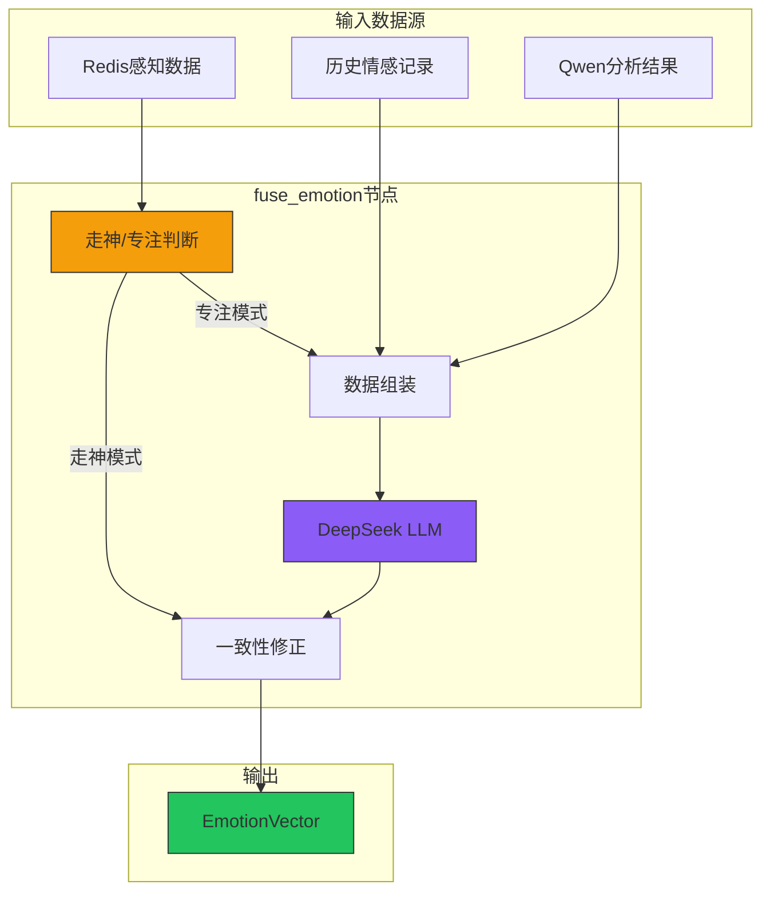
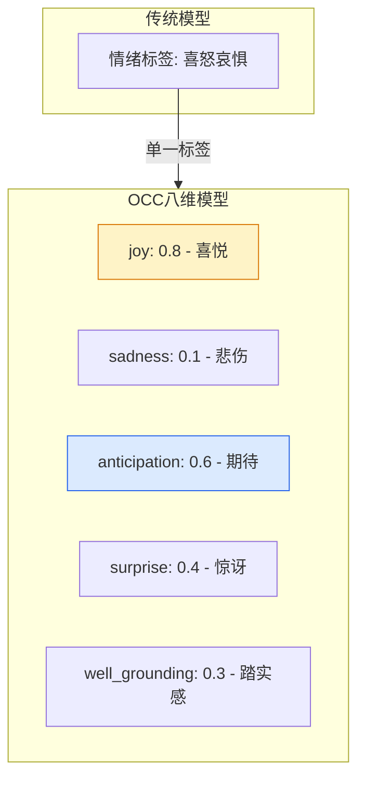
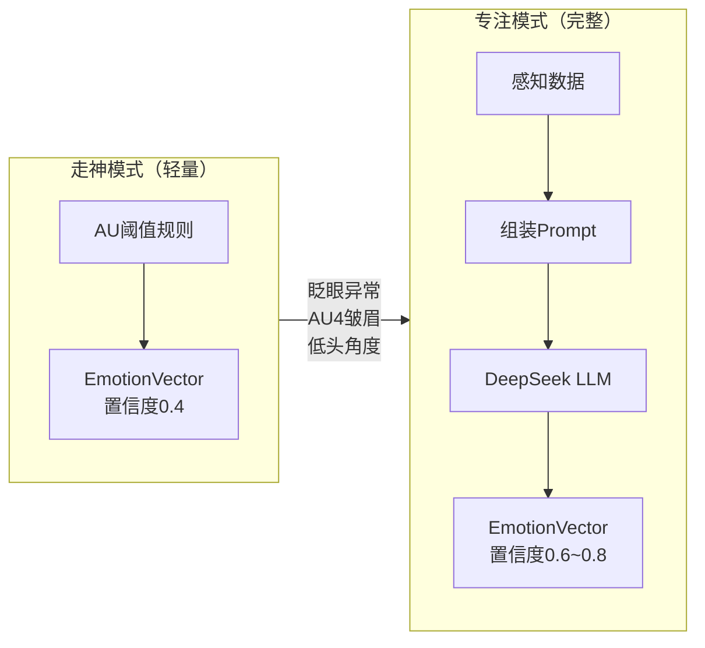
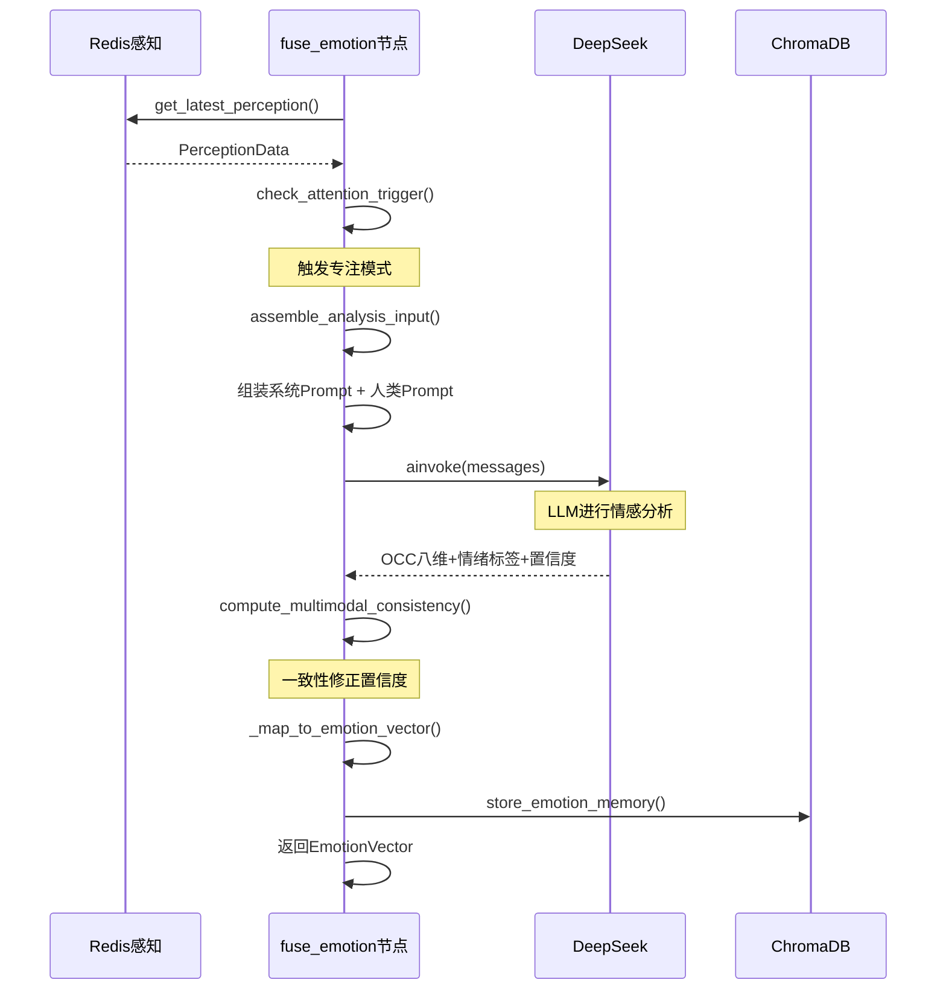

# T07 - 情感融合节点：OCC八维归因与多模态一致性

---

## 1. 模块概览

### 1.1 一句话定义

情感融合节点负责**整合多源感知数据（面部动作单元、音频特征、历史情感），调用DeepSeek LLM进行情感推理，输出标准化的OCC八维情感向量**。

### 1.2 在系统中的位置



### 1.3 解决的核心问题

1. **多源融合**：整合面部、音频、历史等多维数据
2. **走神/专注切换**：根据感知数据动态选择分析深度
3. **OCC八维归因**：将情感量化为八维向量而非简单标签

---

## 2. 技术原理与设计思想

### 2.1 为什么要用OCC情感模型？

**传统情感分类的局限**：
```
问题：只有"喜怒哀惧"四种基础情感

用户A说"我通过了考试！"
→ 可能是喜悦（目标达成）
→ 可能是惊讶（意外）
→ 可能是期待（对未来更有信心）

传统分类无法区分这些细微差别
```

**OCC模型的优势**：



**OCC八维详解**：

| 维度 | 中文 | 心理学定义 | 高值场景 |
|------|------|------------|----------|
| Joy | 喜悦 | 目标达成带来的愉悦 | 考试通过、获得表扬 |
| Sadness | 悲伤 | 面对损失的痛苦 | 失恋、失败、失去 |
| Anger | 愤怒 | 目标被阻碍时的挫败感 | 被冤枉、不公平对待 |
| Fear | 恐惧 | 面对不确定威胁的紧张 | 面试、考试、未知 |
| Disgust | 厌恶 | 对不愉快刺激的排斥 | 看到恶心的事物 |
| Surprise | 惊讶 | 意外事件带来的震惊 | 惊喜、惊吓 |
| Well_grounding | 踏实感 | 感到安全、被支持 | 被理解、感到平静 |
| Anticipation | 期待 | 对未来积极或消极的预期 | 期待假期、担心结果 |

### 2.2 为什么要走神/专注双模式？

**问题**：每次都调用LLM分析太贵/太慢。

**解决方案**：根据感知数据动态选择分析深度。



**触发专注模式的条件**：

| 条件 | 阈值 | 含义 |
|------|------|------|
| 眨眼频率 | > 25次/分 | 紧张焦虑信号 |
| 头部俯仰 | < -15° | 低头沉思或沮丧 |
| AU4皱眉 | > 0.7 | 高强度负面情绪 |
| AU模型置信度 | > 0.6 + 负面 | 可信的负面情绪 |

### 2.3 为什么需要多模态一致性修正？

**问题**：LLM可能产生"幻觉"情绪。

**解决方案**：基于客观数据的一致性修正。

```python
# LLM自报置信度：0.9（很高）
llm_output = {
    "emotion": "焦虑",
    "confidence": 0.9
}

# 但AU数据显示：用户嘴角上扬(AU12=0.6)
# 焦虑+嘴角上扬 = 不一致！

# 一致性修正
consistency = 0.3  # 低一致性
alpha = 0.6  # LLM权重

final_confidence = alpha * 0.9 + (1-alpha) * 0.3 = 0.66
```

---

## 3. 关键代码解析

### 3.1 核心文件结构

```
Agent/src/agent/nodes/
└── fuse_emotion.py      # 情感融合节点
```

### 3.2 主节点函数

```python
# ======== 关键代码1：主入口 ========
async def fuse_emotion_node(state: AgentState) -> dict[str, Any]:
    """
    情感融合节点主入口
    
    执行流程：
    1. 获取感知数据
    2. 判断走神/专注模式
    3a. 走神模式 → 快速规则判断
    3b. 专注模式 → DeepSeek LLM分析
    4. 返回EmotionVector
    """
    session_id = state.get("session_id")

    # Step 1: 获取感知数据
    perception = state.get("latest_perception")
    if perception is None:
        perception = await get_latest_perception(session_id)

    if perception is None:
        logger.warning("[fuse] 无感知数据，返回中性")
        return {"current_emotion": _default_neutral_emotion(session_id)}

    # Step 2: 走神/专注模式判断
    triggered, reason = check_attention_trigger(perception)
    is_focused = triggered or state.get("is_focused_mode", False)

    # Step 3a: 走神模式 → 快速规则
    if not is_focused:
        return {
            "current_emotion": _quick_rule_emotion(perception, session_id),
            "is_focused_mode": False
        }

    # Step 3b: 专注模式 → LLM分析
    return await _full_llm_analysis(state, perception)
```

### 3.3 走神/专注模式判断

```python
# ======== 关键代码2：专注模式触发规则 ========
def check_attention_trigger(perception: PerceptionData) -> tuple[bool, str]:
    """
    判断是否触发专注模式
    
    Returns:
        (triggered: bool, reason: str)
    """
    cfg = perception_config
    au = perception.au

    # 条件1：眨眼频率异常
    if perception.blink_rate > cfg.ATTENTION_TRIGGER_BLINK_RATE:
        return True, f"眨眼频率过高: {perception.blink_rate:.1f}"

    # 条件2：低头角度
    if perception.head_pose.pitch < cfg.ATTENTION_TRIGGER_HEAD_PITCH:
        return True, f"低头角度过大: {perception.head_pose.pitch:.1f}°"

    # 条件3：AU4强烈皱眉
    if au.AU4 > 0.7:
        return True, f"AU4(皱眉)过高: {au.AU4:.2f}"

    # 条件4：AU模型负面情绪 + 高置信度
    negative_emotions = {"sad", "angry", "fear", "disgust", "contempt"}
    if (au.confidence > cfg.ATTENTION_TRIGGER_CONFIDENCE
            and au.primary_emotion in negative_emotions):
        return True, f"AU模型负面情绪: {au.primary_emotion}"

    return False, ""
```

### 3.4 走神模式快速规则

```python
# ======== 关键代码3：快速规则判断 ========
def _quick_rule_emotion(perception: PerceptionData, session_id: str) -> EmotionVector:
    """
    走神模式下的快速规则判断
    
    不调用LLM，仅基于AU阈值推断。
    置信度固定为0.4（低可靠性）。
    """
    au = perception.au

    # AU → 情绪映射
    if au.AU4 > 0.7 and au.AU15 > 0.5:
        primary = "沮丧"  # 皱眉 + 嘴角下垂
    elif au.AU4 > 0.7:
        primary = "焦虑"  # 皱眉为主
    elif au.AU12 > 0.4:
        primary = "开心"  # 嘴角上扬
    else:
        primary = "中性"

    return EmotionVector(
        timestamp=int(time.time() * 1000),
        session_id=session_id,
        primary_emotion=EmotionLabel(primary),
        intensity=min(1.0, (au.AU4 + au.AU15) / 2 + 0.1),
        confidence=0.4,  # 固定低置信度
        reasoning="[走神模式] 基于AU阈值规则快速判断",
        evidence={"au_model": au.primary_emotion}
    )
```

### 3.5 LLM分析（专注模式）

```python
# ======== 关键代码4：DeepSeek LLM分析 ========
async def _full_llm_analysis(state: AgentState, perception: PerceptionData) -> dict:
    """专注模式：调用DeepSeek进行情感分析"""

    # Step 1: 组装Prompt
    analysis_input = _assemble_analysis_input(
        perception=perception,
        qwen_analysis=state.get("qwen_analysis"),
        emotion_history=state.get("emotion_history", []),
        session_id=state.get("session_id")
    )

    # Step 2: 调用DeepSeek
    client = _get_deepseek_client()
    response = await client.ainvoke([
        SystemMessage(_SYSTEM_PROMPT),
        HumanMessage(analysis_input)
    ])

    # Step 3: 解析LLM输出
    llm_output = _parse_llm_output(response.content)

    # Step 4: 多模态一致性修正
    consistency = _compute_multimodal_consistency(
        llm_emotion=llm_output.emotion_assessment.primary_emotion,
        au_emotion=perception.au.primary_emotion,
        qwen_emotion=state.get("qwen_analysis").primary_emotion if state.get("qwen_analysis") else None,
        au_confidence=perception.au.confidence
    )

    alpha = intervention_config.LLM_CONFIDENCE_ALPHA  # 0.6
    final_confidence = alpha * llm_output.emotion_assessment.confidence + (1-alpha) * consistency

    # Step 5: 映射为EmotionVector
    emotion_vector = _map_to_emotion_vector(
        llm_output=llm_output,
        perception=perception,
        final_confidence=final_confidence,
        history_context=_build_history_context(state.get("emotion_history", []))
    )

    return {
        "current_emotion": emotion_vector,
        "is_focused_mode": True
    }
```

### 3.6 多模态一致性计算

```python
# ======== 关键代码5：一致性修正 ========
def _compute_multimodal_consistency(
    llm_emotion: str,
    au_emotion: str,
    qwen_emotion: str | None,
    au_confidence: float
) -> float:
    """
    计算多模态一致性得分(0~1)
    
    一致性 = LLM情绪极性与AU/Qwen是否对齐
    """
    # 情绪极性映射
    polarity_map = {
        "开心": "positive", "平静": "neutral", "中性": "neutral",
        "焦虑": "negative", "沮丧": "negative", "疲惫": "negative",
        "愤怒": "negative", "恐惧": "negative", "厌恶": "negative",
        # AU模型输出（英文）
        "happy": "positive", "neutral": "neutral",
        "sad": "negative", "angry": "negative"
    }

    llm_polarity = polarity_map.get(llm_emotion, "neutral")
    au_polarity = polarity_map.get(au_emotion, "neutral")
    qwen_polarity = polarity_map.get(qwen_emotion or "", "neutral")

    scores = []

    # AU一致性（加权置信度）
    if au_confidence > 0.4:
        au_consistent = 1.0 if llm_polarity == au_polarity else 0.2
        scores.append(au_consistent * au_confidence)

    # Qwen一致性
    if qwen_emotion:
        qwen_consistent = 1.0 if llm_polarity == qwen_polarity else 0.3
        scores.append(qwen_consistent)

    if not scores:
        return 0.5  # 无可靠数据时返回中性

    return sum(scores) / len(scores)
```

### 3.7 OCC八维向量映射

```python
# ======== 关键代码6：OCC向量映射 ========
_OCC_TO_ZH = {
    "joy": "喜悦",
    "sadness": "悲伤",
    "anger": "愤怒",
    "fear": "恐惧",
    "disgust": "厌恶",
    "surprise": "惊讶",
    "well_grounding": "踏实感",
    "anticipation": "期待"
}

def _map_to_emotion_vector(llm_output, perception, final_confidence, history_context) -> EmotionVector:
    """将LLM输出映射为标准EmotionVector"""

    ea = llm_output.emotion_assessment

    return EmotionVector(
        timestamp=int(time.time() * 1000),
        session_id=perception.session_id,
        primary_emotion=EmotionLabel(ea.primary_emotion),
        secondary_emotion=EmotionLabel(ea.secondary_emotion) if ea.secondary_emotion else None,
        intensity=ea.intensity,
        valence=ea.valence,
        arousal=ea.arousal,
        dominance=ea.dominance,
        confidence=final_confidence,
        reasoning=ea.reasoning,
        evidence={
            "au": {  # 客观AU证据
                "AU4": perception.au.AU4,
                "AU12": perception.au.AU12,
                "AU15": perception.au.AU15
            },
            "occ": {  # OCC八维归因
                "joy": ea.occ_joy,
                "sadness": ea.occ_sadness,
                "anger": ea.occ_anger,
                "fear": ea.occ_fear,
                "disgust": ea.occ_disgust,
                "surprise": ea.occ_surprise,
                "well_grounding": ea.occ_well_grounding,
                "anticipation": ea.occ_anticipation
            }
        },
        history_context=history_context
    )
```

---

## 4. 核心难点与实现细节

### 4.1 LLM输出不稳定问题

**问题**：LLM返回的JSON格式可能不稳定。

**解决方案**：多层解析 + Markdown清洗。

```python
# LLM可能返回：
# ```json
# {"emotion": "焦虑", ...}
# ```
# 或直接返回：
# {"emotion": "焦虑", ...}

# 清洗函数
def _clean_llm_json(raw_text: str) -> str:
    # 匹配 ```json...``` 或 ```...```
    match = re.search(r"```(?:json)?\s*(.*?)\s*```", raw_text, re.DOTALL)
    if match:
        return match.group(1).strip()
    return raw_text.strip()
```

### 4.2 Prompt设计要点

**关键设计原则**：

1. **明确输出格式**：让LLM知道要输出什么
2. **提供判断依据**：AU参数表帮助推理
3. **冲突处理规则**：客观与主观不一致时的处理
4. **OCC八维要求**：必须输出所有维度

```python
_SYSTEM_PROMPT = """
你是一个专业的心理学情感分析助手...

【情绪标签枚举——必须从此列表选取】
焦虑、沮丧、平静、开心、疲惫、愤怒、恐惧、厌恶、惊讶、中性

【OCC八维情感归因（必须输出）】
基于OCC模型，对用户情感进行八维度量化评估(0~1)：

| occ_joy | 喜悦 | 目标达成感 |
| occ_sadness | 悲伤 | 失落无助 |
| occ_anger | 愤怒 | 挫败感 |
| occ_fear | 恐惧 | 不安全感 |
| occ_disgust | 厌恶 | 排斥感 |
| occ_surprise | 惊讶 | 意外感 |
| occ_well_grounding | 踏实感 | 安全被支持 |
| occ_anticipation | 期待 | 对未来预期 |

【冲突处理规则】
- AU与Qwen冲突时，优先多个客观参数的一致性
- 置信度<0.5时在reasoning中说明
"""
```

### 4.3 置信度修正公式

**公式**：
```
final_confidence = α × LLM_confidence + (1-α) × consistency

其中α = 0.6（可配置）
```

**设计原理**：
- α=1.0：完全信任LLM
- α=0.0：完全信任客观数据
- α=0.6：平衡LLM推理与客观一致性

### 4.4 历史上下文构建

```python
def _build_history_context(emotion_history: list[dict]) -> dict:
    """计算情感趋势和基线偏差"""
    if not emotion_history:
        return {"recent_trend": "stable", "baseline_deviation": 0.0}

    # 趋势分析
    trend = get_emotion_trend(emotion_history)

    # 基线计算：最近5条强度均值
    recent = emotion_history[-5:]
    intensities = [h.get("intensity", 0.0) for h in recent]
    baseline = sum(intensities) / len(intensities)

    # 当前强度与基线的偏差
    current_intensity = recent[-1].get("intensity", 0.0)
    deviation = current_intensity - baseline

    return {
        "recent_trend": trend.value,
        "baseline_deviation": round(deviation, 3),
        "baseline_mean": round(baseline, 3)
    }
```

---

## 5. 数据流与交互

### 5.1 专注模式完整流程



### 5.2 输入输出示例

**输入（assemble_analysis_input）**：
```
【用户当前状态】

**面部动作单元（AU）**：
- AU4（皱眉）：0.65
- AU12（嘴角上扬）：0.30
- AU15（嘴角下垂）：0.55

**音频特征**：
- 音调：220 Hz
- 响度：0.4

**眨眼频率**：18次/分钟
**专注度**：0.6

**近期情感历史**（共5条）：
- 1709123456000：平静，强度=0.3
- 1709123457500：平静，强度=0.35
```

**输出（EmotionVector）**：
```python
EmotionVector(
    primary_emotion="沮丧",  # 主要情绪
    intensity=0.75,          # 强度
    confidence=0.68,        # 修正后的置信度
    evidence={
        "au": {"AU4": 0.65, "AU15": 0.55},
        "occ": {
            "joy": 0.1,
            "sadness": 0.75,  # 悲伤维度最高
            "anger": 0.3,
            "fear": 0.2,
            "disgust": 0.1,
            "surprise": 0.1,
            "well_grounding": 0.2,
            "anticipation": 0.3
        }
    }
)
```

---

## 6. 配置与依赖

### 6.1 LLM配置

```python
# Agent/config.py
class LLMConfig:
    CHAT_MODEL = "deepseek-chat"
    API_KEY = os.getenv("DEEPSEEK_API_KEY")
    BASE_URL = "https://api.deepseek.com"
    TEMPERATURE = 0.7
    MAX_TOKENS = 1000

class InterventionConfig:
    LLM_CONFIDENCE_ALPHA = 0.6  # LLM置信度权重
```

### 6.2 专注模式触发配置

```python
# Agent/config.py
class PerceptionConfig:
    ATTENTION_TRIGGER_BLINK_RATE = 25      # 眨眼频率阈值
    ATTENTION_TRIGGER_HEAD_PITCH = -15     # 头部俯仰阈值
    ATTENTION_TRIGGER_CONFIDENCE = 0.6       # AU模型置信度阈值
```

---

## 7. 扩展与思考

### 7.1 可选优化方向

**1. 动态α调整**
```python
# 根据场景动态调整α
if emotion_history is empty:
    alpha = 0.8  # 首次分析，更信任LLM
else:
    alpha = 0.5  # 有历史数据，平衡LLM与一致性
```

**2. 融合模型自研**
当前依赖DeepSeek，未来可训练专门的情感融合模型：
```python
class EmotionFusionModel:
    def predict(self, perception, history) -> EmotionVector:
        # 输入感知数据 + 历史
        # 输出OCC八维向量
        pass
```

**3. 实时微调**
根据用户反馈实时调整情感判断：
```python
# 用户拒绝干预 → 降低负面情绪置信度
if feedback == "rejected":
    emotion.confidence *= 0.8
```

### 7.2 设计启示

**1. 多模态优于单模态**
- 单一数据源不可靠
- 多模态一致性检验提高准确率

**2. 按需调用LLM**
- 不是所有场景都需要LLM推理
- 走神/专注模式节省成本

**3. 结构化输出的重要性**
- Pydantic模型保证类型安全
- Prompt设计决定输出质量

---

## 8. 学习资源

### 8.1 官方文档

- [LangChain Pydantic Output Parser](https://python.langchain.com/docs/modules/model_io/output_parsers/)
- [DeepSeek API](https://platform.deepseek.com/docs)

### 8.2 进阶阅读

- [OCC情感模型原始论文](https://cogsci.ucsd.edu/~gratch/COGSC%201/Ortony,%20Clore,%20Collins%20-%20The%20Cognitive%20Structure%20of%20Emotions.pdf)
- [Facial Action Coding System](https://en.wikipedia.org/wiki/Facial_Action_Coding_System)

---

## 模块索引

返回 [模块清单与索引](./00_模块清单与索引.md) | 上一篇：[T06-LangGraph状态机](./T06_LangGraph状态机.md) | 下一篇：[T08-干预决策节点](./T08_干预决策节点.md)
