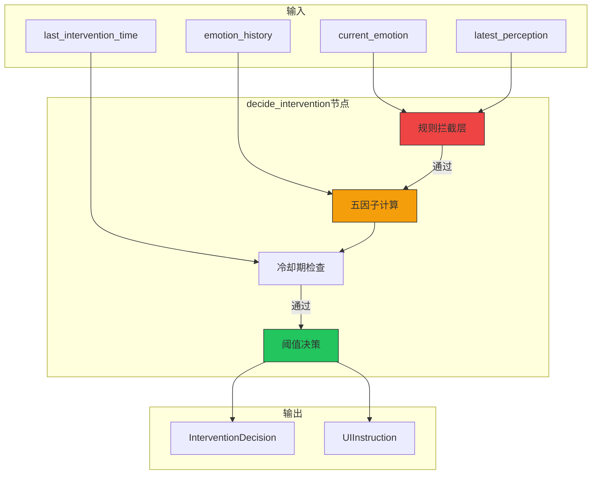
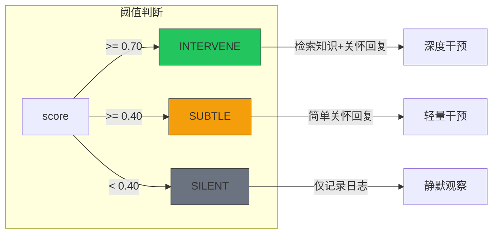
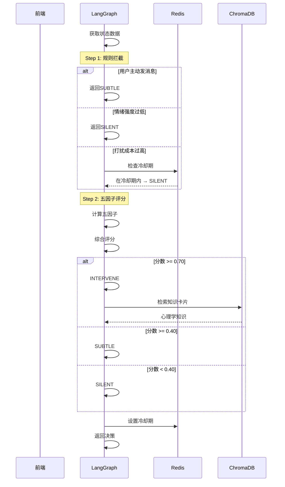

# T08 - 干预决策节点：五因子评分模型与智能关怀

---

## 1. 模块概览

### 1.1 一句话定义

干预决策节点负责**基于五因子评分模型计算综合干预分数，结合冷却期管理和用户主动消息检测，决定婉晴应该采取SILENT/SUBTLE/INTERVENE三种干预级别之一**。

### 1.2 在系统中的位置



### 1.3 解决的核心问题

1. **何时干预**：不是所有情绪波动都需要干预
2. **如何判断**：综合多因子量化评估
3. **避免骚扰**：冷却期防止频繁打扰
4. **用户优先**：用户主动对话必须响应

---

## 2. 技术原理与设计思想

### 2.1 为什么需要干预决策？

**问题**：不是所有情绪波动都需要干预。

| 场景 | 是否干预 | 原因 |
|------|----------|------|
| 用户正在专注工作 | 否 | 打扰成本高 |
| 用户刚被干预过 | 否 | 需要消化时间 |
| 用户情绪持续恶化 | 是 | 需要关怀 |
| 用户主动说话 | 是 | 最低服务要求 |

**干预决策的本质**：
- 不是分析用户情绪
- 而是判断"现在干预是否合适"

### 2.2 五因子评分模型

**核心公式**：

```
干预分数 = W₁×情绪强度 + W₂×情感优先级 - W₃×打扰成本 + W₄×趋势因子 + W₅×置信度

其中：
- W₁ = 0.35（情绪强度权重）
- W₂ = 0.25（情感优先级权重）
- W₃ = 0.20（打扰成本权重，负值）
- W₄ = 0.10（趋势因子权重）
- W₅ = 0.10（置信度权重）
```

**公式解读**：

| 因子 | 含义 | 为什么重要 |
|------|------|------------|
| 情绪强度 | 当前情绪有多强烈 | 强烈情绪更需要关注 |
| 情感优先级 | 某种情绪是否更值得干预 | 焦虑/恐惧 > 开心 |
| 打扰成本 | 用户被打扰的代价 | 专注时不应打扰 |
| 趋势因子 | 情绪在恶化还是好转 | 恶化中更需要干预 |
| 置信度 | 判断的可靠程度 | 低置信度时应保守 |

### 2.3 打扰成本计算

**公式**：

```
打扰成本 = 专注度 × (1 - 唤醒度)

其中：
- 专注度 ∈ [0, 1]：头部稳定、眨眼正常
- 唤醒度 ∈ [0, 1]：激动程度
```

**直觉理解**：
- 用户很专注（focus=0.9）+ 平静（arousal=0.2）
- 打扰成本 = 0.9 × (1 - 0.2) = 0.72（高成本）
- 不应该打扰

### 2.4 三级干预决策



| 决策 | 分数阈值 | 婉晴行为 | 后续节点 |
|------|----------|----------|----------|
| **INTERVENE** | ≥ 0.70 | 主动关怀，检索心理学知识 | retrieve_knowledge → generate_reply |
| **SUBTLE** | ≥ 0.40 | 简单暗示，温和关怀 | generate_reply |
| **SILENT** | < 0.40 | 静默观察，不打扰用户 | log_session |

---

## 3. 关键代码解析

### 3.1 主节点函数

```python
# ======== 关键代码1：主入口 ========
async def decide_intervention_node(state: AgentState) -> dict[str, Any]:
    """
    干预决策节点主入口
    
    Returns:
        {"intervention_decision": InterventionDecision}
    """
    try:
        return await _decide_intervention_impl(state)
    except Exception as e:
        logger.error(f"[decide] 节点异常，降级SILENT: {e}")
        return {"intervention_decision": _create_silent_decision()}
```

### 3.2 五因子计算

```python
# ======== 关键代码2：五因子评分 ========
async def _decide_intervention_impl(state: AgentState) -> dict[str, Any]:
    """五因子评分核心逻辑"""

    emotion = state.get("current_emotion")
    perception = state.get("latest_perception")
    emotion_history = state.get("emotion_history", [])

    # 因子1：情绪强度
    intensity = emotion.intensity

    # 因子2：情感优先级
    primary_emotion = emotion.primary_emotion.value
    emotion_priority = emotion_config.EMOTION_PRIORITY.get(primary_emotion, 0.0)

    # 因子3：打扰成本
    if perception:
        focus_level = perception.focus_level
        arousal = emotion.arousal
    else:
        focus_level = 0.5
        arousal = 0.5

    # 用户拒绝惩罚
    penalty = state.get("user_rejection_penalty", 1.0)
    interrupt_cost = focus_level * (1.0 - arousal) * penalty

    # 因子4：趋势因子
    trend = get_emotion_trend_from_state(emotion_history)
    trend_factor = _get_trend_factor(trend)

    # 因子5：置信度
    confidence = emotion.confidence

    # 综合评分
    cfg = intervention_config
    score = (
        cfg.WEIGHT_INTENSITY * intensity +
        cfg.WEIGHT_EMOTION_PRIORITY * emotion_priority -
        cfg.WEIGHT_INTERRUPT_COST * interrupt_cost +
        cfg.WEIGHT_TREND * trend_factor +
        cfg.WEIGHT_CONFIDENCE * confidence
    )

    logger.info(f"[decide] 五因子: "
        f"intensity={intensity:.2f}, priority={emotion_priority:.2f}, "
        f"cost={interrupt_cost:.2f}, trend={trend_factor:.2f}, "
        f"conf={confidence:.2f} → score={score:.3f}")

    return {"intervention_score": score, ...}
```

### 3.3 规则拦截层

```python
# ======== 关键代码3：规则拦截 ========
async def _decide_intervention_impl(state: AgentState) -> dict:

    # ============ 优先级最高：用户主动发消息 ============
    user_input = state.get("user_input", "")
    if user_input and user_input.strip():
        logger.info("[decide] ★ 用户主动发消息，跳过打扰成本/冷却期")
        return _create_subtle_decision()

    # ============ 规则A：情绪强度过低 → SILENT ============
    if intensity < cfg.MIN_INTENSITY_FOR_INTERVENTION:
        return _create_silent_decision()

    # ============ 规则B：打扰成本过高 → SILENT ============
    if interrupt_cost > cfg.HIGH_INTERRUPT_COST:
        return _create_silent_decision()

    # ============ 规则C：冷却期内 → SILENT ============
    current_time_ms = int(time.time() * 1000)
    redis = await get_redis()
    redis_last_ts = await redis.get(cooldown_key)

    if redis_last_ts:
        last_ts = int(redis_last_ts)
        elapsed = (current_time_ms - last_ts) / 1000.0
        if elapsed < cfg.COOLDOWN_BASE_SECONDS:
            return _create_silent_decision()

    # ============ 特殊：情绪危急 → 跳过所有规则 ============
    if intensity >= cfg.EMERGENCY_INTENSITY_THRESHOLD and emotion_priority >= 0.8:
        logger.warning("[decide] 🚨 检测到情绪危急状态！")
```

### 3.4 冷却期管理

```python
# ======== 关键代码4：冷却期管理 ========
# Redis Key模板
_COOLDOWN_KEY_TPL = "cooldown:agent:{session_id}"
_COOLDOWN_TTL_SECONDS = 300  # 5分钟TTL

async def _check_and_set_cooldown(session_id: str) -> None:
    """设置冷却期（干预执行后调用）"""
    redis = await get_redis()
    current_time = int(time.time() * 1000)

    await redis.set(
        _COOLDOWN_KEY_TPL.format(session_id=session_id),
        str(current_time),
        ex=_COOLDOWN_TTL_SECONDS  # 5分钟后自动过期
    )

async def _is_in_cooldown(session_id: str) -> bool:
    """检查是否在冷却期内"""
    redis = await get_redis()
    last_ts = await redis.get(_COOLDOWN_KEY_TPL.format(session_id=session_id))

    if last_ts:
        elapsed = (int(time.time() * 1000) - int(last_ts)) / 1000.0
        return elapsed < intervention_config.COOLDOWN_BASE_SECONDS

    return False
```

### 3.5 阈值决策

```python
# ======== 关键代码5：阈值决策 ========
async def _decide_intervention_impl(state: AgentState) -> dict:

    # 用户主动 → 强制SUBTLE
    if user_input:
        return _create_subtle_decision()

    # 分数阈值判断
    if score >= cfg.INTERVENE_THRESHOLD:
        action = InterventionAction.INTERVENE
        urgency = InterventionUrgency.HIGH if is_emergency else InterventionUrgency.MEDIUM
    elif score >= cfg.SUBTLE_THRESHOLD:
        action = InterventionAction.SUBTLE
        urgency = InterventionUrgency.LOW
    else:
        action = InterventionAction.SILENT
        urgency = InterventionUrgency.LOW

    # 设置冷却期
    if action != InterventionAction.SILENT:
        await _check_and_set_cooldown(session_id)

    return {
        "intervention_decision": InterventionDecision(
            needed=(action != InterventionAction.SILENT),
            urgency=urgency,
            suggested_action=action,
            intervention_score=score,
            ...
        )
    }
```

### 3.6 UI指令生成

```python
# ======== 关键代码6：UI指令映射 ========
def _get_ui_instruction(action: InterventionAction, emotion_key: str) -> UIInstruction:
    """
    根据动作和情绪生成UI指令
    
    UI指令控制前端光晕动画：
    - color: blue/orange/purple/green/neutral
    - pulse: slow/medium/fast/very_fast
    """
    if action == InterventionAction.SILENT:
        return UIInstruction(color="neutral", pulse="slow")

    if action == InterventionAction.SUBTLE:
        return UIInstruction(color="green", pulse="medium")

    # INTERVENE：根据情绪区分
    emotion_ui_map = {
        "焦虑": {"color": "blue", "pulse": "fast"},
        "沮丧": {"color": "blue", "pulse": "slow"},
        "悲伤": {"color": "blue", "pulse": "slow"},
        "恐惧": {"color": "purple", "pulse": "very_fast"},
        "愤怒": {"color": "purple", "pulse": "very_fast"},
        "厌恶": {"color": "purple", "pulse": "fast"},
    }

    ui_config = emotion_ui_map.get(emotion_key, {"color": "neutral", "pulse": "medium"})
    return UIInstruction(**ui_config)
```

---

## 4. 核心难点与实现细节

### 4.1 权重调优问题

**问题**：如何确定最佳的权重配置？

**解决方案**：A/B测试 + 反馈驱动

```python
# 不同实验分组使用不同权重
if experiment_group == "A":
    WEIGHT_INTENSITY = 0.35
elif experiment_group == "B":
    WEIGHT_INTENSITY = 0.45  # 更看重强度

# 根据反馈调整
if rejection_rate > 0.5:
    # 用户频繁拒绝，提高打扰成本权重
    WEIGHT_INTERRUPT_COST *= 1.2
```

### 4.2 冷却期持久化

**问题**：用户可能关闭页面，进程内冷却期失效。

**解决方案**：Redis持久化冷却期

```python
# 进程内存（不可靠）
last_intervention_time = state.get("last_intervention_time", 0)

# Redis持久化（可靠）
redis = await get_redis()
last_ts = await redis.get(f"cooldown:agent:{session_id}")

if redis_ts:
    # 使用Redis的时间
    elapsed = now - int(redis_ts)
else:
    # 降级使用进程内存
    elapsed = now - state.get("last_intervention_time", 0)
```

### 4.3 用户拒绝惩罚机制

**问题**：如何根据用户反馈调整干预策略？

**解决方案**：拒绝率驱动惩罚系数

```python
# Java后端统计拒绝率
rejection_rate = rejected_count / total_interventions_count

# 惩罚系数
penalty = max(0.5, min(1.5, 1.0 + rejection_rate * 0.5))

# 惩罚系数影响打扰成本
interrupt_cost = focus_level * (1.0 - arousal) * penalty
```

**效果**：
- 用户拒绝率高 → penalty增大 → 打扰成本增大 → 更保守
- 用户接受率高 → penalty=1.0 → 正常干预

### 4.4 紧急情况处理

**问题**：用户情绪危急时不能等待。

**解决方案**：紧急阈值跳过所有规则

```python
# 紧急情况判断
is_emergency = (
    intensity >= cfg.EMERGENCY_INTENSITY_THRESHOLD  # 强度≥0.9
    and emotion_priority >= 0.8  # 高优先级情绪
)

# 紧急情况：跳过打扰成本/冷却期检查
if is_emergency:
    logger.warning("🚨 情绪危急！跳过所有规则限制")
```

---

## 5. 数据流与交互

### 5.1 完整决策流程



### 5.2 干预决策数据结构

```python
@dataclass
class InterventionDecision:
    """干预决策"""
    needed: bool                  # 是否需要干预
    urgency: InterventionUrgency  # 紧急程度
    suggested_action: InterventionAction  # 建议动作
    intervention_score: float     # 综合评分
    interrupt_cost: float         # 打扰成本
    trend: EmotionTrend           # 情绪趋势
    ui_instruction: UIInstruction  # UI指令

@dataclass
class UIInstruction:
    """UI控制指令"""
    color: str   # 光晕颜色: blue/orange/purple/green/neutral
    pulse: str  # 脉冲速度: slow/medium/fast/very_fast
```

---

## 6. 配置与依赖

### 6.1 干预配置

```python
# Agent/config.py
class InterventionConfig:
    # 权重配置
    WEIGHT_INTENSITY = 0.35
    WEIGHT_EMOTION_PRIORITY = 0.25
    WEIGHT_INTERRUPT_COST = 0.20
    WEIGHT_TREND = 0.10
    WEIGHT_CONFIDENCE = 0.10

    # 阈值配置
    INTERVENE_THRESHOLD = 0.70   # 深度干预阈值
    SUBTLE_THRESHOLD = 0.40      # 轻量干预阈值

    # 规则配置
    MIN_INTENSITY_FOR_INTERVENTION = 0.30  # 最低干预强度
    HIGH_INTERRUPT_COST = 0.65  # 打扰成本上限
    COOLDOWN_BASE_SECONDS = 120   # 冷却时间（秒）
    EMERGENCY_INTENSITY_THRESHOLD = 0.90  # 紧急强度

    # 情绪优先级
    EMOTION_PRIORITY = {
        "焦虑": 0.8,
        "沮丧": 0.8,
        "恐惧": 0.9,
        "愤怒": 0.7,
        "悲伤": 0.6,
        "厌恶": 0.5,
        "惊讶": 0.3,
        "中性": 0.0,
        "开心": 0.0
    }

    # 趋势因子
    TREND_RISING_FACTOR = 0.15
    TREND_FALLING_FACTOR = -0.05
    TREND_STABLE_FACTOR = 0.0
```

### 6.2 Redis依赖

```python
# 冷却期Key模板
"cooldown:agent:{session_id}"
```

---

## 7. 扩展与思考

### 7.1 可选优化方向

**1. 强化学习优化权重**
```python
# 收集用户反馈作为reward
# 使用强化学习动态调整权重
class AdaptiveWeights:
    def update(self, decision, feedback):
        # feedback: accepted/rejected/ignored
        reward = {"accepted": 1, "rejected": -1, "ignored": 0}[feedback]
        # 更新权重...
```

**2. 多轮对话记忆**
```python
# 当前：只看最近N条情感历史
# 优化：考虑多轮干预的累积效果
if consecutive_interventions > 3:
    score *= 0.8  # 连续干预降低分数
```

**3. 场景感知**
```python
# 结合时间、任务阶段等场景因素
if task_phase == "experiment_task":
    # 实验中更保守
    thresholds = {"intervene": 0.75, "subtle": 0.50}
elif task_phase == "companion":
    # 陪伴模式更积极
    thresholds = {"intervene": 0.60, "subtle": 0.35}
```

### 7.2 设计启示

**1. 打扰是有成本的**
- 好的干预时机比干预本身更重要
- 冷却期是用户体验的保障

**2. 量化优于主观**
- 多因子量化比单一指标更可靠
- 反馈驱动可以持续优化

**3. 用户意图优先**
- 用户主动是最高优先级信号
- 系统不能"自作多情"

---

## 8. 学习资源

### 8.1 官方文档

- [LangChain Tool Calling](https://python.langchain.com/docs/modules/model_io/tools/)
- [Pydantic Data Classes](https://docs.pydantic.dev/)

### 8.2 进阶阅读

- [Reinforcement Learning from Human Feedback (RLHF)](https://arxiv.org/abs/2009.14720)
- [Cognitive Behavioral Therapy Principles](https://www.apa.org/ed/graduate)

---

## 模块索引

返回 [模块清单与索引](./00_模块清单与索引.md) | 上一篇：[T07-情感融合节点](./T07_情感融合节点.md) | 下一篇：[T09-记忆系统](./T09_记忆系统.md)
