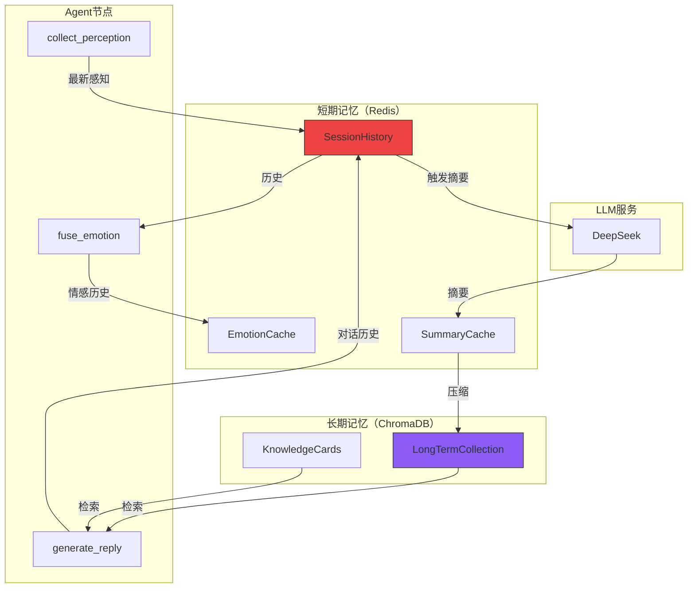
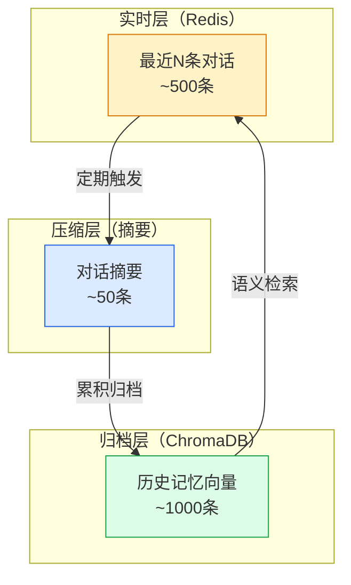
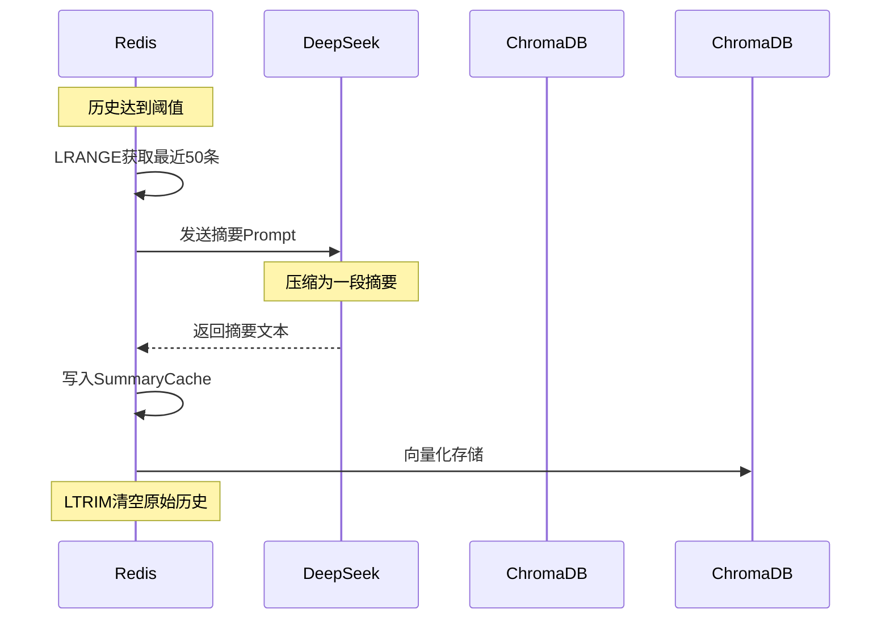
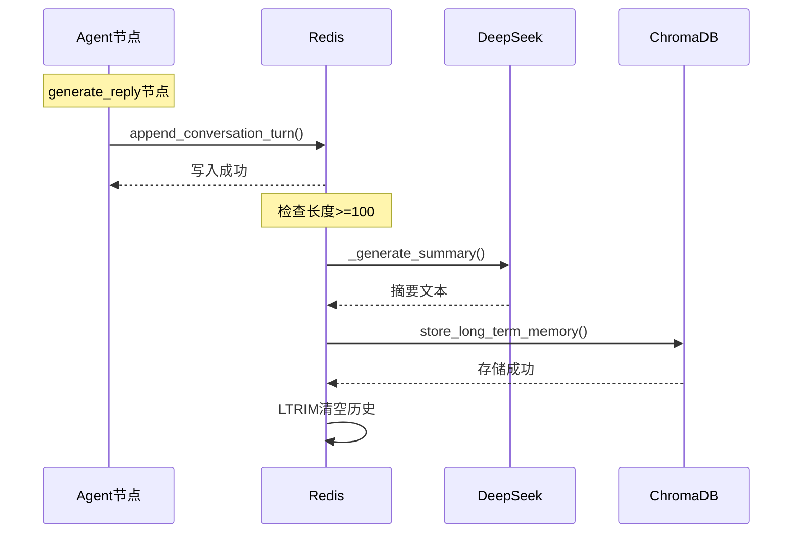
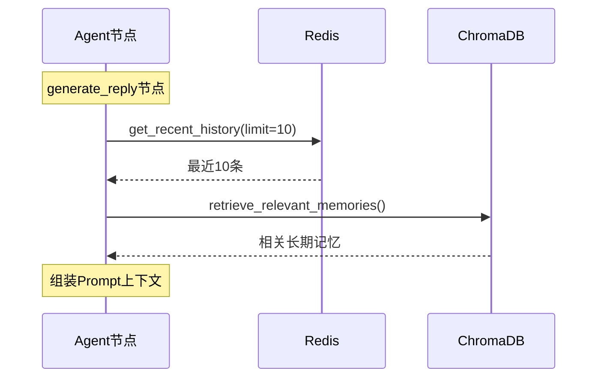

# T09 - 记忆系统：Redis短期记忆与ChromaDB长期记忆

---

## 1. 模块概览

### 1.1 一句话定义

记忆系统负责**管理婉晴AI的对话历史和情感轨迹**，通过Redis实现短期记忆的快速读写，通过ChromaDB实现长期记忆的语义存储和检索。

### 1.2 在系统中的位置



### 1.3 解决的核心问题

1. **短期记忆容量**：对话历史无限增长，存储和传输都成问题
2. **长期记忆检索**：需要根据语义检索历史，而非简单关键词
3. **记忆压缩**：定期将对话压缩为摘要，释放存储空间

---

## 2. 技术原理与设计思想

### 2.1 为什么需要分层记忆？

**问题**：对话历史会无限增长。

| 对话轮数 | Token数 | 问题 |
|----------|---------|------|
| 10轮 | ~2,000 | 可接受 |
| 50轮 | ~10,000 | 开始变慢 |
| 100轮 | ~20,000 | 超出手柄上下文 |
| 500轮 | ~100,000 | 完全不可用 |

**分层记忆设计**：



### 2.2 短期记忆：Redis List

**为什么选择Redis List？**

| 特性 | Redis List | MySQL | 文件 |
|------|-----------|-------|------|
| 读写速度 | O(1) | O(log n) | O(n) |
| 原子操作 | LPUSH/LTRIM | 需要事务 | N/A |
| TTL支持 | 有 | 需要额外字段 | 无 |
| 内存占用 | 高 | 中 | 低 |

**Redis List操作**：
```python
# 追加消息
redis.lpush(f"session:{session_id}:history", json.dumps(msg))

# 限制长度
redis.ltrim(f"session:{session_id}:history", 0, MAX_LENGTH - 1)

# 读取历史
redis.lrange(f"session:{session_id}:history", 0, -1)
```

### 2.3 长期记忆：向量数据库

**为什么需要向量检索？**

```
传统关键词检索：
用户问："今天遇到不开心的事"
历史中："上午客户沟通有问题"（包含"问题"）

向量语义检索：
用户问："今天遇到不开心的事"
历史中："上午心情低落"（语义相似）

向量检索能找到语义相近的记录，而非字面匹配
```

**ChromaDB优势**：
- 轻量级，易于部署
- 支持元数据过滤
- 内置嵌入模型

### 2.4 记忆摘要压缩

**问题**：Redis容量有限，如何保存更长时间的记忆？

**解决方案**：LLM摘要压缩



---

## 3. 关键代码解析

### 3.1 核心文件结构

```
Agent/src/memory/
├── short_term.py      # 短期记忆（Redis）
├── long_term.py       # 长期记忆（ChromaDB）
└── manager.py        # 记忆管理器（协调）

Agent/src/rag/
└── retriever.py      # RAG检索
```

### 3.2 短期记忆服务

```python
# ======== 关键代码1：短期记忆服务 ========
class ShortTermMemoryService:
    """
    短期记忆服务

    使用Redis List存储最近的对话历史。
    """

    # 配置常量
    MAX_HISTORY_LENGTH = 1000      # 最大历史条数
    SUMMARY_THRESHOLD = 100         # 触发摘要的历史条数
    SUMMARY_CACHE_TTL = 7 * 86400  # 摘要缓存7天

    # Redis Key模板
    HISTORY_KEY = "session:{session_id}:history"
    SUMMARY_KEY = "session:{session_id}:summary"

    async def get_recent_history(
        self,
        session_id: str,
        limit: int = 20
    ) -> list[dict]:
        """获取最近的对话历史"""
        redis = await get_redis()
        key = self.HISTORY_KEY.format(session_id=session_id)

        # LREVRANGE：从后往前取（最新的在前面）
        raw = await redis.lrange(key, 0, limit - 1)

        return [json.loads(item) for item in raw]

    async def append_conversation_turn(
        self,
        session_id: str,
        user_message: str,
        ai_message: str
    ) -> None:
        """追加一轮对话"""
        redis = await get_redis()
        key = self.HISTORY_KEY.format(session_id=session_id)

        turn = {
            "timestamp": int(time.time() * 1000),
            "user": user_message,
            "ai": ai_message
        }

        # LPUSH + LTRIM 保证长度不超限
        await redis.lpush(key, json.dumps(turn))
        await redis.ltrim(key, 0, self.MAX_HISTORY_LENGTH - 1)

        # 检查是否需要摘要
        await self.check_and_summarize_history(session_id)
```

### 3.3 记忆摘要压缩

```python
# ======== 关键代码2：记忆摘要压缩 ========
async def check_and_summarize_history(self, session_id: str) -> None:
    """
    检查历史长度，必要时触发摘要压缩
    """
    redis = await get_redis()
    history_key = self.HISTORY_KEY.format(session_id=session_id)

    # 获取历史长度
    length = await redis.llen(history_key)

    if length < self.SUMMARY_THRESHOLD:
        return  # 不需要摘要

    logger.info(f"[memory] 历史长度{length}，触发摘要压缩")

    # 获取完整历史
    raw_history = await redis.lrange(history_key, 0, -1)
    history = [json.loads(item) for item in raw_history]

    # 调用LLM生成摘要
    summary = await self._generate_summary(history)

    # 写入摘要缓存
    summary_key = self.SUMMARY_KEY.format(session_id=session_id)
    await redis.setex(
        summary_key,
        self.SUMMARY_CACHE_TTL,
        json.dumps({
            "timestamp": int(time.time() * 1000),
            "turn_count": length,
            "summary": summary
        })
    )

    # 归档到长期记忆
    await self.long_term_service.store_long_term_memory(
        session_id=session_id,
        content=summary,
        memory_type="conversation_summary"
    )

    # 清空Redis历史，保留最近20条
    await redis.ltrim(history_key, 0, 19)

    logger.info(f"[memory] 摘要压缩完成，保留20条最新")


async def _generate_summary(self, history: list[dict]) -> str:
    """
    使用LLM生成对话摘要

    Prompt设计要点：
    1. 要求简洁概括
    2. 提取关键话题和情感变化
    3. 保留重要细节
    """
    # 构建历史文本
    history_text = "\n".join([
        f"用户: {turn['user']}\n婉晴: {turn['ai']}"
        for turn in history
    ])

    prompt = f"""请将以下对话压缩为一段简洁的摘要（200字以内）：

{history_text}

摘要要求：
1. 概括对话的主要话题
2. 记录情感变化趋势
3. 保留关键细节（如具体事件、用户提到的信息）
"""

    client = _get_deepseek_client()
    response = await client.ainvoke([
        SystemMessage(_SUMMARY_SYSTEM_PROMPT),
        HumanMessage(prompt)
    ])

    return response.content.strip()
```

### 3.4 长期记忆服务

```python
# ======== 关键代码3：长期记忆服务 ========
class LongTermMemoryService:
    """
    长期记忆服务

    使用ChromaDB向量数据库存储语义记忆。
    """

    # ChromaDB配置
    COLLECTION_NAME = "long_term_memories"

    # 向量模型
    EMBEDDING_MODEL = "sentence-transformers/all-MiniLM-L6-v2"

    def __init__(self):
        self._client = None
        self._collection = None

    async def initialize(self):
        """初始化ChromaDB客户端"""
        import chromadb
        from chromadb.config import Settings

        self._client = chromadb.PersistentClient(
            path="./data/chromadb",
            settings=Settings(anonymized_telemetry=False)
        )

        self._collection = self._client.get_or_create_collection(
            name=self.COLLECTION_NAME,
            metadata={"description": "婉晴AI长期记忆"}
        )

    async def store_long_term_memory(
        self,
        session_id: str,
        content: str,
        memory_type: str = "conversation_summary",
        user_id: str = ""
    ) -> str:
        """
        存储长期记忆

        流程：
        1. 使用嵌入模型将内容向量化
        2. 存储到ChromaDB
        """
        # 生成向量
        embedding = await self._embed_text(content)

        # 生成ID
        memory_id = f"{session_id}:{int(time.time() * 1000)}"

        # 存储
        self._collection.add(
            ids=[memory_id],
            embeddings=[embedding],
            documents=[content],
            metadatas=[{
                "session_id": session_id,
                "user_id": user_id,
                "memory_type": memory_type,
                "timestamp": int(time.time() * 1000),
                "is_cold": False  # 冷热标记
            }]
        )

        logger.info(f"[memory] 长期记忆存储: {memory_id}, type={memory_type}")
        return memory_id

    async def retrieve_relevant_memories(
        self,
        query: str,
        session_id: str,
        top_k: int = 5
    ) -> list[dict]:
        """
        检索相关长期记忆

        流程：
        1. 将查询向量化
        2. 在ChromaDB中检索相似记忆
        3. 返回top_k个结果
        """
        # 查询向量化
        query_embedding = await self._embed_text(query)

        # 检索
        results = self._collection.query(
            query_embeddings=[query_embedding],
            n_results=top_k,
            where={"session_id": session_id}  # 过滤：同session的记忆
        )

        # 解析结果
        memories = []
        for i, doc_id in enumerate(results["ids"][0]):
            memories.append({
                "id": doc_id,
                "content": results["documents"][0][i],
                "distance": results["distances"][0][i],
                "metadata": results["metadatas"][0][i]
            })

        return memories
```

### 3.5 记忆检索器

```python
# ======== 关键代码4：记忆检索器 ========
class MemoryRetriever:
    """
    统一记忆检索接口

    协调短期记忆、长期记忆、RAG知识库的检索。
    """

    def __init__(
        self,
        short_term: ShortTermMemoryService,
        long_term: LongTermMemoryService,
        knowledge_retriever: KnowledgeRetriever
    ):
        self.short_term = short_term
        self.long_term = long_term
        self.knowledge = knowledge_retriever

    async def retrieve_context(
        self,
        session_id: str,
        current_emotion: EmotionVector,
        user_input: str
    ) -> dict[str, Any]:
        """
        检索所有相关上下文

        返回：
        {
            "recent_history": [...],        # 短期历史
            "long_term_memories": [...],    # 长期记忆
            "knowledge_cards": [...],       # 知识卡片
            "summary": "..."                # 当前摘要
        }
        """
        # 并行检索
        results = await asyncio.gather(
            self.short_term.get_recent_history(session_id, limit=10),
            self.long_term.retrieve_relevant_memories(
                query=user_input,
                session_id=session_id,
                top_k=3
            ),
            self.knowledge.retrieve_knowledge_cards(
                emotion=current_emotion.primary_emotion.value,
                query=user_input,
                top_k=3
            )
        )

        recent_history, long_term_memories, knowledge_cards = results

        # 获取摘要
        summary = await self.short_term.get_summary(session_id)

        return {
            "recent_history": recent_history,
            "long_term_memories": long_term_memories,
            "knowledge_cards": knowledge_cards,
            "summary": summary
        }
```

---

## 4. 核心难点与实现细节

### 4.1 Redis容量管理

**问题**：Redis内存有限，历史不能无限增长。

**解决方案**：LTRIM定期裁剪

```python
# ======== 容量管理 ========
MAX_HISTORY_LENGTH = 1000

async def append_conversation_turn(self, session_id: str, ...):
    # 追加新消息
    await redis.lpush(key, json.dumps(turn))

    # 裁剪到最大长度
    await redis.ltrim(key, 0, MAX_HISTORY_LENGTH - 1)
```

**为什么用LPUSH而非RPUSH？**
- LPUSH：新消息在列表头部，取最新消息用LRANGE
- RPUSH：新消息在列表尾部，取最新消息用LRANGE + 逆序

**婉晴AI选择LPUSH**：
```python
# 取最新的10条
recent = await redis.lrange(key, 0, 9)
# recent[0]是最新的
```

### 4.2 摘要触发时机

**问题**：什么时候触发摘要压缩？

**方案A**：固定轮数触发
```python
if len(history) >= 100:
    trigger_summary()
```
**问题**：可能恰好在关键时刻触发

**方案B**：时间+轮数双重触发（婉晴AI采用）
```python
# 条件1：轮数>=100
# 条件2：距离上次摘要>10分钟
if turn_count >= 100 and time_since_last_summary > 600:
    trigger_summary()
```

### 4.3 向量化模型选择

**选择**：sentence-transformers/all-MiniLM-L6-v2

| 模型 | 维度 | 速度 | 精度 |
|------|------|------|------|
| all-MiniLM-L6-v2 | 384 | 快 | 中 |
| all-mpnet-base-v2 | 768 | 慢 | 高 |
| text-embedding-ada-002 | 1536 | 中 | 高 |

**婉晴AI选择MiniLM**：
- 速度快，适合实时检索
- 维度低，存储效率高
- 精度对于中文场景够用

### 4.4 冷热记忆分离

**问题**：大量旧记忆拖慢检索。

**解决方案**：冷热分离

```python
# 写入时标记
metadata["is_cold"] = False  # 新记忆=热

# 超过30天的记忆标记为冷
if current_time - metadata["timestamp"] > 30 * 86400000:
    metadata["is_cold"] = True

# 检索时优先热记忆
if retrieval_for_rag:
    where = {"session_id": session_id}
else:
    # 只检索热记忆
    where = {"session_id": session_id, "is_cold": False}
```

---

## 5. 数据流与交互

### 5.1 记忆写入流程



### 5.2 记忆检索流程



### 5.3 记忆数据结构

```json
// 短期记忆（Redis）
{
    "timestamp": 1709123456789,
    "user": "今天心情不好",
    "ai": "听起来你今天遇到了一些不开心的事..."
}

// 摘要（Redis + ChromaDB）
{
    "timestamp": 1709123456789,
    "turn_count": 50,
    "summary": "用户表达了工作压力，婉晴进行了倾听和情绪疏导...",
    "metadata": {
        "session_id": "xxx",
        "memory_type": "conversation_summary",
        "is_cold": false
    }
}
```

---

## 6. 配置与依赖

### 6.1 短期记忆配置

```python
# Agent/config.py
class MemoryConfig:
    MAX_HISTORY_LENGTH = 1000       # 最大历史条数
    SUMMARY_THRESHOLD = 100        # 触发摘要的条数
    SUMMARY_TTL_SECONDS = 7 * 86400  # 摘要缓存7天
    KEEP_AFTER_SUMMARY = 20        # 摘要后保留条数
```

### 6.2 长期记忆配置

```python
class MemoryConfig:
    CHROMA_PERSIST_PATH = "./data/chromadb"
    EMBEDDING_MODEL = "sentence-transformers/all-MiniLM-L6-v2"
    LONG_TERM_TOP_K = 3           # 检索top_k
    SIMILARITY_THRESHOLD = 0.7    # 相似度阈值
```

### 6.3 依赖项

```txt
# requirements.txt
redis>=5.0.0
chromadb>=0.4.0
sentence-transformers>=2.2.0
```

---

## 7. 扩展与思考

### 7.1 可选优化方向

**1. 多模态记忆**
```python
# 存储图像记忆
memory = {
    "type": "image",
    "image_base64": "...",
    "description": "用户分享的图片",
    "emotion": "好奇"
}
```

**2. 主动回忆**
```python
# 不只是被动检索，还主动回忆相关记忆
async def proactive_recall(session_id: str, current_emotion: str):
    # 查找同类型情绪的历史记忆
    memories = await long_term.search(
        emotion_keywords=[current_emotion],
        limit=3
    )
    return memories
```

**3. 记忆衰减**
```python
# 长时间不访问的记忆，逐渐降低重要性分数
def decay_score(original_score: float, days_since_access: int) -> float:
    return original_score * (0.9 ** days_since_access)
```

### 7.2 设计启示

**1. 分层是存储的本质**
- 短期：速度快、容量小
- 长期：速度慢、容量大
- 分层平衡了性能和成本

**2. 摘要压缩是必须的**
- 信息不会凭空消失
- 需要主动压缩才能持续运行

**3. 向量检索优于关键词**
- 语义理解比字面匹配更智能
- 但向量检索有延迟，需要优化

---

## 8. 学习资源

### 8.1 官方文档

- [Redis Data Types](https://redis.io/docs/data-types/)
- [ChromaDB Documentation](https://docs.trychroma.com/)
- [Sentence Transformers](https://www.sbert.net/)

### 8.2 进阶阅读

- [RAG架构设计](https://arxiv.org/abs/2005.11401)
- [Memory in AI Agents](https://arxiv.org/abs/2303.03371)

---

## 模块索引

返回 [模块清单与索引](./00_模块清单与索引.md) | 上一篇：[T08-干预决策节点](./T08_干预决策节点.md) | 下一篇：[T10-RAG知识库检索](./T10_RAG知识库检索.md)
