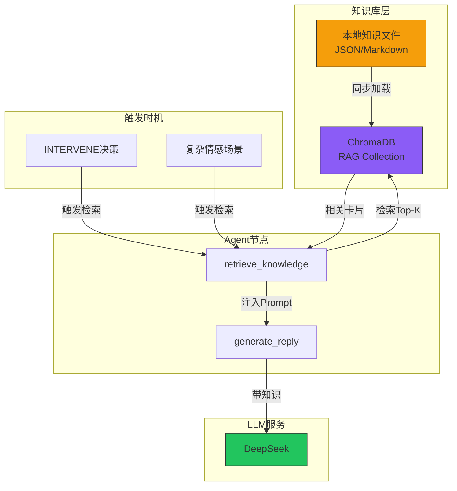
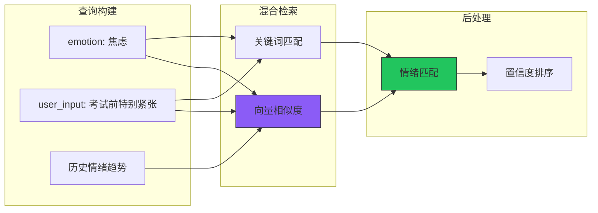
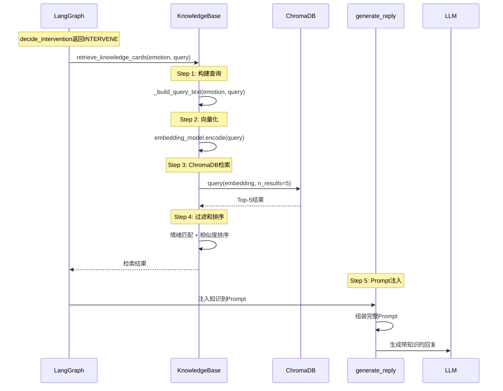

# T10 - RAG知识库检索：心理学知识卡片与语义检索

---

## 1. 模块概览

### 1.1 一句话定义

RAG知识库检索模块负责**从心理学知识库中检索与当前情感和用户输入相关的知识卡片，将检索结果注入Prompt，帮助婉晴生成更专业、更具心理学依据的回复**。

### 1.2 在系统中的位置



### 1.3 解决的核心问题

1. **专业知识匮乏**：LLM缺乏专业的心理学知识
2. **回复同质化**：通用LLM回复缺乏针对性
3. **知识时效性**：需要可更新的心理学知识库

---

## 2. 技术原理与设计思想

### 2.1 为什么需要RAG？

**问题**：LLM不知道心理学专业知识。

```
通用LLM回复：
"听起来你心情不好，试试做点开心的事吧！"

问题：
- 太泛泛
- 没有科学依据
- 用户可能觉得敷衍
```

**RAG增强后**：
```
基于"5-4-3-2-1接地技术"的知识：
"当情绪强烈时，可以尝试5-4-3-2-1 grounding技术：
先说出5样你能看到的东西，然后4样能摸到的..."

婉晴回复：
"我能感受到你现在情绪很强烈... 让我分享一个心理学技术
叫做5-4-3-2-1接地技术..."
```

### 2.2 知识卡片设计

**知识卡片结构**：

```python
@dataclass
class KnowledgeCard:
    """心理学知识卡片"""
    card_id: str
    title: str                          # 标题
    summary: str                        # 摘要
    technique: str                       # 核心技术名称
    applicable_emotions: list[str]      # 适用情绪
    applicability_conditions: str       # 适用条件
    procedure: str                       # 具体步骤
    contraindications: str               # 禁忌症/不适用情况
    example_script: str                  # 示例对话
    confidence: float                   # 置信度/质量评分
```

**示例卡片**：

```json
{
    "card_id": "grounding_5_4_3_2_1",
    "title": "5-4-3-2-1接地技术",
    "technique": "感官 grounding",
    "applicable_emotions": ["焦虑", "恐惧", "惊恐发作"],
    "procedure": "1. 说出5样你能看到的东西\n2. 说出4样能摸到的东西\n...",
    "example_script": "当你感到焦虑时，可以说：'婉晴陪你一起做5-4-3-2-1练习...'"
}
```

### 2.3 检索策略设计

**为什么需要混合检索？**

```
单一关键词检索：
用户情绪："焦虑"
检索结果：所有包含"焦虑"的知识

语义检索：
用户情绪："焦虑" + 用户输入："考试前特别紧张"
检索结果：与"考试焦虑"语义相关的知识
```

**婉晴AI的检索策略**：



---

## 3. 关键代码解析

### 3.1 核心文件结构

```
Agent/src/rag/
├── retriever.py      # RAG检索器
├── knowledge_base.py # 知识库加载
└── card_loader.py   # 卡片解析
```

### 3.2 知识库初始化

```python
# ======== 关键代码1：知识库初始化 ========
class KnowledgeBase:
    """
    心理学知识库

    从本地文件加载知识卡片，存储到ChromaDB。
    """

    COLLECTION_NAME = "psychology_knowledge"

    def __init__(self):
        self._client = None
        self._collection = None
        self._embedding_model = None

    async def initialize(self):
        """初始化知识库"""
        import chromadb
        from chromadb.config import Settings

        # ChromaDB客户端
        self._client = chromadb.PersistentClient(
            path="./data/chromadb",
            settings=Settings(anonymized_telemetry=False)
        )

        # 获取/创建Collection
        self._collection = self._client.get_or_create_collection(
            name=self.COLLECTION_NAME,
            metadata={"description": "婉晴心理学知识库"}
        )

        # 加载嵌入模型
        from sentence_transformers import SentenceTransformer
        self._embedding_model = SentenceTransformer(
            "sentence-transformers/all-MiniLM-L6-v2"
        )

        # 同步知识卡片
        await self.sync_knowledge_base()

    async def sync_knowledge_base(self):
        """
        同步知识库

        从本地文件加载知识卡片，upsert到ChromaDB。
        """
        import glob

        # 查找知识卡片文件
        card_files = glob.glob("./knowledge/**/*.json", recursive=True)
        card_files.extend(glob.glob("./knowledge/**/*.md", recursive=True))

        if not card_files:
            logger.warning("[rag] 未找到知识卡片文件")
            return

        logger.info(f"[rag] 发现{len(card_files)}个知识卡片文件")

        # 加载并解析
        cards = []
        for filepath in card_files:
            parsed = self._parse_card_file(filepath)
            cards.extend(parsed)

        logger.info(f"[rag] 解析得到{len(cards)}张知识卡片")

        # 去重
        existing_ids = set(self._collection.get()["ids"])
        new_cards = [c for c in cards if c.card_id not in existing_ids]

        if new_cards:
            # 向量化并存储
            await self._upsert_cards(new_cards)
            logger.info(f"[rag] 新增{len(new_cards)}张知识卡片")
        else:
            logger.info("[rag] 知识库已是最新")
```

### 3.3 知识卡片解析

```python
# ======== 关键代码2：卡片文件解析 ========
def _parse_card_file(self, filepath: str) -> list[KnowledgeCard]:
    """解析知识卡片文件"""

    with open(filepath, 'r', encoding='utf-8') as f:
        content = f.read()

    if filepath.endswith('.json'):
        return self._parse_json_card(content, filepath)
    elif filepath.endswith('.md'):
        return self._parse_markdown_card(content, filepath)
    else:
        logger.warning(f"[rag] 不支持的文件格式: {filepath}")
        return []


def _parse_json_card(self, content: str, filepath: str) -> list[KnowledgeCard]:
    """解析JSON格式卡片"""

    try:
        data = json.loads(content)

        # 支持单卡片或多卡片数组
        if isinstance(data, list):
            cards = data
        else:
            cards = [data]

        return [
            KnowledgeCard(
                card_id=card.get("card_id", card.get("id", hashlib.md5(card.get("title", "").encode()).hexdigest())),
                title=card["title"],
                summary=card.get("summary", ""),
                technique=card.get("technique", ""),
                applicable_emotions=card.get("applicable_emotions", []),
                applicability_conditions=card.get("conditions", ""),
                procedure=card.get("procedure", ""),
                contraindications=card.get("contraindications", ""),
                example_script=card.get("example_script", ""),
                confidence=card.get("confidence", 0.8)
            )
            for card in cards
        ]
    except Exception as e:
        logger.error(f"[rag] 解析JSON卡片失败: {filepath}, {e}")
        return []
```

### 3.4 混合检索实现

```python
# ======== 关键代码3：混合检索 ========
async def retrieve_knowledge_cards(
    self,
    emotion: str,
    query: str,
    top_k: int = 5,
    session_id: str = ""
) -> list[dict]:
    """
    检索相关知识卡片

    检索策略：
    1. 构建混合查询字符串
    2. 向量化检索
    3. 元数据过滤（情绪匹配）
    4. 排序输出
    """

    # Step 1: 构建查询字符串
    query_text = self._build_query_text(emotion, query)

    # Step 2: 向量化
    query_embedding = self._embedding_model.encode(query_text).tolist()

    # Step 3: ChromaDB检索
    results = self._collection.query(
        query_embeddings=[query_embedding],
        n_results=top_k * 2,  # 多检索一些，后面过滤
        include=["documents", "metadatas", "distances"]
    )

    # Step 4: 后处理
    cards = []
    for i in range(len(results["ids"][0])):
        card = {
            "id": results["ids"][0][i],
            "content": results["documents"][0][i],
            "distance": results["distances"][0][i],
            "metadata": results["metadatas"][0][i]
        }

        # 情绪匹配过滤
        applicable = card["metadata"].get("applicable_emotions", [])
        if applicable and emotion not in applicable:
            continue  # 跳过不匹配的情绪

        # 相似度过滤
        similarity = 1 - card["distance"]  # distance越小越相似
        if similarity < self.SIMILARITY_THRESHOLD:
            continue

        cards.append(card)

    # Step 5: 排序（综合相似度和置信度）
    cards.sort(
        key=lambda c: (1 - c["distance"]) * c["metadata"].get("confidence", 0.8),
        reverse=True
    )

    return cards[:top_k]


def _build_query_text(self, emotion: str, user_input: str) -> str:
    """
    构建检索查询文本

    融合情绪标签和用户输入，提高检索相关性。
    """
    parts = [
        f"情绪类型: {emotion}",
        f"用户描述: {user_input}",
        "相关心理学技术"
    ]
    return " | ".join(parts)
```

### 3.5 Prompt注入

```python
# ======== 关键代码4：Prompt注入 ========
def inject_knowledge_into_prompt(
    retrieved_cards: list[dict],
    base_prompt: str
) -> str:
    """
    将检索到的知识卡片注入到Prompt中

    注入格式：
    【心理学知识参考】
    ## 卡片1：标题
    核心技术：xxx
    适用情绪：xxx
    具体步骤：
    xxx
    示例对话：
    xxx
    ---
    ## 卡片2：...
    """

    if not retrieved_cards:
        return base_prompt

    # 构建知识卡片文本
    knowledge_section = "\n\n【心理学知识参考】\n"
    knowledge_section += "(以下内容来自婉晴心理知识库，请在回复中适当引用)\n\n"

    for i, card in enumerate(retrieved_cards, 1):
        metadata = card["metadata"]
        content = card["content"]

        knowledge_section += f"## {i}. {metadata.get('title', '未命名')}\n"
        knowledge_section += f"- 核心技术：{metadata.get('technique', 'N/A')}\n"
        knowledge_section += f"- 适用情绪：{', '.join(metadata.get('applicable_emotions', []))}\n\n"

        if metadata.get("procedure"):
            knowledge_section += f"- 具体步骤：\n{metadata['procedure']}\n\n"

        if metadata.get("example_script"):
            knowledge_section += f"- 示例对话：\n{metadata['example_script']}\n"

        knowledge_section += "\n---\n"

    # 注入到系统Prompt之后
    injection_point = base_prompt.rfind("\n\n")
    if injection_point == -1:
        return base_prompt + knowledge_section

    return base_prompt[:injection_point] + knowledge_section + base_prompt[injection_point:]
```

---

## 4. 核心难点与实现细节

### 4.1 知识卡片质量控制

**问题**：知识卡片质量参差不齐。

**解决方案**：
1. 置信度字段标记质量
2. 检索结果综合排序
3. 人工审核流程

```python
# 置信度影响排序
score = (1 - distance) * confidence
cards.sort(key=lambda c: score, reverse=True)
```

### 4.2 向量化模型选择

**中文语义支持**：

| 模型 | 中文支持 | 速度 | 维度 |
|------|----------|------|------|
| all-MiniLM-L6-v2 | 一般 | 快 | 384 |
| paraphrase-multilingual | 好 | 慢 | 768 |
| text2vec-base-chinese | 优秀 | 中 | 768 |

**婉晴AI选择**：使用all-MiniLM-L6-v2 + 中文查询扩展

```python
# 扩展中文查询
def _expand_chinese_query(self, emotion: str, query: str) -> str:
    """中文查询扩展，提高中文检索效果"""
    emotion_map = {
        "焦虑": ["紧张", "担心", "不安", "anxiety"],
        "沮丧": ["低落", "抑郁", "难过", "sad"],
        # ...
    }

    expanded = [emotion]
    for eng in emotion_map.get(emotion, []):
        expanded.append(eng)

    return " ".join(expanded + [query])
```

### 4.3 知识卡片冷启动

**问题**：初次运行时知识库为空。

**解决方案**：内置默认知识卡片

```python
DEFAULT_KNOWLEDGE_CARDS = [
    {
        "card_id": "grounding_5_4_3_2_1",
        "title": "5-4-3-2-1接地技术",
        "technique": "感官 grounding",
        "applicable_emotions": ["焦虑", "恐惧", "惊恐发作"],
        "procedure": "1. 说出5样你能看到的东西\n2. 说出4样能摸到的东西\n3. 说出3样能听到的声音\n4. 说出2种能闻到的气味\n5. 说出1种能尝到的味道",
        "example_script": "让我们一起做5-4-3-2-1练习，帮助你回到当下..."
    },
    # ... 更多默认卡片
]

async def sync_knowledge_base(self):
    # 如果没有找到文件，加载默认卡片
    if not card_files:
        await self._upsert_cards([
            KnowledgeCard(**card) for card in DEFAULT_KNOWLEDGE_CARDS
        ])
```

### 4.4 知识过期处理

**问题**：心理学知识可能过时。

**解决方案**：
1. 版本号管理
2. 定期重新加载
3. 动态更新接口

```python
class KnowledgeBase:
    VERSION_KEY = "knowledge_base:version"
    CURRENT_VERSION = "1.0.0"

    async def sync_knowledge_base(self):
        # 检查版本
        current = await redis.get(self.VERSION_KEY)
        if current == self.CURRENT_VERSION:
            logger.info("[rag] 知识库已是最新版本")
            return

        # 版本不匹配，重新加载
        await self._reload_all_cards()
        await redis.set(self.VERSION_KEY, self.CURRENT_VERSION)
```

---

## 5. 数据流与交互

### 5.1 知识检索完整流程



### 5.2 检索结果示例

```json
// 输入
{
    "emotion": "焦虑",
    "query": "考试前特别紧张"
}

// 输出
[
    {
        "id": "grounding_5_4_3_2_1",
        "title": "5-4-3-2-1接地技术",
        "technique": "感官 grounding",
        "similarity": 0.85,
        "content": "...",
        "metadata": {
            "applicable_emotions": ["焦虑", "恐惧"],
            "confidence": 0.9
        }
    },
    {
        "id": "breathing_box",
        "title": "箱式呼吸法",
        "technique": "呼吸调节",
        "similarity": 0.72,
        "metadata": {
            "applicable_emotions": ["焦虑", "紧张"],
            "confidence": 0.85
        }
    }
]
```

---

## 6. 配置与依赖

### 6.1 RAG配置

```python
# Agent/config.py
class RAGConfig:
    COLLECTION_NAME = "psychology_knowledge"
    EMBEDDING_MODEL = "sentence-transformers/all-MiniLM-L6-v2"
    TOP_K = 3              # 检索Top-K
    SIMILARITY_THRESHOLD = 0.6  # 相似度阈值
    KNOWLEDGE_DIR = "./knowledge"
```

### 6.2 知识文件格式

```json
// knowledge/grounding.json
[
    {
        "card_id": "grounding_5_4_3_2_1",
        "title": "5-4-3-2-1接地技术",
        "summary": "通过调动五感帮助用户回到当下，缓解焦虑和恐惧",
        "technique": "感官 grounding",
        "applicable_emotions": ["焦虑", "恐惧", "惊恐发作"],
        "conditions": "适用于情绪激动、需要立即平复的场景",
        "procedure": "1. 说出5样你能看到的东西\n2. 说出4样能摸到的东西\n3. 说出3样能听到的声音\n4. 说出2种能闻到的气味\n5. 说出1种能尝到的味道",
        "contraindications": "严重认知障碍患者不适用",
        "example_script": "让我们一起做一个简单的练习...现在请告诉我，你能看到哪些东西？",
        "confidence": 0.95
    }
]
```

### 6.3 依赖项

```txt
# requirements.txt
chromadb>=0.4.0
sentence-transformers>=2.2.0
```

---

## 7. 扩展与思考

### 7.1 可选优化方向

**1. 多语言知识库**
```python
# 支持英文心理学知识的翻译检索
def translate_and_retrieve(query, target_lang="zh"):
    # 调用翻译API
    translated = translate(query, target_lang)
    # 检索
    results = retrieve(query) + retrieve(translated)
```

**2. 动态知识更新**
```python
# 支持从Notion等外部源实时更新知识
async def sync_from_notion():
    # 从Notion数据库读取
    pages = await notion_client.query_database(database_id)
    # 转换为知识卡片
    cards = [parse_notion_page(p) for p in pages]
    # upsert到ChromaDB
    await upsert_cards(cards)
```

**3. 用户个性化知识**
```python
# 根据用户历史，个性化推荐知识
async def personalized_retrieve(user_id, emotion, query):
    # 获取用户偏好
    prefs = await get_user_preferences(user_id)
    # 过滤/加权检索结果
    results = await retrieve(emotion, query)
    return apply_preferences(results, prefs)
```

### 7.2 设计启示

**1. RAG让LLM更专业**
- 通用LLM缺乏专业知识
- RAG注入领域知识

**2. 检索质量决定回复质量**
- 好的检索策略比模型更重要
- 混合检索比单一检索更鲁棒

**3. 知识需要维护**
- 知识库不是一次性构建
- 需要持续更新和质量控制

---

## 8. 学习资源

### 8.1 官方文档

- [LangChain RAG Tutorial](https://python.langchain.com/docs/tutorials/rag/)
- [ChromaDB Quick Start](https://docs.trychroma.com/docs/overview)
- [Sentence Transformers](https://www.sbert.net/)

### 8.2 进阶阅读

- [RAG Survey](https://arxiv.org/abs/2312.10997)
- [Retrieval-Augmented Generation for Knowledge-Intensive NLP Tasks](https://arxiv.org/abs/2005.11401)

---

## 模块索引

返回 [模块清单与索引](./00_模块清单与索引.md) | 上一篇：[T09-记忆系统](./T09_记忆系统.md) | 下一篇：[T11-回复生成节点](./T11_回复生成节点.md)
