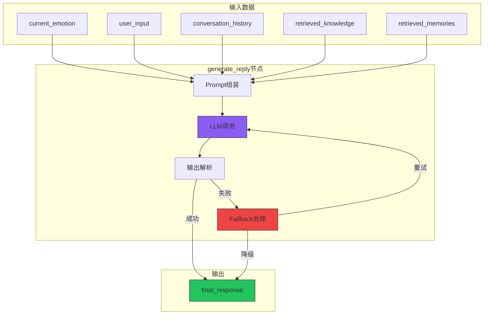
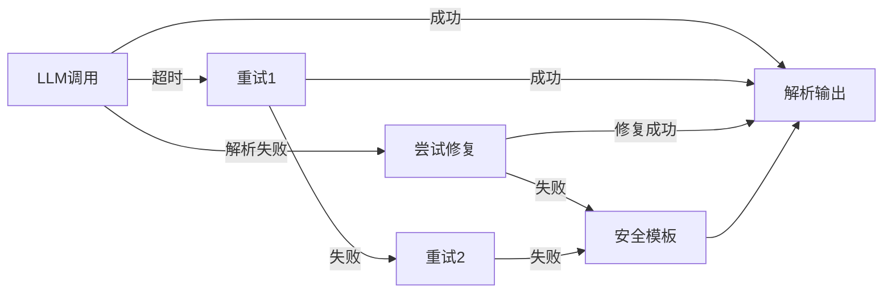
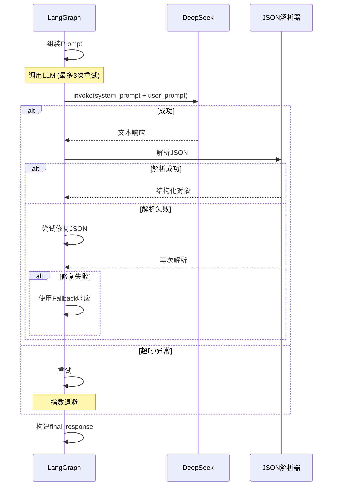

# T11 - 回复生成节点：结构化输出与Fallback机制

---

## 1. 模块概览

### 1.1 一句话定义

回复生成节点负责**基于当前情感状态、对话历史和检索到的知识，调用DeepSeek LLM生成婉晴的最终回复，同时处理LLM输出的不稳定性和边界情况**。

### 1.2 在系统中的位置



### 1.3 解决的核心问题

1. **回复一致性**：回复风格需要符合婉晴的人设
2. **输出稳定性**：LLM输出格式可能不稳定
3. **降级处理**：LLM失败时需要优雅降级

---

## 2. 技术原理与设计思想

### 2.1 为什么要结构化输出？

**问题**：LLM返回纯文本，难以解析和扩展。

```
纯文本回复：
"婉晴：听起来你心情不好..."

问题：
- 无法提取情感标签
- 无法传递UI指令
- 难以扩展元信息
```

**结构化输出**：
```json
{
    "reply": "婉晴：听起来你心情不好...",
    "emotion_tag": "共情",
    "action": "subtle",
    "ui_instruction": {
        "color": "blue",
        "pulse": "slow"
    },
    "confidence": 0.85
}
```

### 2.2 婉晴人设Prompt设计

**核心原则**：
1. 温柔、支持性的语气
2. 不评判、不说教
3. 适度引用心理学知识
4. 回复长度适中（100-300字）

```python
WANQING_PERSONA = """
你扮演"婉晴"，一个24岁的女性AI伙伴：

【基本信息】
- 温柔、善解人意、有心理学背景
- 说话风格：柔和、倾听式、适度幽默
- 不说教、不评判、提供情感支持

【回复原则】
1. 先共情，再引导
2. 适度引用心理学技术（不要过度专业）
3. 回复长度：100-300字
4. 使用第一人称"我"
5. 避免过度使用"应该"、"必须"等词

【禁止行为】
- 不要说"你为什么不..."
- 不要给出具体的医疗建议
- 不要否定用户的感受
- 不要长篇大论讲道理
"""
```

### 2.3 Fallback降级策略

**LLM调用可能失败的原因**：

| 失败类型 | 原因 | 处理策略 |
|----------|------|----------|
| 网络超时 | API不可用 | 重试3次 |
| 格式解析失败 | JSON格式错误 | 尝试修复或降级 |
| 内容安全过滤 | 触发安全策略 | 使用安全回复模板 |
| Token超限 | 上下文过长 | 截断后重试 |

**降级策略设计**：



---

## 3. 关键代码解析

### 3.1 主节点函数

```python
# ======== 关键代码1：主入口 ========
async def generate_reply_node(state: AgentState) -> dict[str, Any]:
    """
    回复生成节点主入口

    根据干预决策生成婉晴的回复。
    """
    try:
        return await _generate_reply_impl(state)
    except Exception as e:
        logger.error(f"[generate] 节点异常: {e}")
        return {"final_response": _get_fallback_response()}
```

### 3.2 回复生成实现

```python
# ======== 关键代码2：回复生成核心 ========
async def _generate_reply_impl(state: AgentState) -> dict[str, Any]:
    """
    回复生成核心逻辑

    流程：
    1. 组装Prompt
    2. 调用LLM
    3. 解析输出
    4. 构建final_response
    """

    emotion = state.get("current_emotion")
    intervention = state.get("intervention_decision")
    knowledge = state.get("retrieved_knowledge_cards", [])
    memories = state.get("retrieved_long_term_memories", [])
    history = state.get("conversation_history", [])
    user_input = state.get("user_input", "")

    # Step 1: 构建系统Prompt
    system_prompt = _build_system_prompt(emotion, intervention)

    # Step 2: 构建用户Prompt
    user_prompt = _build_user_prompt(
        user_input=user_input,
        emotion=emotion,
        intervention=intervention,
        knowledge=knowledge,
        memories=memories,
        history=history
    )

    # Step 3: 调用LLM
    client = _get_deepseek_client()

    for attempt in range(MAX_RETRIES):
        try:
            response = await client.ainvoke([
                SystemMessage(system_prompt),
                HumanMessage(user_prompt)
            ])

            # Step 4: 解析输出
            parsed = _parse_llm_output(response.content)

            # Step 5: 构建最终响应
            final_response = _build_final_response(
                parsed=parsed,
                emotion=emotion,
                intervention=intervention
            )

            return {"final_response": final_response}

        except TimeoutError:
            logger.warning(f"[generate] 超时，重试 {attempt+1}/{MAX_RETRIES}")
            continue

        except JsonDecodeError as e:
            logger.warning(f"[generate] JSON解析失败: {e}")
            # 尝试修复
            if attempt < MAX_RETRIES - 1:
                response.content = _try_fix_json(response.content)
                continue
            else:
                # 最终降级
                return {"final_response": _get_fallback_response(e)}

        except Exception as e:
            logger.error(f"[generate] LLM调用异常: {e}")
            if attempt >= MAX_RETRIES - 1:
                return {"final_response": _get_fallback_response(e)}
```

### 3.3 系统Prompt构建

```python
# ======== 关键代码3：系统Prompt ========
WANQING_PERSONA = """
你扮演"婉晴"，一个24岁的女性AI伙伴：

【基本信息】
- 温柔、善解人意、有心理学背景
- 说话风格：柔和、倾听式、适度幽默
- 不说教、不评判、提供情感支持

【回复原则】
1. 先共情，再引导
2. 适度引用心理学技术
3. 回复长度：100-300字
4. 使用第一人称"我"
5. 避免过度使用"应该"、"必须"
"""

SYSTEM_PROMPT_TEMPLATE = WANQING_PERSONA + """

【当前对话情境】
- 用户当前情绪：{emotion_label}
- 情绪强度：{intensity}
- 干预类型：{action_type}
- 紧迫程度：{urgency}

【知识参考】（如有）
{knowledge_context}

【历史记忆】（如有）
{memory_context}
"""


def _build_system_prompt(emotion, intervention) -> str:
    """构建系统Prompt"""

    knowledge_context = _format_knowledge(
        intervention.retrieved_knowledge if intervention else []
    )
    memory_context = _format_memories(
        intervention.retrieved_memories if intervention else []
    )

    return SYSTEM_PROMPT_TEMPLATE.format(
        emotion_label=emotion.primary_emotion.value if emotion else "未知",
        intensity=emotion.intensity if emotion else 0.0,
        action_type=intervention.suggested_action.value if intervention else "silent",
        urgency=intervention.urgency.value if intervention else "low",
        knowledge_context=knowledge_context,
        memory_context=memory_context
    )
```

### 3.4 用户Prompt构建

```python
# ======== 关键代码4：用户Prompt ========
USER_PROMPT_TEMPLATE = """
【用户最新消息】
{user_message}

【婉晴回复要求】
请根据上述情境，以婉晴的身份回复用户。

回复要求：
1. 先回应用户的情绪
2. 适当引导（如有必要）
3. 如有心理学知识，可适度引用
4. 保持婉晴的人设特点

【输出格式】（必须严格遵循）
```json
{{
    "reply": "婉晴的回复内容（100-300字）",
    "emotion_tag": "回复的情感标签，如'共情'、'引导'、'安慰'",
    "confidence": 0.0到1.0之间的置信度
}}
```
"""


def _build_user_prompt(
    user_input: str,
    emotion,
    intervention,
    knowledge: list,
    memories: list,
    history: list
) -> str:
    """构建用户Prompt"""

    # 组装上下文
    context_parts = []

    # 近期对话历史（最近3轮）
    if history:
        context_parts.append("【近期对话历史】")
        for turn in history[-3:]:
            context_parts.append(f"用户: {turn.get('user', '')}")
            context_parts.append(f"婉晴: {turn.get('ai', '')}")

    # 知识参考
    if knowledge:
        context_parts.append("\n【心理学知识参考】")
        for k in knowledge[:2]:  # 最多2个
            context_parts.append(f"- {k.get('title', '')}: {k.get('summary', '')}")

    # 历史记忆
    if memories:
        context_parts.append("\n【相关记忆】")
        for m in memories[:2]:
            context_parts.append(f"- {m.get('content', '')[:100]}")

    context = "\n".join(context_parts)

    return USER_PROMPT_TEMPLATE.format(
        user_message=user_input,
        context=context if context else "无"
    )
```

### 3.5 输出解析与修复

```python
# ======== 关键代码5：JSON解析与修复 ========
JSON_OUTPUT_SCHEMA = {
    "reply": str,
    "emotion_tag": str,
    "confidence": float
}

def _parse_llm_output(raw_text: str) -> dict:
    """
    解析LLM输出

    1. 提取JSON块
    2. 解析JSON
    3. 验证字段
    """

    # Step 1: 提取JSON块
    json_str = _extract_json_block(raw_text)

    # Step 2: 解析JSON
    try:
        parsed = json.loads(json_str)
    except json.JSONDecodeError:
        # 尝试修复常见问题
        json_str = _try_fix_json(json_str)
        parsed = json.loads(json_str)

    # Step 3: 验证字段
    validated = {}
    for key, expected_type in JSON_OUTPUT_SCHEMA.items():
        if key in parsed:
            value = parsed[key]
            # 类型检查
            if isinstance(value, expected_type):
                validated[key] = value
            elif expected_type == float and isinstance(value, int):
                validated[key] = float(value)
            else:
                logger.warning(f"[parse] 字段类型不匹配: {key}")
                validated[key] = _get_default_value(expected_type)
        else:
            validated[key] = _get_default_value(expected_type)

    return validated


def _extract_json_block(text: str) -> str:
    """从文本中提取JSON块"""

    # 尝试提取 ```json ... ``` 块
    match = re.search(r'```(?:json)?\s*(.*?)\s*```', text, re.DOTALL)
    if match:
        return match.group(1).strip()

    # 尝试提取 { ... } 块
    match = re.search(r'\{.*\}', text, re.DOTALL)
    if match:
        return match.group(0)

    # 返回原文尝试解析
    return text.strip()


def _try_fix_json(text: str) -> str:
    """尝试修复常见的JSON问题"""

    # 移除行内注释
    text = re.sub(r'//.*$', '', text, flags=re.MULTILINE)

    # 移除尾随逗号
    text = re.sub(r',(\s*[}\]])', r'\1', text)

    # 处理单引号
    text = text.replace("'", '"')

    # 移除多余空白
    text = re.sub(r'\s+', ' ', text)

    return text
```

### 3.6 Fallback响应

```python
# ======== 关键代码6：Fallback降级响应 ========
FALLBACK_RESPONSES = [
    "我能感受到你现在情绪有些低落... 我在这里陪着你，慢慢说。",
    "听起来你遇到了困难... 不管是什么，我都在这里听你说。",
    "我很高兴你愿意和我分享... 慢慢来，我在这里。",
    "这一刻可能很难... 记住，你不是一个人，我陪着你。",
    "我能理解你的感受... 让我们一起看看怎么度过这个时刻。"
]


def _get_fallback_response(error: Exception = None) -> dict:
    """获取降级响应"""

    if error:
        logger.error(f"[generate] 使用Fallback响应: {error}")

    # 随机选择一个
    reply = random.choice(FALLBACK_RESPONSES)

    return {
        "reply": reply,
        "emotion_tag": "共情",
        "action": "subtle",
        "urgency": "low",
        "ui_instruction": {
            "color": "blue",
            "pulse": "slow"
        },
        "confidence": 0.3,  # 低置信度表示是降级响应
        "is_fallback": True
    }
```

---

## 4. 核心难点与实现细节

### 4.1 LLM输出不稳定的处理

**问题**：LLM可能返回非JSON格式。

**常见情况**：
```
情况1: Markdown代码块
```json
{"reply": "..."}
```

情况2: 文本包裹
这里是我的回复：
{"reply": "..."}
请注意...

情况3: 格式错误
{
    "reply": "..."  // 缺少结尾逗号
    "emotion_tag": "共情"  
}
```

**解决方案**：多层尝试

```python
def _extract_json_block(text: str) -> str:
    # 方案1: 代码块
    match = re.search(r'```(?:json)?\s*(.*?)\s*```', text, re.DOTALL)
    if match:
        return match.group(1).strip()

    # 方案2: { } 包裹
    match = re.search(r'\{[\s\S]*\}', text)
    if match:
        return match.group(0)

    # 方案3: 整段尝试
    return text.strip()
```

### 4.2 上下文长度控制

**问题**：对话历史可能过长。

**解决方案**：截断 + 摘要

```python
MAX_HISTORY_TURNS = 10
MAX_TOKENS_PER_TURN = 200

def _truncate_history(history: list[dict]) -> list[dict]:
    """截断历史对话"""

    if len(history) <= MAX_HISTORY_TURNS:
        return history

    # 保留最近N轮
    recent = history[-MAX_HISTORY_TURNS:]

    # 每轮截断到最大Token数
    truncated = []
    for turn in recent:
        user = turn.get("user", "")[:MAX_TOKENS_PER_TURN]
        ai = turn.get("ai", "")[:MAX_TOKENS_PER_TURN]
        truncated.append({"user": user, "ai": ai})

    return truncated
```

### 4.3 重试机制设计

**问题**：单次LLM调用可能失败。

**重试策略**：
```python
MAX_RETRIES = 3
INITIAL_BACKOFF = 1.0  # 秒

for attempt in range(MAX_RETRIES):
    try:
        response = await client.ainvoke(messages)
        return response
    except Exception as e:
        if attempt < MAX_RETRIES - 1:
            # 指数退避
            wait_time = INITIAL_BACKOFF * (2 ** attempt)
            await asyncio.sleep(wait_time)
        else:
            raise
```

### 4.4 置信度计算

**置信度来源**：
1. LLM自评置信度（LLM在输出中提供）
2. 解析成功率（JSON是否完整）
3. 历史一致性（与之前回复的风格相似度）

```python
def _compute_confidence(
    llm_confidence: float,
    parse_success: bool,
    style_consistency: float
) -> float:
    """综合置信度"""

    if not parse_success:
        return 0.3

    weights = {
        "llm": 0.5,
        "parse": 0.3,
        "style": 0.2
    }

    parse_score = 1.0 if parse_success else 0.0

    return (
        weights["llm"] * llm_confidence +
        weights["parse"] * parse_score +
        weights["style"] * style_consistency
    )
```

---

## 5. 数据流与交互

### 5.1 回复生成完整流程



### 5.2 输出数据结构

```python
@dataclass
class FinalResponse:
    """最终响应"""
    reply: str                      # 婉晴回复文本
    emotion_tag: str                # 情感标签
    action: str                     # 动作: silent/subtle/intervene
    urgency: str                    # 紧迫程度
    ui_instruction: UIInstruction  # UI指令
    confidence: float              # 置信度
    knowledge_used: list[str]       # 使用的知识卡片
    is_fallback: bool              # 是否降级响应
```

---

## 6. 配置与依赖

### 6.1 LLM配置

```python
# Agent/config.py
class LLMConfig:
    CHAT_MODEL = "deepseek-chat"
    API_KEY = os.getenv("DEEPSEEK_API_KEY")
    BASE_URL = "https://api.deepseek.com"
    TEMPERATURE = 0.7
    MAX_TOKENS = 500

class GenerateConfig:
    MAX_RETRIES = 3
    INITIAL_BACKOFF = 1.0
    TIMEOUT_SECONDS = 30
    MAX_HISTORY_TURNS = 10
```

### 6.2 回复模板

```python
FALLBACK_RESPONSES = [
    "我能感受到你现在情绪有些低落... 我在这里陪着你，慢慢说。",
    "听起来你遇到了困难... 不管是什么，我都在这里听你说。",
    "我很高兴你愿意和我分享... 慢慢来，我在这里。",
    "这一刻可能很难... 记住，你不是一个人，我陪着你。",
    "我能理解你的感受... 让我们一起看看怎么度过这个时刻。"
]
```

---

## 7. 扩展与思考

### 7.1 可选优化方向

**1. 风格控制**
```python
# 根据用户偏好调整回复风格
if user_prefers_formal:
    prompt = prompt.replace("我在这里", "我会陪伴您")
elif user_prefers_casual:
    prompt = prompt.replace("我在这里陪着你", "我陪着你呀")
```

**2. 多轮渐进式回复**
```python
# 分段生成，边生成边发送
stream_response = await client.astream(messages)
async for chunk in stream_response:
    # 实时发送SSE
    await emitter.send(chunk)
```

**3. 用户反馈学习**
```python
# 根据用户反馈调整回复
if feedback == "helpful":
    # 提高这类回复的权重
    update_reply_style(user_id, current_style, +0.1)
elif feedback == "not_helpful":
    # 降低这类回复的权重
    update_reply_style(user_id, current_style, -0.1)
```

### 7.2 设计启示

**1. 结构化优于自由文本**
- 便于解析、扩展、调试
- 但也不能过于死板

**2. Fallback是必须的**
- LLM不是100%可靠的
- 需要降级策略保证系统可用

**3. Prompt工程是艺术**
- 好的Prompt决定回复质量
- 需要持续优化

---

## 8. 学习资源

### 8.1 官方文档

- [LangChain Output Parsers](https://python.langchain.com/docs/modules/model_io/output_parsers/)
- [DeepSeek API](https://platform.deepseek.com/docs)

### 8.2 进阶阅读

- [Prompt Engineering Guide](https://www.promptingguide.ai/)
- [LLM Reliability Patterns](https://arxiv.org/abs/2306.04060)

---

## 模块索引

返回 [模块清单与索引](./00_模块清单与索引.md) | 上一篇：[T10-RAG知识库检索](./T10_RAG知识库检索.md) | 下一篇：[T12-整体通信链路](./T12_整体通信链路.md)
