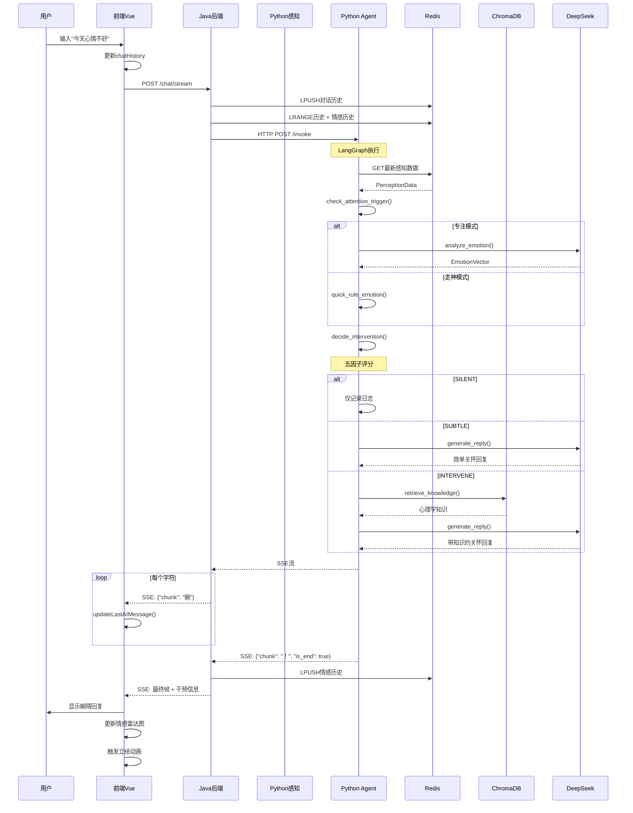
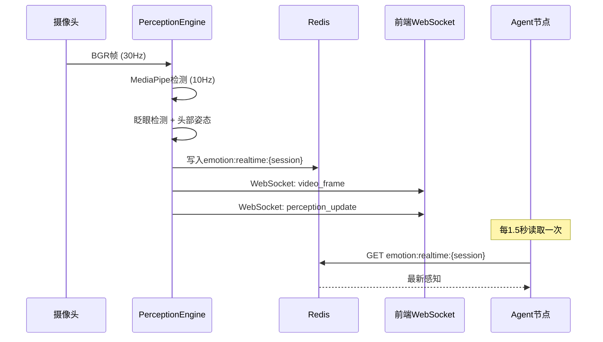
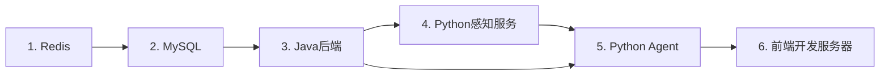
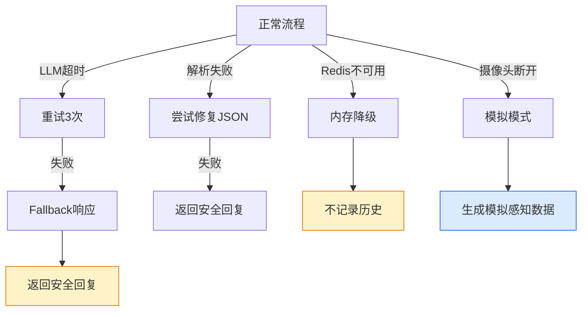

# T12 - 整体通信链路：从用户到婉晴的全链路追踪

---

## 1. 模块概览

### 1.1 一句话定义

整体通信链路文档串联婉晴AI系统的所有模块，**从用户发起对话到最终收到婉晴回复的完整数据流**，包括前端交互、Java后端处理、Python感知服务和Agent推理的全过程。

### 1.2 系统架构总览

```mermaid
flowchart TB
    subgraph Frontend["前端 Vue3"]
        A[App.vue]
        B[ChatWindow]
        C[EmotionRadar]
        D[PortraitBox]
        E[VisualSignal]
        F[Pinia Store]
    end

    subgraph Java["Java后端 (8080)"]
        G[ChatController]
        H[AgentClient]
        I[SessionService]
        J[EmotionHistoryService]
    end

    subgraph Python感知["Python感知服务 (8000)"]
        K[PerceptionEngine]
        L[MediaPipe]
        M[BlinkDetector]
        N[WebSocket Server]
    end

    subgraph Python Agent["Python Agent (8001)"]
        O[FastAPI]
        P[LangGraph]
        Q[fuse_emotion]
        R[decide_intervention]
        S[retrieve_knowledge]
        T[generate_reply]
    end

    subgraph Storage["存储层"]
        U[Redis]
        V[MySQL]
        W[ChromaDB]
    end

    Frontend -->|SSE| Java
    Java -->|SSE| Python Agent
    Java -->|Redis| U
    Java -->|MySQL| V

    Frontend -->|WebSocket| Python感知
    Python感知 -->|Redis| U

    Python Agent -->|Redis| U
    Python Agent -->|ChromaDB| W

    style Frontend fill:#61dafb,stroke:#333
    style Java fill:#6db33f,stroke:#333
    style Python感知 fill:#f59e0b,stroke:#333
    style Python Agent fill:#8b5cf6,stroke:#333
    style Storage fill:#3e8ed0,stroke:#333
```

---

## 2. 核心技术选型

### 2.1 为什么选择这套技术栈？

| 层次 | 技术选型 | 替代方案 | 选择原因 |
|------|----------|----------|----------|
| 前端框架 | Vue 3 | React, Angular | 轻量、生态成熟、易上手 |
| 前端状态 | Pinia | Vuex, Redux | Vue3官方推荐、TypeScript友好 |
| 实时通信 | SSE + WebSocket | Socket.io, Long Polling | SSE适合推送，WS适合双向 |
| 后端框架 | Spring Boot | Django, FastAPI | 企业级稳定、MySQL集成好 |
| 异步通信 | WebClient (Reactor) | RestTemplate | 响应式、非阻塞 |
| Python服务 | FastAPI | Flask, Django | 异步支持好、类型验证强 |
| Agent框架 | LangGraph | LangChain LCEL, 自研 | 状态管理、条件路由强 |
| 向量数据库 | ChromaDB | Milvus, Pinecone | 轻量、易部署 |
| 缓存 | Redis | Memcached | 支持复杂数据结构、持久化 |

### 2.2 服务划分原则

```
为什么感知服务和Agent分开部署？

1. 职责单一
   - 感知服务：专注数据采集和处理
   - Agent服务：专注推理和决策

2. 扩展性
   - 感知服务可以水平扩展（多摄像头）
   - Agent服务可以独立升级

3. 容错性
   - 感知服务挂了不影响对话
   - Agent服务挂了不影响感知显示
```

---

## 3. 完整数据流详解

### 3.1 对话交互完整流程



### 3.2 感知数据流



---

## 4. 各服务接口定义

### 4.1 Java后端接口

#### 4.1.1 会话管理

```yaml
POST /api/v1/session/start
  Request:
    {
      "subject_name": "张三",
      "experiment_group": "A组"
    }
  Response:
    {
      "session_id": "550e8400-e29b-41d4-a716-446655440000",
      "created_at": "2026-03-26T10:00:00"
    }

GET /api/v1/session/{sessionId}
  Response:
    {
      "session_id": "...",
      "status": "active",
      ...
    }
```

#### 4.1.2 对话接口

```yaml
POST /api/v1/chat/stream
  Headers:
    Authorization: Bearer {session_id}
  Request:
    {
      "message": "今天心情不好"
    }
  Response: SSE流
    event: message
    data: {"chunk": "婉", "is_end": false}
    data: {"chunk": "晴", "is_end": false}
    ...
    data: {"chunk": "！", "is_end": true, "vector": {...}, "action": "subtle"}
    event: end
```

### 4.2 Python Agent接口

```yaml
POST /internal/v1/agent/invoke
  Request:
    {
      "session_id": "...",
      "user_message": "...",
      "conversation_history": [...],
      "emotion_history": [...]
    }
  Response: SSE流
    data: {"chunk": "婉", "is_end": false, ...}
    ...
    data: {"chunk": "！", "is_end": true, ...}
```

### 4.3 Python感知服务接口

```yaml
WebSocket /ws

# 发送消息
{
    "type": "ping" | "chat" | "request_summary"
}

# 接收消息
{
    "type": "video_frame",
    "data": "data:image/jpeg;base64,..."
}

{
    "type": "perception_update",
    "data": {
        "timestamp_ms": ...,
        "au": {...},
        "head_pose": {...},
        "blink_rate": ...,
        "focus_level": ...
    }
}

{
    "type": "voice_play",
    "data": "data:audio/mp3;base64,..."
}
```

---

## 5. 关键数据格式

### 5.1 感知数据结构

```python
class PerceptionData(BaseModel):
    """感知数据结构"""
    timestamp: int = Field(description="Unix毫秒时间戳")
    session_id: str

    au: ActionUnits = Field(description="面部动作单元")
    head_pose: HeadPose = Field(description="头部姿态")
    blink_rate: float = Field(description="眨眼频率(次/分)")
    focus_level: float = Field(description="专注度(0-1)")
    audio: Optional[AudioFeatures] = None

class ActionUnits(BaseModel):
    AU1: float = Field(ge=0, le=1, description="眉内侧上抬")
    AU4: float = Field(ge=0, le=1, description="皱眉")
    AU12: float = Field(ge=0, le=1, description="嘴角上扬")
    AU15: float = Field(ge=0, le=1, description="嘴角下垂")
    primary_emotion: str = Field(description="AU模型预测的主要情绪")
    confidence: float = Field(ge=0, le=1, description="置信度")

class HeadPose(BaseModel):
    pitch: float = Field(description="俯仰角(度)")
    yaw: float = Field(description="偏航角(度)")
    roll: float = Field(description="翻滚角(度)")
```

### 5.2 情感向量结构

```python
class EmotionVector(BaseModel):
    """OCC八维情感向量"""
    timestamp: int
    session_id: str
    primary_emotion: EmotionLabel  # 喜悦/悲伤/愤怒/恐惧/厌恶/惊讶/中性/开心
    secondary_emotion: Optional[EmotionLabel] = None
    intensity: float = Field(ge=0, le=1, description="情绪强度")
    valence: float = Field(ge=-1, le=1, description="效价(负-正)")
    arousal: float = Field(ge=0, le=1, description="唤醒度")
    dominance: float = Field(ge=0, le=1, description="支配度")
    confidence: float = Field(ge=0, le=1, description="综合置信度")

    # OCC八维
    occ_joy: float = Field(ge=0, le=1, description="喜悦")
    occ_sadness: float = Field(ge=0, le=1, description="悲伤")
    occ_anger: float = Field(ge=0, le=1, description="愤怒")
    occ_fear: float = Field(ge=0, le=1, description="恐惧")
    occ_disgust: float = Field(ge=0, le=1, description="厌恶")
    occ_surprise: float = Field(ge=0, le=1, description="惊讶")
    occ_well_grounding: float = Field(ge=0, le=1, description="踏实感")
    occ_anticipation: float = Field(ge=0, le=1, description="期待")
```

### 5.3 干预决策结构

```python
class InterventionDecision(BaseModel):
    """干预决策"""
    needed: bool = Field(description="是否需要干预")
    urgency: InterventionUrgency  # LOW/MEDIUM/HIGH
    suggested_action: InterventionAction  # SILENT/SUBTLE/INTERVENE
    intervention_score: float = Field(description="综合评分(0-1)")

    # 五因子
    intensity_factor: float = Field(description="情绪强度因子")
    emotion_priority: float = Field(description="情绪优先级因子")
    interrupt_cost: float = Field(description="打扰成本")
    trend_factor: float = Field(description="趋势因子")
    confidence_factor: float = Field(description="置信度因子")

    reply: Optional[str] = Field(description="婉晴的回复文本")
    ui_instruction: UIInstruction = Field(description="UI控制指令")
```

---

## 6. Redis数据结构总览

### 6.1 Key命名规范

```
# 对话历史（List）
session:{session_id}:history

# 情感历史（List）
session:{session_id}:emotions

# 摘要缓存（String）
session:{session_id}:summary

# 实时感知数据（String）
emotion:realtime:{session_id}

# 干预冷却期（String + TTL）
cooldown:agent:{session_id}

# 长期记忆（ChromaDB管理）
collection: long_term_memories

# RAG知识库（ChromaDB管理）
collection: psychology_knowledge
```

### 6.2 各数据结构详情

```python
# session:{session_id}:history (List)
# 每条消息格式：
{
    "timestamp": 1709123456789,
    "role": "user" | "ai",
    "text": "消息内容"
}

# session:{session_id}:emotions (List)
# 每条情感格式：
{
    "timestamp": 1709123456789,
    "primary_emotion": "悲伤",
    "intensity": 0.75,
    "confidence": 0.68
}

# emotion:realtime:{session_id} (String/JSON)
{
    "timestamp": 1709123456789,
    "au": {"AU4": 0.5, ...},
    "head_pose": {"pitch": -10, "yaw": 5, "roll": 2},
    "blink_rate": 18.0,
    "focus_level": 0.75
}
```

---

## 7. 部署架构

### 7.1 服务端口分配

| 服务 | 端口 | 协议 | 说明 |
|------|------|------|------|
| Java后端 | 8080 | HTTP | 主服务入口 |
| Python感知服务 | 8000 | HTTP/WS | 感知数据采集 |
| Python Agent | 8001 | HTTP | Agent推理 |
| Redis | 6379 | TCP | 缓存和消息队列 |
| MySQL | 3306 | TCP | 会话持久化 |
| ChromaDB | 8000 | HTTP | 与Python Agent同进程 |

### 7.2 启动顺序



**启动脚本示例**：
```bash
#!/bin/bash
# start_all.sh

# 1. 启动Redis
redis-server redis.conf &

# 2. 启动MySQL
mysql.server start

# 3. 启动Java后端
cd backend && ./mvnw spring-boot:run &

# 4. 启动Python感知服务
cd backend/ai_assistant && python -m uvicorn main:app --port 8000 &

# 5. 启动Python Agent
cd Agent && python -m uvicorn src.api.main:app --port 8001 &

# 6. 启动前端
cd frontend && npm run dev
```

---

## 8. 错误处理与容错

### 8.1 各层错误处理策略

| 层级 | 错误类型 | 处理策略 | 影响范围 |
|------|----------|----------|----------|
| 前端 | WebSocket断开 | 自动重连(3s间隔) | 感知显示中断 |
| 前端 | SSE失败 | 最多重试3次 | 对话可能中断 |
| Java | Agent调用失败 | 返回友好错误 | 对话失败 |
| Java | Redis不可用 | 降级到内存 | 历史记录丢失 |
| Python Agent | LLM超时 | 重试3次+fallback | 回复可能不完整 |
| Python感知 | 摄像头断开 | 自动重连+模拟模式 | 感知数据停止 |
| Python感知 | MediaPipe崩溃 | 捕获异常+重启 | 短期中断 |

### 8.2 降级路径



---

## 9. 监控与调试

### 9.1 关键日志点位

```python
# 前端
console.log('[WS] 连接状态:', readyState)
console.log('[SSE] 收到数据:', payload)
console.log('[Store] 状态更新:', state)

// Java
log.info("[Chat] 收到请求: sessionId={}", sessionId)
log.debug("[Agent] 转发SSE帧: {}", frame)
log.warn("[Chat] SSE异常: {}", e)

// Python感知
logging.info("感知数据写入Redis: {}", perception)
logging.warning("摄像头读取失败, 尝试重连")

# Python Agent
logger.info(f"[graph] LangGraph执行: session={session_id}")
logger.debug(f"[fuse] 情感分析: emotion={emotion}")
logger.info(f"[decide] 干预决策: action={action}, score={score}")
```

### 9.2 健康检查接口

```yaml
# Java健康检查
GET /actuator/health
Response: {"status": "UP", "components": {...}}

# Python感知健康检查
GET /health
Response: {"status": "ok", "camera": "connected", "redis": "ok"}

# Python Agent健康检查
GET /health
Response: {"status": "ok", "langgraph": "ready", "redis": "ok"}
```

### 9.3 调试技巧

**1. 查看Redis数据**
```bash
redis-cli
> KEYS session:*
> GET session:xxx:history
> LRANGE session:xxx:emotions 0 9
```

**2. 抓取SSE流**
```bash
curl -X POST http://localhost:8080/api/v1/chat/stream \
  -H "Content-Type: application/json" \
  -H "Authorization: Bearer xxx" \
  -d '{"message":"你好"}' \
  --no-buffer
```

**3. 测试LangGraph**
```python
from agent.graph import get_graph

graph = get_graph()
result = await graph.ainvoke({
    "session_id": "test",
    "user_input": "今天心情不好"
})
print(result["final_response"])
```

---

## 10. 性能优化建议

### 10.1 当前瓶颈分析

| 组件 | 潜在瓶颈 | 当前状态 | 优化方向 |
|------|----------|----------|----------|
| MediaPipe | CPU占用 | 10Hz全速 | 降频到3Hz |
| LLM调用 | API延迟 | ~2-5秒 | 缓存+降级 |
| ChromaDB | 向量化延迟 | ~100ms | 批量写入 |
| SSE传输 | 带宽占用 | ~50KB/s | 压缩+采样 |

### 10.2 优化方案

**1. 感知降频**
```python
# 非关键帧降频
if not is_key_frame:
    sample_interval = 0.5  # 2Hz
else:
    sample_interval = 0.1  # 10Hz
```

**2. LLM响应缓存**
```python
# 相同输入+相似情感的缓存
cache_key = hash(user_input + emotion.primary_emotion)
if cached := redis.get(f"llm_cache:{cache_key}"):
    return cached

# 生成后缓存
redis.setex(f"llm_cache:{cache_key}", ttl=3600, value=response)
```

**3. ChromaDB批量写入**
```python
# 定期批量写入，而非实时
BATCH_SIZE = 50
BATCH_INTERVAL = 60  # 秒

async def batch_store():
    while True:
        await asyncio.sleep(BATCH_INTERVAL)
        batch = await queue.get_all()
        collection.add(batch)
```

---

## 11. 学习总结

### 11.1 架构设计要点

1. **服务分离**：感知与推理分离，便于独立扩展
2. **状态外置**：Redis存储状态，服务无状态
3. **接口统一**：SSE统一推送协议
4. **降级完备**：每层都有降级策略

### 11.2 技术选型经验

1. **够用就好**：不追求最新最强的技术
2. **团队熟悉**：选择团队有经验的框架
3. **生态完善**：配套工具和文档齐全

### 11.3 工程实践

1. **日志完备**：关键节点都有日志
2. **监控健康**：健康检查接口便于运维
3. **错误处理**：异常情况有兜底

---

## 模块索引

返回 [模块清单与索引](./00_模块清单与索引.md) | 上一篇：[T11-回复生成节点](./T11_回复生成节点.md)
