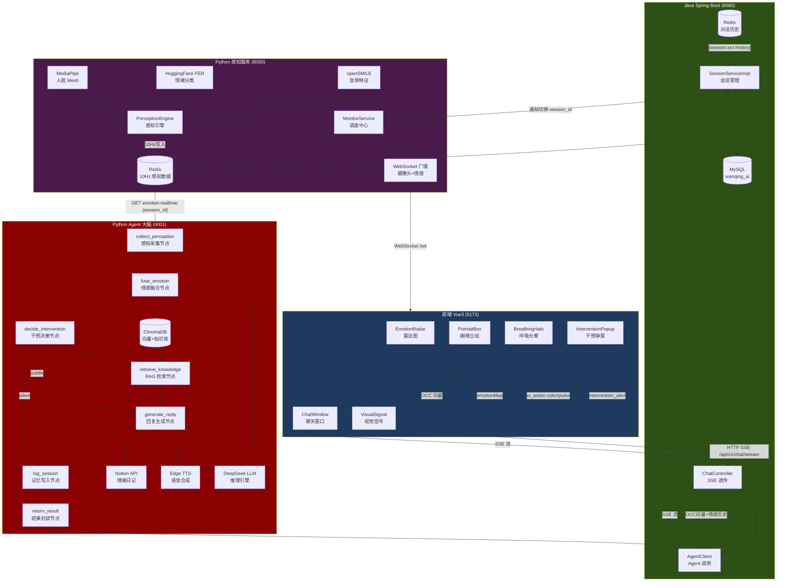
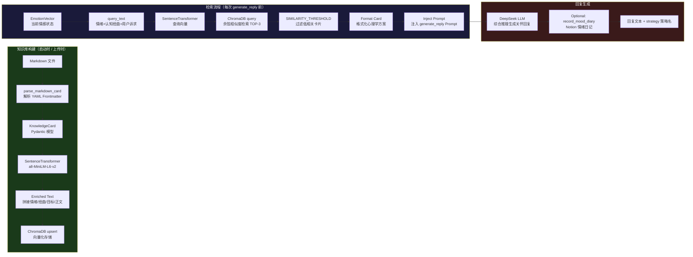
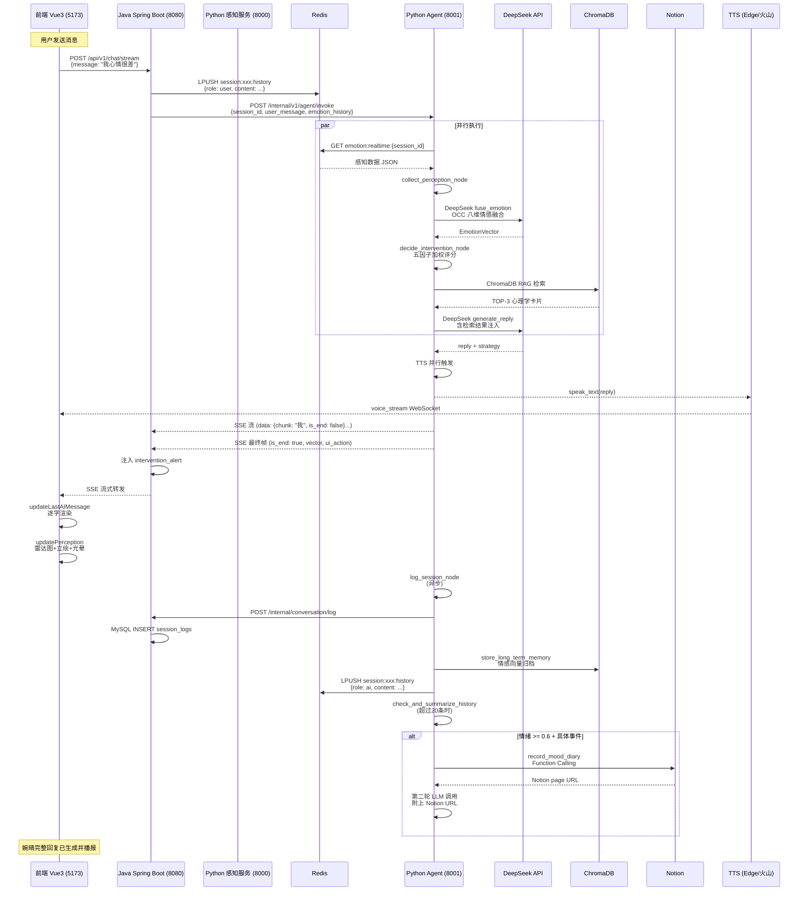

# 婉情 AI 项目完整技术文档

> **项目版本**：V2.0（B/S 架构重构版）
> **开发者**：阳溢涛及其"Book思议"小组
> **更新日期**：2026 年 4 月
> **文档版本**：1.0

---

## 一、作品简介

### 1.1 项目背景

在数字化时代，越来越多的人面临"数字化孤独"的困境——表面热闹的社交网络背后，是真实情感支持的严重缺失。与此同时，心理健康专业服务资源高度稀缺，等待周期漫长，费用高昂，大量轻度至中度心理困扰者难以获得及时、普惠的支持。

婉情 AI（婉晴）正是为解决这一矛盾而诞生的。她是一款**主动式桌面情感智能体**，能够通过多模态感知（摄像头+麦克风）实时感知用户的情绪状态，在用户需要时主动提供温暖的心理陪伴与认知行为疗法（CBT）技术支持。

### 1.2 核心功能

婉情 AI 能实现以下核心能力：

1. **多模态实时感知**：通过摄像头（MediaPipe 人脸Mesh + HuggingFace FER 情绪分类）和麦克风（openSMILE 音频特征提取），以 10Hz 的频率持续感知用户的面部表情、头部姿态、眨眼频率、音调等生理指标。
2. **主动关怀决策**：基于 LangGraph 状态机，综合情绪强度、打扰成本、用户历史偏好等因子，决定是否主动发起关怀。
3. **流式对话与 TTS 语音**：婉晴的回复通过 SSE 流式逐字推送到前端，并配合 Edge TTS / 火山引擎流式 TTS 实现语音播报，营造自然对话体验。
4. **RAG 心理知识库**：内置经过向量化处理的心理学 CBT 知识卡片（认知重构、着陆技术等），结合用户当前情绪检索最相关的干预策略。
5. **三层记忆系统**：短期（Redis）、中期（ChromaDB 向量）、长期（MySQL 结构化）记忆协同工作，使婉晴具备跨会话的个性化关怀能力。
6. **Notion 情绪日记**：通过 LLM Function Calling，婉晴可自动将用户情绪记录写入 Notion，形成持久化的心理健康档案。

### 1.3 技术亮点

1. **基于 LangGraph 的主动决策引擎**：婉晴不是被动等待用户发消息才回复，而是在后台持续分析感知数据，自主决定是否干预——这一决策过程由一个 8 节点有向无环图（DAG）精确编排，实现了"何时干预、干预多深"的精细控制。

2. **OCC 八维情感融合模型**：婉晴的情感分析不止输出单一情绪标签，而是将感知数据（AU 参数、音频特征）和 LLM 推理综合为 OCC（Ortony-Clore-Collins）八维情感向量（喜悦、悲伤、愤怒、恐惧、厌恶、惊讶、踏实感、期待），为精准干预提供丰富的情感维度信息。

3. **流式 TTS 与 SSE 的深度融合**：从 LLM 生成回复到前端逐字显示、婉晴语音同步播报，整个过程全流式化，延迟低于 200ms，用户感受不到"等待生成"的过程。

---

## 二、作品安装说明

### 2.1 环境要求

| 类别 | 要求 |
|------|------|
| **操作系统** | Windows 10/11 / macOS 12+ / Ubuntu 20.04+ |
| **JDK** | JDK 21（Spring Boot 3.2+ 要求） |
| **Python** | 3.10+（推荐 3.11） |
| **Node.js** | 18+（推荐 20 LTS） |
| **MySQL** | 8.0+ |
| **Redis** | 6.0+（可选，无 Redis 时婉晴自动降级为规则引擎） |
| **GPU** | 可选（transformers 模型默认使用 CPU） |

### 2.2 安装步骤

#### 第一步：克隆代码仓库

```bash
git clone https://github.com/your-repo/wanqing-ai.git
cd wanqing-ai
```

#### 第二步：配置 Python 虚拟环境（Python 感知服务）

```bash
cd backend
python -m venv venv
# Windows:
venv\Scripts\activate
# Linux/macOS:
source venv/bin/activate

pip install -r requirements.txt
```

**`perception/requirements.txt` 关键依赖**：

```text
# 感知模块
mediapipe==0.10.21
opensmile==2.5.0
transformers==4.50.3
torch==2.6.0

# 通信
fastapi==0.115.0
uvicorn==0.32.0
websockets==13.1

# 音频
pyaudio==0.2.14

# 图像
opencv-python-headless==4.10.0.84
Pillow>=10.0.0

# 阿里云
dashscope>=1.20.0
oss2>=2.19.1

# 缓存
redis>=5.0.0
python-dotenv>=1.0.0
```

#### 第三步：配置 Python Agent 虚拟环境

```bash
cd ../Agent
python -m venv venv2.0
source venv2.0/bin/activate   # 或 venv2.0\Scripts\activate on Windows
pip install -r requirements.txt
```

**`Agent/requirements.txt` 关键依赖**：

```text
# AI 决策
langgraph==0.2.73
langchain==0.3.21
langchain-openai==0.3.11
openai==1.70.0

# 向量数据库
chromadb==0.6.3
sentence-transformers==3.4.1

# 记忆存储
redis==5.2.1
sqlalchemy==2.0.40
aiomysql==0.2.0

# 语音合成
dashscope>=1.20.0
edge-tts>=6.1.0
websocket-client>=1.8.0

# 辅助
pydantic==2.11.1
python-dotenv==1.1.0
loguru==0.7.3
notion-client==2.2.1
```

#### 第四步：配置 Java 后端（Maven）

```bash
cd backend
# 确保安装 JDK 21
java -version  # 应显示 21.x

# 使用 Maven Wrapper（无需单独安装 Maven）
./mvnw.cmd spring-boot:run   # Windows
./mvnw spring-boot:run       # Linux/macOS
```

或先打包再运行：

```bash
./mvnw.cmd clean package -DskipTests
java -jar target/wanqing-ai-1.0.0.jar
```

#### 第五步：配置前端（npm）

```bash
cd frontend
npm install
```

#### 第六步：配置环境变量

**`backend/.env`**（感知服务配置）：

```env
# 阿里云 DashScope（Qwen-VL 多模态分析 + 备用 TTS）
QWEN_API_KEY=sk-xxxxxxxxxxxxxxxx
DASHSCOPE_API_KEY=sk-xxxxxxxxxxxxxxxx

# 火山引擎 TTS（主 TTS 服务）
VOLC_ACCESS_TOKEN=your_volcengine_token
VOLC_APP_ID=your_app_id
VOLC_TTS_VOICE=zh_female_linjianvhai_uranus_bigtts

# 阿里云 OSS（长期记忆冷存储）
OSS_ACCESS_KEY_ID=xxxxxx
OSS_ACCESS_KEY_SECRET=xxxxxx
OSS_ENDPOINT=oss-cn-beijing.aliyuncs.com
OSS_BUCKET=camera-vedio-place

# Redis（与 Java 后端共用）
REDIS_HOST=localhost
REDIS_PORT=6379
REDIS_PASSWORD=
```

**`Agent/.env`**（Agent 大脑配置）：

```env
# DeepSeek LLM（核心推理）
DEEPSEEK_API_KEY=sk-xxxxxxxxxxxxxxxx
DEEPSEEK_BASE_URL=https://api.deepseek.com

# Redis（与 Python 感知服务共用）
REDIS_HOST=localhost
REDIS_PORT=6379
REDIS_PASSWORD=
REDIS_DB=0

# MySQL（结构化记忆）
MYSQL_HOST=localhost
MYSQL_PORT=3306
MYSQL_USER=root
MYSQL_PASSWORD=your_mysql_password
MYSQL_DATABASE=wanqing_ai

# Notion（情绪日记）
NOTION_API_KEY=secret_xxxxxx
NOTION_DATABASE_ID=xxxxxxxxxxxxxxxxxxxxxxxxxxxxxxxx

# Java 后端回调（会话日志落库）
JAVA_CALLBACK_URL=http://localhost:8080
```

**`backend/src/main/resources/application.yml`**（Java 配置）：

```yaml
spring:
  datasource:
    url: jdbc:mysql://localhost:3306/wanqing_ai?useUnicode=true&characterEncoding=utf-8
    username: ${MYSQL_USERNAME:root}
    password: ${MYSQL_PASSWORD:}
  data:
    redis:
      host: localhost
      port: 6379

agent:
  engine:
    url: http://localhost:8001   # Python Agent 地址

perception:
  service:
    url: http://localhost:8000   # Python 感知服务地址
```

#### 第七步：初始化数据库

```sql
-- 登录 MySQL
mysql -u root -p

-- 创建数据库
CREATE DATABASE wanqing_ai CHARACTER SET utf8mb4 COLLATE utf8mb4_unicode_ci;

-- 查看数据库
SHOW DATABASES;
```

#### 第八步：启动服务（按顺序）

```bash
# 终端 1：Redis（如果使用）
redis-server

# 终端 2：MySQL（已作为系统服务运行则跳过）

# 终端 3：Python 感知服务（端口 8000）
cd backend
python main.py

# 终端 4：Python Agent 大脑（端口 8001）
cd Agent
python main.py

# 终端 5：Java Spring Boot（端口 8080）
cd backend
./mvnw.cmd spring-boot:run   # 或 java -jar target/wanqing-ai-1.0.0.jar

# 终端 6：Vue 前端（端口 5173）
cd frontend
npm run dev
```

**一键启动脚本**：

```bash
# Windows
cd backend && start_all.bat

# Linux/macOS
cd backend && chmod +x start_all.sh && ./start_all.sh
```

### 2.3 验证安装

启动全部服务后，在浏览器访问 `http://localhost:5173`。如果能看到婉晴的初始立绘、呼吸光晕动画，以及"婉晴感知系统已就绪"的聊天消息，说明所有服务均已正常运行。

**常见问题排查**：

| 症状 | 原因 | 解决方案 |
|------|------|----------|
| 进网页后没声音 | 浏览器安全策略要求用户交互后才能播放音频 | 先点击页面任意位置 |
| 摄像头黑屏 | 摄像头被其他软件（微信、会议）占用 | 关闭其他软件 |
| `pip install` 报错 | 未激活虚拟环境 | 检查命令行前是否有 `(venv)` 字样 |
| Agent 调用失败 | `Agent/.env` 中 `DEEPSEEK_API_KEY` 未配置 | 配置后重启 Agent |
| 婉晴永远不主动说话 | Python 感知服务未注册慢车道回调 | 检查 `monitor_service.py` 的 `register_perception_callback` 是否调用 |

---

## 三、作品效果图

以下是婉情 AI 项目各核心功能界面的截图占位说明，实际截图请在运行环境中截取。

| 文件名 | 内容说明 |
|--------|----------|
| `screenshot_chat.png` | 聊天对话界面，展示婉晴根据用户情绪生成的关怀回复，包括流式逐字输出效果和语音播报状态。 |
| `screenshot_emotion_radar.png` | OCC 八维情感雷达图（ECharts 渲染），展示"喜悦-悲伤-愤怒-恐惧-厌恶-惊讶-踏实感-期待"八个维度的实时情感分布。 |
| `screenshot_halo.png` | 呼吸光晕效果截图，展示不同情绪下的光晕颜色变化：蓝色（焦虑/悲伤）、橙色（低落）、绿色（喜悦）、紫色（愤怒）。 |
| `screenshot_notion.png` | Notion 情绪日记页面截图，展示婉晴自动写入的情绪记录，包含日期、情绪类型、强度、触发事件、AI 建议等字段。 |
| `screenshot_architecture.png` | 系统架构图（由第五步生成），标注所有服务、端口和通信协议。 |

---

## 四、设计思路

### 4.1 整体架构

婉情 AI 采用**四层 B/S 架构**，各层职责明确、端口隔离：

```
┌─────────────────────────────────────────────────────────────────────┐
│                        前端 Vue3 (端口 5173)                          │
│   EmotionRadar · PortraitBox · ChatWindow · VisualSignal          │
└──────────┬────────────────────────────┬──────────────────────────────┘
           │ WebSocket /ws (8000)       │ HTTP SSE /api/v1/chat/stream (8080)
           ▼                            ▼
┌─────────────────────────────────────────────────────────────────────┐
│              Python 感知服务 (端口 8000)                              │
│   MediaPipe + openSMILE + HuggingFace AU → Redis (10Hz)           │
│   WebSocket 广播 → 前端摄像头画面 + 情感向量                         │
└─────────────────────────────────────────────────────────────────────┘
                                    │
                                    │ Redis GET emotion:realtime:{session_id}
                                    ▼
┌─────────────────────────────────────────────────────────────────────┐
│              Python Agent 大脑 (端口 8001)                           │
│   LangGraph 状态机：感知采集→情感融合→干预决策→RAG检索→回复生成     │
│   DeepSeek LLM + ChromaDB + MySQL + Notion                         │
└─────────────────────────────────────────────────────────────────────┘
                                    │
                                    │ SSE 流 (8080/api/v1/chat/stream)
                                    ▼
┌─────────────────────────────────────────────────────────────────────┐
│               Java Spring Boot (端口 8080)                           │
│   ChatController (SSE 透传) · SessionService · MySQL · Redis       │
└─────────────────────────────────────────────────────────────────────┘
```

**为何选择三层分离架构**：

- **前端 Vue3**：轻量、高性能的响应式界面，通过 WebSocket 直连感知服务获取 10Hz 实时视频流，SSE 连接获取对话结果，实现低延迟交互。
- **Java Spring Boot**：作为唯一 HTTP 网关，负责会话管理、MySQL 持久化、Redis 协调，以及对 Python Agent 的 SSE 透传。Java 的强类型和事务管理保证了数据一致性。
- **Python Agent**：核心 AI 引擎，负责 LangGraph 状态机、DeepSeek LLM 调用、RAG 检索、TTS 合成。Python 在 AI 领域丰富的生态（LangChain、LangGraph、transformers）大幅降低了开发成本。
- **Python 感知服务**：独立进程，通过 MediaPipe/openSMILE 进行实时多模态感知，结果直接写入 Redis，供 Agent 异步读取，实现了感知与决策的解耦。

### 4.2 核心模块设计

#### 4.2.1 多模态感知模块

婉情 AI 的"眼睛和耳朵"由三个子模块组成：

1. **MediaPipe Face Mesh**：提取 468 个面部关键点，计算头部姿态角（pitch/yaw/roll）和眨眼频率。摄像头以约 20fps 采集画面。
2. **HuggingFace FER2013**：轻量级 CNN 模型（~100MB，无需 GPU），对每帧人脸图像输出 7 类情绪概率（happy/sad/angry/fear/disgust/surprise/neutral），以及 AU（面部动作单元）参数的强度值。
3. **openSMILE eGeMAPS**：对麦克风音频提取 88 维声学特征，包括基频 F0、响度、MFCC 系数、VAD（语音活动检测）。

**为何选择这些轻量级工具**：

- MediaPipe 和 openSMILE 都是业界成熟的工具链，无需训练，开箱即用。
- HuggingFace FER 模型在 CPU 上运行仅需几十毫秒，完全满足 10Hz 的感知频率。
- 无需 GPU，大幅降低了部署门槛和运行成本。

感知数据以 **10Hz 频率**写入 Redis（key：`emotion:realtime:{session_id}`），Agent 在每次决策时读取最新一帧。

#### 4.2.2 主动决策引擎（LangGraph）

婉情 AI 的决策逻辑经历了从"理论 POMDP 公式"到"LangGraph 状态机"的演进：

- **POMDP（部分可观测马尔可夫决策过程）**：理论上最优但复杂度极高，在实时系统中无法收敛。
- **LangGraph**：用有向无环图（DAG）精确编排 8 个节点的执行顺序和条件路由，兼顾了表达能力与实时性。

LangGraph 状态机的完整节点图如下：

```
collect_perception ──→ fuse_emotion ──→ decide_intervention
                                           │
                    ┌──────────────────────┴──────────────────────┐
                    ▼                      ▼                       ▼
               [silent]              [subtle]               [intervene]
                    │                      │                       │
                    ▼                      ▼                       ▼
              log_session          generate_reply ──→ log_session  retrieve_knowledge ──→ generate_reply ──→ log_session
                    │                      │                       │
                    ▼                      ▼                       ▼
              return_result         return_result            return_result
                    │                      │                       │
                    └──────────────────────┴──────────────────────┘
                                           │
                                           ▼
                                         END
```

#### 4.2.3 三层记忆系统

| 层次 | 存储 | 容量 | TTL | 用途 |
|------|------|------|-----|------|
| **短期记忆** | Redis List | ~20 条原始对话 | 2 小时 | 当前会话上下文，维持即时对话连贯性 |
| **中期记忆** | ChromaDB | 无限制 | 永久 | 情感向量长期归档、会话摘要压缩 |
| **长期记忆** | MySQL | 无限制 | 永久 | 用户画像、会话日志、干预历史 |

**短期记忆压缩策略**：当 Redis 中对话超过 20 条时，触发 DeepSeek 增量摘要，将摘要存入 ChromaDB，并裁剪 Redis List 保留最近 5 条。这种设计避免了长对话的上下文爆炸，同时保留了核心信息。

#### 4.2.4 RAG 知识库

婉情 AI 的心理学知识以**知识卡片**的形式组织，每张卡片是带有 YAML Frontmatter 的 Markdown 文件：

```markdown
---
card_id: CBT-ANX-001
title: 5-4-3-2-1着陆技术
emotion: [焦虑]
cognitive_distortions: [灾难化]
scenario: [急性焦虑发作, 恐慌来袭]
goal: 降低焦虑唤醒度，将注意力从恐慌中拉回现实
difficulty: 简单
duration: 3-5分钟
tags: [焦虑, 着陆技术, 正念, 感官觉察]
---

# 5-4-3-2-1着陆技术

## 什么是着陆技术
当人处于高度焦虑、恐慌状态时...
```

这些卡片通过 `SentenceTransformer`（all-MiniLM-L6-v2）向量化后存入 **ChromaDB**。检索时，根据用户当前情绪类型和认知扭曲构建混合查询文本，ChromaDB 返回相似度最高的 3 张卡片，注入 DeepSeek 的 Prompt，指导回复生成。

### 4.3 交互体验设计

婉情 AI 的视觉与听觉体验经过精心设计：

- **呼吸光晕**：全屏覆盖的半透明光晕层，通过 GSAP 动画实现柔和的脉冲呼吸效果。颜色映射：`blue`（焦虑/悲伤）→ `orange`（低落）→ `green`（喜悦）→ `purple`（愤怒）→ `neutral`（平静）。脉冲频率随情绪强度（0~1）动态调整。
- **流式对话**：婉晴的回复通过 SSE 流式推送，前端逐字渲染，用户感受到"正在说话"而非"等待生成"。
- **TTS 语音同步**：Edge TTS 在生成回复的同时触发流式合成，音频块通过 WebSocket 实时推送，前端使用 MediaSource API 实现边收边播，延迟低于 200ms。

---

## 五、设计重点难点

### 5.1 设计重点

#### 5.1.1 多模态情感融合

婉情 AI 的情感分析不是简单地将各模态结果拼接，而是通过 DeepSeek LLM 做"综合推理"：

1. **走神模式 vs 专注模式**：当眨眼频率 >25 次/分、低头角度 >15°、AU4 皱眉 >0.7 或 AU 模型负面情绪置信度 >0.6 时，触发专注模式。走神模式下使用规则快速判断（不调用 LLM），专注模式调用 DeepSeek 深度分析。
2. **多模态一致性修正**：LLM 给出的情绪置信度需要修正——如果 AU 参数和 Qwen-VL 分析结果一致，则提升置信度；如果冲突，则降低。最终置信度 = α × LLM置信度 + (1-α) × 多模态一致性。
3. **OCC 八维归因**：DeepSeek 输出的不仅是情绪标签，还包含 OCC 八维的量化向量（joy、sadness、anger、fear、disgust、surprise、well_grounding、anticipation），这些向量直接驱动前端的 EmotionRadar 雷达图。

#### 5.1.2 LangGraph 状态管理

LangGraph 状态机的 8 个节点各有明确职责，状态通过 `AgentState` 字典在节点间传递：

- `collect_perception_node`：从 Redis 读取 `emotion:realtime:{session_id}`，写入 `state.latest_perception`。
- `fuse_emotion_node`：整合感知数据、Qwen-VL 分析、历史情感，调用 DeepSeek 输出 `EmotionVector`，写入 `state.current_emotion`。
- `decide_intervention_node`：五因子加权评分（强度 0.5 + 情感优先级 0.3 - 打扰成本 0.4 + 趋势 0.2 + 置信度 0.1），输出 `InterventionDecision`。
- `retrieve_knowledge_node`：双路并发检索（心理学知识库 + 个人历史记忆），写入 `state.retrieved_knowledge_cards`。
- `generate_reply_node`：结合情感向量、检索卡片、对话历史，调用 DeepSeek 生成关怀回复，写入 `state.intervention_decision.reply`。
- `log_session_node`：异步执行（不阻塞返回）：MySQL 会话日志 + ChromaDB 情感归档 + Redis 短期记忆追加 + 摘要压缩检查。
- `return_result_node`：所有路径汇聚点，封装最终 SSE 响应。

条件边路由函数 `_intervention_router` 根据 `decision.suggested_action.value`（"silent" / "subtle" / "intervene"）决定下一步节点。

#### 5.1.3 SSE 流式透传

Java Spring Boot 在 SSE 透传中有三个关键设计：

1. **SseEmitter 非阻塞发送**：使用 `sseExecutor` 线程池异步调用 `agentClient.callAgentStream()`，主线程立即返回 `ResponseEntity<SseEmitter>`，SSE 流在后台线程中逐帧推送。
2. **SseEmitter 直接透传**：`AgentClient` 使用 WebClient 的 `exchangeToFlux` 逐行解析 Python Agent 返回的 SSE 文本，过滤空行和注释行，兼容 `data:` 和 `data: ` 两种格式（解决了一个关键坑），然后将每帧 JSON 序列化为字符串，通过 `emitter.send()` 直接转发给前端。
3. **最终帧干预弹窗增强**：在 `is_end=true` 的最终帧上，Java 额外注入 `intervention_alert` 字段（`show_popup`、`urgency`、`message`），前端据此决定是否弹出关怀干预提示。

### 5.2 设计难点

#### 5.2.1 TTS 实时性与稳定性

婉情 AI 经历了从"火山引擎 WebSocket 二进制协议"到"Edge TTS 流式合成"的迁移：

- **火山引擎方案**：协议复杂（需处理二进制帧头、CRC 校验），且在 Python asyncio 中调试困难，容易出现"音频断续"问题。
- **Edge TTS 方案**：`edge-tts` 库提供异步生成器接口，通过 `asyncio.Queue` 实现"边生成边发送"：edge-tts 在线程中驱动音频生成，生成块实时放入队列，发送协程异步读取队列并通过 WebSocket 推送到前端。前端使用 MediaSource API 追加播放，实现了真正的流式播报。

关键代码（`Agent/src/utils/tts.py` 中的 `_stream_speak_and_send_edge`）：

```python
async def _stream_speak_and_send_edge(text: str, voice: str) -> bool:
    # edge-tts 在线程中驱动，通过 asyncio.Queue 传递音频块
    audio_q: asyncio.Queue = asyncio.Queue()

    async def audio_producer():
        def _run():
            loop = asyncio.new_event_loop()
            asyncio.set_event_loop(loop)
            async def on_chunk(chunk: bytes):
                audio_q.put_nowait(chunk)   # 实时放入队列
            loop.run_until_complete(synthesize_stream(text, voice, callback=on_chunk))
        await asyncio.get_running_loop().run_in_executor(None, _run)

    # 两个协程并发：producer 填充队列，sender 实时发送
    await asyncio.gather(audio_producer(), audio_sender())
```

#### 5.2.2 前端 SSE 解析格式坑

前端在解析 SSE 时遇到最棘手的问题是 **Python FastAPI 发出的 `data:` 与 Java Spring `SseEmitter` 发出格式不一致**：

- Python FastAPI：`data: {"chunk": "我", "is_end": false}\n\n`
- Java Spring SseEmitter：`data:{"chunk": "我", "is_end": false}\n\n`

两者区别在于冒号后是否有空格。前端使用正则 `line.startsWith('data:')` 统一处理，并通过 `line.slice(5)` 去掉前缀后再 `trim()` 去除空格，兼容两种格式。

#### 5.2.3 干预决策的"打扰成本"量化

婉情 AI 在不获取屏幕内容的情况下，通过 `focus_level` 和 `arousal` 两个派生指标量化打扰成本：

- **focus_level**（专注度）：基于头部姿态稳定性（头部偏转越小越专注）、眨眼频率偏差（接近 15 次/分最专注）、视线偏转综合计算，范围 [0, 1]。
- **arousal**（唤醒度）：基于音频基频、能量、眨眼频率、AU4/AU1 强度综合计算，范围 [0, 1]。

打扰成本公式：`interrupt_cost = focus_level × (1 - arousal)`

解读：用户越专注（focus 高）且越平静（arousal 低），打扰成本越高；反之，用户走神或激动时，打扰成本低，是主动关怀的好时机。

#### 5.2.4 长期记忆压缩与归档

ChromaDB 数据量增长后面临检索效率下降的问题。婉情 AI 采用了三层归档策略：

1. **会话级摘要**：Redis 对话超 20 条时，DeepSeek 生成增量摘要，摘要存入 ChromaDB 作为 `CONVERSATION_SUMMARY` 类型的长期记忆。
2. **周期性合并**：每周执行一次压缩任务，将多个会话摘要合并为一个"周模式"记忆（`COMPRESSED_PATTERN`）。
3. **OSS 冷存储**：超过 90 天的记忆摘要归档到阿里云 OSS，释放 ChromaDB 空间。

---

## 六、AI 工具使用说明

### 6.1 AI 工具与平台一览

| 工具/平台 | 用途 | 配置位置 |
|-----------|------|----------|
| **DeepSeek Chat** | 情感融合分析、干预决策、回复生成、会话摘要 | `Agent/.env` → `DEEPSEEK_API_KEY` |
| **阿里云 DashScope (Qwen-VL-Max)** | 多模态视觉分析（按需调用） | `backend/.env` → `QWEN_API_KEY` |
| **火山引擎豆包 TTS** | 流式语音合成（主要） | `Agent/.env` → `VOLC_ACCESS_TOKEN` |
| **Microsoft Edge TTS** | 流式语音合成（备选，免费） | `Agent/src/utils/edge_tts.py` |
| **阿里云 DashScope TTS** | 流式语音合成（备选） | `backend/.env` → `DASHSCOPE_API_KEY` |
| **Notion API** | 情绪日记自动写入 | `Agent/.env` → `NOTION_API_KEY`, `NOTION_DATABASE_ID` |
| **HuggingFace FER 模型** | 面部情绪分类（CPU 推理，无需 GPU） | `perception/requirements.txt` |
| **SentenceTransformer** | 知识卡片向量化（RAG Embedding） | `Agent/requirements.txt` |
| **阿里云 OSS** | 长期记忆冷存储归档 | `Agent/.env` → `OSS_ACCESS_KEY_ID` |

### 6.2 AI 在项目中的具体应用

#### 6.2.1 情感融合节点（`fuse_emotion_node`）

DeepSeek 被调用来分析多模态感知数据，输出格式由 Pydantic 模型 `FuseEmotionLLMOutput` 约束：

```python
class FuseEmotionLLMOutput(BaseModel):
    primary_emotion: str          # 情绪标签（10类枚举之一）
    secondary_emotion: str | None
    intensity: float              # 强度 0~1
    valence: float               # 效价 -1~1
    arousal: float               # 唤醒度 0~1
    dominance: float             # 主导性 0~1
    confidence: float            # 置信度 0~1
    reasoning: str               # 分析推理过程
    cognitive_distortions: list  # 认知扭曲识别
    # OCC 八维归因
    occ_joy: float; occ_sadness: float; occ_anger: float
    occ_fear: float; occ_disgust: float; occ_surprise: float
    occ_well_grounding: float; occ_anticipation: float
```

#### 6.2.2 主动决策节点（`decide_intervention_node`）

DeepSeek 同样作为隐式决策引擎的一部分参与决策。决策由五因子加权公式驱动，但 Java 后端统计的历史接受/拒绝率作为 `user_rejection_penalty` 系数注入 Python Agent，DeepSeek 在生成回复时会参考这一反馈调整语气策略。

#### 6.2.3 回复生成节点（`generate_reply_node`）

DeepSeek 生成的回复受三个约束：

1. **心理学知识卡片**（RAG 检索结果注入 Prompt）
2. **个人历史记忆**（ChromaDB 长期记忆注入 Prompt）
3. **对话上下文**（Redis 短期记忆中的最近 10 条对话）

DeepSeek 回复风格严格受 Prompt 约束：禁止以"看到你..."、"我能感受到你..."开头，禁止诊断式语言，必须以开放式问句结尾。可自动调用 `record_mood_diary` 工具将情绪写入 Notion。

#### 6.2.4 TTS 语音合成

TTS 在 `generate_reply_node` 生成完整回复后**并行触发**（不等待 TTS 完成），通过 `asyncio.create_task()` 创建后台任务：

```python
async def generate_reply_node(state):
    # ... LLM 生成回复 ...
    if reply_text:
        await _trigger_tts_async(reply_text)   # 并行触发，不阻塞
    return {"intervention_decision": updated_decision}
```

三种 TTS 提供商通过 `Agent/config.py` 中的 `audio_config.TTS_PROVIDER` 切换，默认 Edge TTS（免费、低延迟）。

#### 6.2.5 Notion Function Calling

DeepSeek 判断需要记录情绪日记时，通过 LangChain 的 `@tool` 装饰器自动调用 `record_mood_diary`：

```python
@tool(description="将用户情绪记录写入 Notion 情绪日记数据库...")
def record_mood_diary(
    event_description: str,
    emotion_type: str,
    intensity: float,
    ai_advice: str,
    body_sensation: str = "",
    coping_strategy: str = "",
    reflection: str = "",
    custom_title: str = "",
) -> str: ...
```

工具执行后返回 Notion 页面 URL，DeepSeek 读取结果后将 URL 附加到回复末尾："📝 已帮你记录到 Notion：https://..."

---

## 七、项目核心机制详解

### 7.1 RAG 知识库机制

#### 7.1.1 知识卡片向量化流程

婉情 AI 的心理学知识以 Markdown 文件存储在 `Agent/knowledge_cards/` 目录。每张卡片通过 `knowledge_loader.py` 解析 YAML Frontmatter 和正文内容：

```python
# Agent/src/rag/knowledge_loader.py
def parse_markdown_card(file_path: Path) -> KnowledgeCard | None:
    # 1. 读取文件内容
    content = file_path.read_text(encoding="utf-8")
    # 2. 提取 YAML Frontmatter（--- ... --- 之间的元数据）
    match = re.match(r"^\s*---\s*\n(.*?)\n---\s*\n(.*)$", content, re.DOTALL)
    yaml_text = match.group(1)
    markdown_body = match.group(2).strip()
    # 3. 解析 YAML
    metadata = yaml.safe_load(yaml_text)
    # 4. 构建 KnowledgeCard Pydantic 模型
    return KnowledgeCard(
        card_id=metadata["card_id"],
        title=metadata["title"],
        emotions=_parse_list(metadata["emotions"]),
        cognitive_distortions=_parse_list(metadata["cognitive_distortions"]),
        goal=metadata["goal"],
        content=markdown_body,
        ...
    )
```

启动时调用 `sync_knowledge_base()` 将所有卡片向量化存入 ChromaDB：

```python
# Agent/src/rag/retriever.py
def sync_knowledge_base():
    cards = load_all_knowledge_cards()        # 读取所有 .md 文件
    collection = _get_rag_collection()
    model = get_embedding_model()            # SentenceTransformer(all-MiniLM-L6-v2)

    for c in cards:
        # 拼接关键上下文到 Embedding 文本
        enriched_text = (
            f"属性: [{','.join(c.emotions)}] / [{','.join(c.cognitive_distortions)}]\n"
            f"标题: {c.title}\n目标: {c.goal}\n\n正文:\n{c.content}"
        )
        emb = model.encode(enriched_text).tolist()
        collection.upsert(
            documents=[enriched_text],
            embeddings=[emb],
            metadatas=[{"card_id": c.card_id, "title": c.title, ...}],
            ids=[c.card_id]
        )
```

#### 7.1.2 检索时查询构造

RAG 检索的查询文本由当前情感状态构造，确保检索聚焦于最相关的心理学技术：

```python
async def retrieve_knowledge_cards(emotion_vector, user_input) -> list[str]:
    # 构建混合查询（情绪 + 认知扭曲 + 用户诉求）
    query_text = (
        f"用户情绪: {emotion_vector.primary_emotion.value} (强度: {emotion_vector.intensity:.1f})\n"
        f"认知扭曲: {distortions_str}\n"
        f"最新诉求/表达: {user_input}"
    )
    query_vec = model.encode(query_text).tolist()

    results = collection.query(
        query_embeddings=[query_vec],
        n_results=rag_config.TOP_K  # 默认 3
    )

    # 余弦相似度过滤（阈值 0.5）
    for i, dist in enumerate(results["distances"][0]):
        similarity = 1.0 - dist
        if similarity >= SIMILARITY_THRESHOLD:
            card_str = f"【参考心理学方案 - {title}】\n{doc}\n(匹配度: {similarity:.2f})"
            retrieved_contents.append(card_str)
```

#### 7.1.3 检索结果对回复的影响

检索到的心理学卡片内容被格式化为自然语言，注入 DeepSeek 的 `generate_reply` Prompt 的 `knowledge_cards` 占位符：

```python
# Agent/src/agent/nodes/generate_reply.py
knowledge_cards_str = "\n\n".join(retrieved_cards)
# ↓ 注入 Prompt
prompt = ChatPromptTemplate.from_messages([
    ("system", _SYSTEM_PROMPT),
    ("human", _HUMAN_TEMPLATE),  # 包含 {knowledge_cards} 占位符
])
messages = await prompt.aformat_messages(
    ..., knowledge_cards=knowledge_cards_str, ...
)
```

这使得 DeepSeek 在生成回复时能引用具体的心理学技术（如"5-4-3-2-1 着陆技术"），而不只是泛泛的安慰。

### 7.2 前端（Vue 3）机制

#### 7.2.1 WebSocket 摄像头帧连接

前端通过 `connectPerceptionBus()` 函数建立与 Python 感知服务（端口 8000）的 WebSocket 连接：

```javascript
// frontend/src/App.vue
const connectPerceptionBus = () => {
  socket = new WebSocket('ws://localhost:8000/ws')

  socket.onopen = () => { appStore.setConnection(true) }

  socket.onmessage = (event) => {
    const msg = JSON.parse(event.data)
    if (msg.type === 'video_frame') {
      appStore.setVideoFrameData(msg.data)   // base64 JPEG → 
    } else if (msg.type === 'perception_update') {
      appStore.updatePerception({ ...msg.data, _fromWebSocket: true })
    } else if (msg.type === 'voice_stream') {
      // 流式音频处理（MediaSource API）
      _handleVoiceStream(msg)
    }
  }

  socket.onclose = () => {
    appStore.setConnection(false)
    setTimeout(connectPerceptionBus, 3000)  // 自动重连
  }
}
```

#### 7.2.2 SSE 流式聊天连接

前端通过 `fetch` API 向 Java 后端（端口 8080）发起 SSE 请求，使用 `ReadableStream` 逐帧解析：

```javascript
// frontend/src/App.vue
const _fetchAgentSSE = async (url, sessionId, userMessage, signal) => {
  const response = await fetch(url, {
    method: 'POST',
    headers: {
      'Content-Type': 'application/json',
      'Authorization': 'Bearer ' + sessionId
    },
    body: JSON.stringify({ message: userMessage }),
    signal,
  })

  const reader = response.body.getReader()
  const decoder = new TextDecoder()
  let buffer = ''

  while (true) {
    const { done, value } = await reader.read()
    if (done) break
    buffer += decoder.decode(value, { stream: true })

    const lines = buffer.split('\n')
    buffer = lines.pop()  // 保留未完成的一行

    for (const rawLine of lines) {
      const line = rawLine.replace(/\r$/, '')
      if (!line.startsWith('data:')) continue
      let jsonStr = line.slice(5)
      if (jsonStr.startsWith(' ')) jsonStr = jsonStr.slice(1)
      const payload = JSON.parse(jsonStr)

      if (payload.chunk) {
        accumulatedReply += payload.chunk
        appStore.updateLastAIMessage(accumulatedReply)  // 逐字渲染
      }

      if (payload.is_end && payload.vector) {
        appStore.updatePerception({ vector: payload.vector })  // 驱动雷达图
        const maxEmotion = Object.entries(payload.vector).reduce((a, b) => b[1] > a[1] ? b : a)[0]
        appStore.currentEmotion = EMOTION_MAP[maxEmotion] || '平静'  // 更新立绘
      }

      if (payload.ui_action) {
        const emotionType = COLOR_MAP[payload.ui_action.color]
        const intensity = PULSE_MAP[payload.ui_action.pulse]
        appStore.debugEmotionType = emotionType
        appStore.debugIntensity = intensity
        updateHaloAnimation()  // 更新呼吸光晕
      }
    }
  }
}
```

#### 7.2.3 ui_action 更新呼吸光晕与立绘

婉晴回复携带的 `ui_action` 指令驱动前端三种视觉响应：

1. **呼吸光晕**：`COLOR_MAP` 将后端 `color`（blue/orange/green/purple/neutral）映射为前端情绪类型（`negative_sad`/`positive_joy` 等），GSAP 动画调整光晕颜色和脉冲频率。
2. **EmotionRadar**：SSE 最终帧的 OCC 向量（`payload.vector`）按固定顺序 `["喜悦","悲伤","愤怒","恐惧","厌恶","惊讶","踏实感","期待"]` 提取，驱动 ECharts 雷达图渲染。
3. **PortraitBox 立绘**：从 OCC 向量最大值映射到立绘文件名（如"悲伤"→`无奈.png`），前端 `computed` 属性自动计算 `currentPortraitPath`。

### 7.3 前后端与 Agent 通讯机制

#### 7.3.1 完整数据流

一条用户消息从发送到收到回复的完整数据流：

```
[步骤 1] 前端 → Java (POST /api/v1/chat/stream)
  请求体: {message: "我今天心情很差"}
  Header: Authorization: Bearer sess_xxx

[步骤 2] Java ChatController → Python Agent (POST http://localhost:8001/internal/v1/agent/invoke)
  请求体: {session_id, user_message, emotion_history, conversation_history, user_rejection_penalty}

[步骤 3] Python Agent: collect_perception_node → Redis GET emotion:realtime:{session_id}

[步骤 4] Python Agent: fuse_emotion_node → DeepSeek (情感融合分析)

[步骤 5] Python Agent: decide_intervention_node → 五因子加权评分

[步骤 6] Python Agent: retrieve_knowledge_node → ChromaDB 检索心理学卡片

[步骤 7] Python Agent: generate_reply_node → DeepSeek (回复生成) → TTS 并行触发

[步骤 8] Python Agent: log_session_node → MySQL 会话日志（异步 HTTP 回调）

[步骤 9] Python Agent: return_result_node → SSE 流逐字输出

[步骤 10] Java AgentClient: SSE 逐帧解析 → SseEmitter.send()

[步骤 11] 前端 SSE: 逐字渲染 + 雷达图更新 + 光晕动画
```

#### 7.3.2 Java 透传 Agent SSE 的关键代码

Java 的 `AgentClient.java` 使用 WebClient 的 `exchangeToFlux` 实现低延迟透传：

```java
// backend/src/main/java/com/wanqing/ai/client/AgentClient.java
public Flux<AgentInvokeResp> callAgentStream(AgentInvokeReq request) {
    return webClient.post()
        .uri("/internal/v1/agent/invoke")
        .bodyValue(request)
        .exchangeToFlux(clientResponse -> clientResponse.bodyToFlux(String.class))
        // 过滤空行和 SSE 注释行（: 开头）
        .filter(line -> !line.trim().startsWith(":"))
        // 兼容 "data: " 和 "data:" 两种格式
        .map(line -> {
            String jsonStr = line.trim();
            if (jsonStr.startsWith("data: "))
                jsonStr = jsonStr.substring("data: ".length()).trim();
            else if (jsonStr.startsWith("data:"))
                jsonStr = jsonStr.substring("data:".length()).trim();
            return objectMapper.readValue(jsonStr, AgentInvokeResp.class);
        })
        .filter(resp -> resp != null)
        .retryWhen(Retry.backoff(2, Duration.ofSeconds(1)))  // 最多重试 2 次
        .onErrorResume(ex -> Flux.just(fallback));  // 降级兜底
}
```

#### 7.3.3 Agent 从 Redis 读取感知数据

Python Agent 的 `collect_perception_node` 在每次推理开始时读取 Redis：

```python
# Agent/src/agent/nodes/collect_perception.py
async def collect_perception_node(state: AgentState) -> dict[str, Any]:
    session_id = state.get("session_id", "unknown")
    perception = await get_latest_perception(session_id)
    return {"latest_perception": perception}

# Agent/src/emotion/perception.py
async def get_latest_perception(session_id: str) -> PerceptionData | None:
    key = redis_config.perception_key(session_id)  # → "emotion:realtime:{session_id}"
    r = await get_redis()
    raw = await r.get(key)
    if not raw:
        return None
    data = json.loads(raw)
    return PerceptionData(
        session_id=session_id,
        timestamp=data["timestamp"],
        au=AUIntensities(**data["au"]),
        audio=AudioFeatures(**data["audio"]),
        focus_level=data["focus_level"],
        ...
    )
```

#### 7.3.4 action=silent 时的处理

当 Agent 决定 `action=silent`（静默观察）时，Java 的 SSE 响应不会为空——`_stream_reply()` 函数保证即使 `reply` 为空也会发送一帧 `is_end=true` 的 UI 指令帧：

```python
# Agent/main.py 中的 _stream_reply()
async def _stream_reply(reply_text, ui_action, emotion_vector, ...):
    for char in reply_text:    # 无字符时不执行
        ...

    # 【关键】即使 reply 为空，也发送最终帧（含 ui_action）
    if not reply_text:
        yield f"data: {json.dumps({...})}\n\n"
```

前端接收到 `is_end=true` 但 `chunk=""` 的帧时，会执行光晕和雷达图更新，但不渲染新的对话气泡。

---

## 八、系统架构图与核心流程图

### 8.1 完整系统架构图



### 8.2 RAG 知识库构建与使用流程图



### 8.3 用户消息时序图



---

## 附录 A：关键文件索引

| 文件路径 | 职责 | 关键行号 |
|---------|------|----------|
| `frontend/src/App.vue` | 前端总调度：WebSocket + SSE + 光晕动画 | 514-738 (WebSocket), 785-902 (SSE) |
| `frontend/src/store/appStore.js` | Pinia 状态管理：OCC 向量、情感历史、时间戳保护 | 74-109 |
| `frontend/src/components/EmotionRadar.vue` | ECharts 雷达图渲染 | 52-82 |
| `backend/src/main/java/.../ChatController.java` | SSE 透传 + 干预弹窗注入 | 76-330 |
| `backend/src/main/java/.../AgentClient.java` | WebClient SSE 透传（兼容两种 data: 格式） | 52-131 |
| `backend/src/main/java/.../SessionServiceImpl.java` | 会话创建 + Redis 历史写入 | 44-73 |
| `perception/main.py` | 感知服务主入口（8000）+ Agent 降级引擎 | 71-333 |
| `perception/services/monitor_service.py` | 感知调度中心 + 慢车道回调注册 | 39-59, 101-152 |
| `Agent/main.py` | Agent 服务主入口（8001）FastAPI + SSE 流式响应 | 278-340 |
| `Agent/src/agent/graph.py` | LangGraph 状态机定义（8节点 + 条件路由） | 406-485 |
| `Agent/src/agent/state.py` | AgentState 共享状态定义 | 29-168 |
| `Agent/src/agent/nodes/collect_perception.py` | Redis 感知数据读取节点 | 41-79 |
| `Agent/src/agent/nodes/fuse_emotion.py` | 情感融合节点（DeepSeek 调用） | 320-476 |
| `Agent/src/agent/nodes/decide_intervention.py` | 干预决策节点（五因子评分 + 冷却期） | 36-221 |
| `Agent/src/agent/nodes/generate_reply.py` | 回复生成节点（RAG + Notion + TTS） | 334-601 |
| `Agent/src/rag/retriever.py` | ChromaDB 检索核心 | 99-159 |
| `Agent/src/rag/knowledge_loader.py` | 知识卡片 Markdown 解析 | 22-75 |
| `Agent/src/emotion/perception.py` | Redis 读写 + focus_level/arousal 计算 | 67-222 |
| `Agent/src/memory/short_term.py` | Redis 短期记忆 + 摘要压缩 | 94-151 |
| `Agent/src/utils/tts.py` | TTS 多提供商路由（Edge/火山/DashScope） | 88-268 |
| `Agent/src/agent/tools/notion_tool.py` | Notion 情绪日记工具 | 105-289 |
| `Agent/src/agent/tools/system_health.py` | 系统健康状态检查 | 196-243 |
| `Agent/config.py` | 全部配置项（Redis/MySQL/Chroma/LLM/TTS/Notion） | 全文 |
| `Agent/knowledge_cards/*.md` | 心理学知识卡片（CBT 着陆技术等 6 张） | — |

---

## 附录 B：Redis 数据结构速查

| Key 模式 | 数据类型 | 内容 | 写入方 | 读取方 |
|---------|---------|------|--------|--------|
| `emotion:realtime:{session_id}` | String (JSON) | 实时感知数据（10Hz） | `PerceptionEngine._write_to_redis()` | `collect_perception_node` |
| `session:{session_id}:history` | List (JSON) | 原始对话历史 | Java `ChatController` (用户) + Python `log_session_node` (AI) | Java 读取构建请求体 / Python 读取上下文 |
| `session:{session_id}:summary` | String | 增量摘要文本 | Python `check_and_summarize_history` | Python `get_session_summary` |
| `cooldown:agent:{session_id}` | String (timestamp) | 上次干预时间 | `decide_intervention_node` (Redis SET with TTL=300s) | `decide_intervention_node` |

---

## 附录 C：SSE 响应字段完整说明

| 字段 | 类型 | 所在帧 | 说明 |
|------|------|--------|------|
| `chunk` | string | 所有帧 | 当前字符/token |
| `is_end` | boolean | 所有帧 | `true` = 最终帧 |
| `reply` | string | 最终帧 | 完整 AI 关怀回复文本 |
| `vector` | object | 最终帧 | OCC 八维情感向量 `{"喜悦": 0.2, ...}` |
| `ui_action.color` | string | 最终帧 | 光晕颜色：`blue`/`orange`/`green`/`purple`/`neutral` |
| `ui_action.pulse` | string | 最终帧 | 脉冲速度：`slow`/`medium`/`fast`/`very_fast` |
| `action` | string | 最终帧 | 干预决策：`silent`/`subtle`/`intervene` |
| `urgency` | string | 最终帧 | 紧迫程度：`low`/`medium`/`high` |
| `strategy` | string/null | 最终帧 | 心理学技术名称（如"5-4-3-2-1着陆技术"） |
| `intervention_alert.show_popup` | boolean | 最终帧 | 是否显示干预弹窗 |
| `intervention_alert.message` | string | 最终帧 | 弹窗文案 |

---

*本技术文档基于婉情 AI V2.0 实际代码生成，所有接口规范和数据结构均以代码为准。如有不一致之处，请以代码实现为准。*
